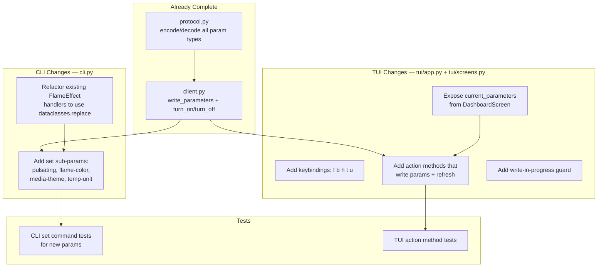
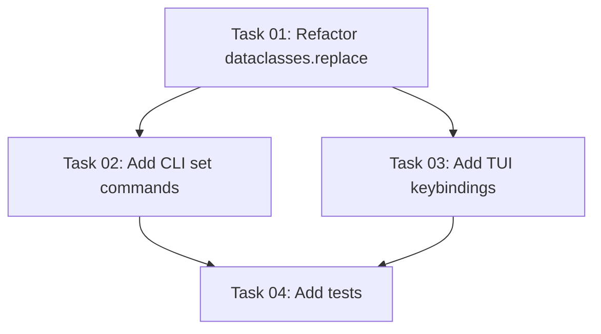

# Plan: Fireplace State Controls — CLI & TUI

## Original Work Order
> We need to add API calls, CLI support, and TUI support to change the state of the fireplace. This includes all flame effects, Heat, Mode, Temp Unit, and Timers. Plan how to implement this.

## Plan Clarifications

| Question | Answer |
|----------|--------|
| Should CLI also add set commands for Sound and Log Effect (not explicitly requested)? | No — limit scope to explicitly requested parameters only (flame effects, heat, mode, temp unit, timers). Sound and log-effect CLI commands are out of scope per YAGNI. |
| When the TUI timer toggle enables the timer, what default duration should it use? | 60 minutes. This is a common session duration. |
| Should the TUI heat mode cycle include all modes (Normal, Boost, Eco, Fan Only) or skip uncommon ones? | All four modes: Normal → Boost → Eco → Fan Only → Normal. |
| The work order mentions "API calls" — are new API endpoints needed? | No. The existing `write_parameters()` client method and protocol encoders already support all writable parameter types. Only UI-layer work is needed in `cli.py` and `tui/`. |

## Executive Summary

This plan adds write-control coverage for the explicitly requested fireplace parameters (flame effects, heat, mode, temp unit, timers) across both the CLI and TUI interfaces. The client layer (`write_parameters`) and protocol layer (encode/decode) already support all writable parameter types — no new API calls or protocol changes are needed. The work is purely UI-layer: adding CLI `set` sub-parameters and TUI keybindings.

The approach extends existing patterns rather than introducing new abstractions. CLI commands follow the established `flameconnect set <fire_id> <param> <value>` pattern. TUI controls use single-key bindings that cycle through valid values, following the existing `p` (power toggle) pattern.

## Context

### Current State vs Target State

| Current State | Target State | Why? |
|---|---|---|
| CLI `set` supports 6 params: mode, flame-speed, brightness, heat-mode, heat-temp, timer | CLI `set` adds 3 more: pulsating, flame-color, media-theme, plus temp-unit | Users cannot control these flame-effect settings or temp unit from the command line |
| TUI has only power toggle (`p`) and refresh (`r`) | TUI has keybindings for flame speed, brightness, heat mode, timer, and temp unit | Users must leave the TUI to change settings; the TUI is monitoring-only |
| No input validation feedback in TUI | TUI shows confirmation messages in the messages panel after writes | Users need feedback that their command was received |
| FlameEffectParam writes use manual 12-field construction | FlameEffectParam writes use `dataclasses.replace()` | Reduces boilerplate and prevents field-copy bugs |

### Background

The wire protocol layer (`protocol.py`) already has complete encode/decode support for all 8 writable parameter types (ModeParam, FlameEffectParam, HeatParam, HeatModeParam, TimerParam, TempUnitParam, SoundParam, LogEffectParam). The client's `write_parameters()` method is a generic transport that accepts any list of Parameter dataclasses. No new API calls or protocol changes are needed.

The CLI currently uses a read-modify-write pattern for parameters with multiple fields (e.g., FlameEffectParam has 12 fields — changing brightness requires reading current state, copying all other fields, and writing back). This same pattern applies to new CLI set commands. The `dataclasses.replace()` function works with frozen dataclasses and eliminates manual field copying.

Existing CLI `set` commands already cover: `mode`, `flame-speed`, `brightness`, `heat-mode`, `heat-temp`, `timer`. These remain unchanged.

## Architectural Approach

### CLI: Add Missing Set Sub-Parameters

**Objective**: Add CLI `set` support for the remaining flame-effect fields and temp-unit.

New set sub-parameters to add to `cmd_set()` in `cli.py`:

| Sub-Parameter | Value Format | Target Field | Parent Param |
|---|---|---|---|
| `pulsating` | `on` / `off` | `FlameEffectParam.pulsating_effect` | FlameEffectParam |
| `flame-color` | `all`, `yellow-red`, `yellow-blue`, `blue`, `red`, `yellow`, `blue-red` | `FlameEffectParam.flame_color` | FlameEffectParam |
| `media-theme` | `user-defined`, `white`, `blue`, `purple`, `red`, `green`, `prism`, `kaleidoscope`, `midnight` | `FlameEffectParam.media_theme` | FlameEffectParam |
| `temp-unit` | `fahrenheit` / `celsius` | `TempUnitParam.unit` | TempUnitParam |

Each new handler function follows the same structure as existing handlers: validate input, fetch current state if needed (for FlameEffectParam), construct a new param with the changed field via `dataclasses.replace()`, call `write_parameters`, print confirmation.

The `_SET_PARAM_NAMES` constant and `build_parser` help text must be updated to list all valid parameter names.

### CLI: Refactor Existing Handlers to Use dataclasses.replace()

**Objective**: Simplify existing FlameEffectParam write handlers to prevent field-copy bugs.

The existing `_set_flame_speed` and `_set_brightness` handlers manually construct a new FlameEffectParam by copying all 12 fields. Refactoring these to use `dataclasses.replace(current, flame_speed=speed)` eliminates the manual field list and makes future field additions safe.

Similarly, `_set_heat_mode` and `_set_heat_temp` can use `dataclasses.replace()` on HeatParam. The `turn_on` method in `client.py` also manually copies FlameEffectParam fields and should be refactored.

### TUI: Add Interactive Keybindings

**Objective**: Allow users to control the most commonly used fireplace settings directly from the TUI dashboard.

New keybindings added to `FlameConnectApp.BINDINGS`:

| Key | Action | Behavior |
|---|---|---|
| `f` | Cycle flame speed | Increments flame speed 1→2→3→4→5→1, writes FlameEffectParam |
| `b` | Toggle brightness | Toggles between High and Low, writes FlameEffectParam |
| `h` | Cycle heat mode | Cycles Normal→Boost→Eco→Fan Only→Normal, writes HeatParam |
| `t` | Toggle timer | If enabled: disables (duration=0). If disabled: enables with 60-minute default. Writes TimerParam. |
| `u` | Toggle temp unit | Toggles between Fahrenheit and Celsius, writes TempUnitParam |

Each action method in `app.py` follows the same pattern as the existing `action_toggle_power`:

1. Guard: check that `screen` is `DashboardScreen` and `fire_id` is set
2. Guard: check `_write_in_progress` flag; if set, return early (prevents API spam)
3. Set `_write_in_progress = True`
4. Read current state from `DashboardScreen.current_parameters` (cached dict keyed by param type)
5. Compute the new value (cycle/toggle)
6. Construct the new parameter via `dataclasses.replace()`
7. Call `client.write_parameters()`
8. Log the action to the messages panel
9. Call `screen.refresh_state()` to update the display
10. Set `_write_in_progress = False`

The `DashboardScreen` must expose a `current_parameters` property returning `self._previous_params` (a `dict[type, Parameter]`) so action methods can read cached state without an API call.

The status bar text must be updated to show the new keybindings.

### Tests

**Objective**: Maintain test coverage for all new CLI and TUI write paths.

**CLI tests**: Each new `_set_*` function gets a test that mocks the HTTP layer (via aioresponses) and verifies:
- The correct parameter type and field value are written
- Invalid input produces an error message and `sys.exit(1)`

**TUI tests**: Each new `action_*` method gets a test using Textual's `async with app.run_test()` pattern that verifies:
- The keybinding triggers the correct action
- `write_parameters` is called with the expected parameter
- The messages panel shows the confirmation message

## Risk Considerations and Mitigation Strategies

Technical Risks

- **Stale cached parameters in TUI**: Action methods read cached params that may be outdated if the fireplace state changed externally (e.g., via the mobile app).
    - **Mitigation**: For multi-field parameters like FlameEffectParam, the TUI reads from cached state to avoid an extra API call. The immediate `refresh_state()` after writing corrects any staleness. If the toggle direction is wrong due to stale state, the user simply presses the key again.

- **API rate limiting from rapid key presses**: Users might press keys faster than the API can respond.
    - **Mitigation**: A single `_write_in_progress` boolean flag on `FlameConnectApp` gates all write actions. While any write + refresh is in flight, all other write keybindings return early. This is simple and prevents all concurrent writes without per-action complexity.

Implementation Risks

- **FlameEffectParam has 12 fields**: Every write must preserve all unchanged fields. A typo or missing field produces a broken write.
    - **Mitigation**: Use `dataclasses.replace()` which only specifies changed fields and copies everything else. This eliminates the class of bugs where a new field is added to the dataclass but not copied in a write handler.

## Success Criteria

### Primary Success Criteria
1. CLI `set` supports pulsating, flame-color, media-theme, and temp-unit with appropriate input validation and error messages
2. TUI has 5 new keybindings (f, b, h, t, u) that write parameters and refresh the display
3. All new code paths have automated tests that pass without live API access
4. Write operations in the TUI provide user feedback via the messages panel and trigger an automatic state refresh
5. Existing FlameEffectParam write handlers are refactored to use `dataclasses.replace()`

## Resource Requirements

### Development Skills
- Python async programming (aiohttp, asyncio)
- Textual TUI framework (App bindings, Screen interaction, widget updates)
- argparse CLI patterns
- pytest with aioresponses mocking

### Technical Infrastructure
- Existing FlameConnect development environment (uv, ruff, mypy, pytest)
- No new dependencies required

## Integration Strategy

All changes integrate with the existing architecture:
- CLI handlers plug into the existing `cmd_set()` dispatch in `cli.py`
- TUI actions plug into `FlameConnectApp.BINDINGS` and follow the `action_toggle_power` pattern
- Both layers use `FlameConnectClient.write_parameters()` as the single write transport
- Tests follow established patterns in `test_client.py` and mock at the HTTP layer

## Notes

- The `dataclasses.replace()` refactor applies to both new and existing handlers: `_set_flame_speed`, `_set_brightness` in CLI, and `turn_on` in `client.py`. This is a minor refactor that simplifies every FlameEffectParam and HeatParam write site.
- Sound and log-effect CLI commands are explicitly out of scope per user confirmation — they were not requested in the work order. They can be added in a future plan if needed.
- The existing `turn_on`/`turn_off` convenience methods in `client.py` remain as the entry point for the TUI's `p` binding.

### Change Log
- 2026-02-23: Initial plan created
- 2026-02-23: Refinement — trimmed sound/log-effect from scope per YAGNI and user confirmation; set timer default to 60 minutes; confirmed all four heat modes in TUI cycle; added Plan Clarifications table; detailed write-in-progress guard as single boolean flag; added dataclasses.replace() refactor as explicit architectural component
- 2026-02-23: Generated tasks and execution blueprint

## Task Dependency Visualization

## Execution Blueprint

**Validation Gates:**
- Reference: `/config/hooks/POST_PHASE.md`

### ✅ Phase 1: Foundation Refactor
**Parallel Tasks:**
- ✔️ Task 01: Refactor existing write handlers to use dataclasses.replace()

### ✅ Phase 2: Feature Implementation
**Parallel Tasks:**
- ✔️ Task 02: Add missing CLI set sub-parameters (depends on: 01)
- ✔️ Task 03: Add TUI interactive keybindings (depends on: 01)

### ✅ Phase 3: Test Coverage
**Parallel Tasks:**
- ✔️ Task 04: Add tests for new CLI and TUI write operations (depends on: 02, 03)

### Execution Summary
- Total Phases: 3
- Total Tasks: 4
- Maximum Parallelism: 2 tasks (in Phase 2)
- Critical Path Length: 3 phases

## Execution Summary

**Status**: Completed Successfully
**Completed Date**: 2026-02-23

### Results
- Phase 1: Refactored 5 write handlers in `cli.py` and `client.py` to use `dataclasses.replace()`, removing 47 lines of manual field copying
- Phase 2: Added 4 new CLI set commands (pulsating, flame-color, media-theme, temp-unit) and 5 new TUI keybindings (f, b, h, t, u) with write-in-progress guard
- Phase 3: Added 64 new tests (39 CLI + 28 TUI) — total test count grew from 105 to 169, all passing
- All commits on `project-foundation` branch: `99fc8c8` (refactor), `076c8e7` (features), `c342037` (tests)

### Noteworthy Events
No significant issues encountered. All phases executed cleanly with no test failures or linting regressions.

### Recommendations
- Sound and log-effect CLI commands can be added in a future plan if users request them
- The TUI keybindings could be extended with more controls (e.g., flame color cycling) if the single-key pattern proves popular
