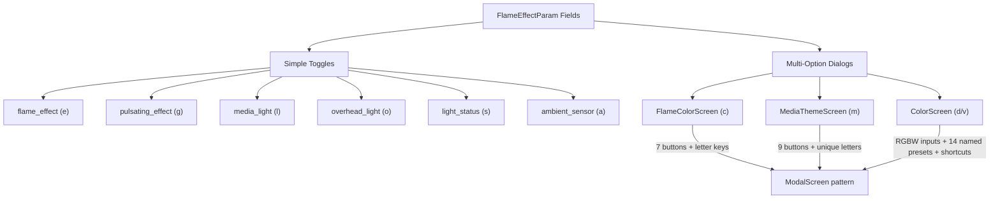
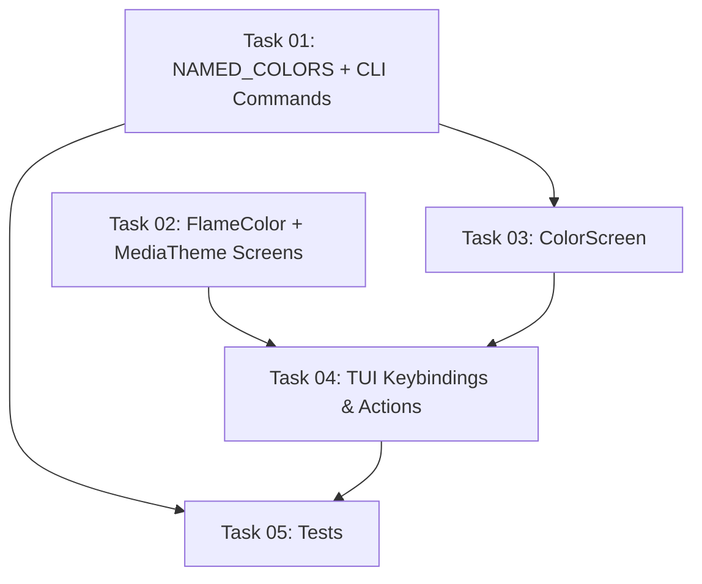

# Plan: Flame Effect Controls — Full CLI & TUI Coverage

## Original Work Order

> Implement CLI and TUI controls for all flame effect settings. In the TUI, settings that are not just a simple toggle of two states should show a dialog with available options. For media theme, a unique letter should be able to be typed directly in the dialog to select a theme (as well as tabbing through, like with flame speed). For colours, users should be able to input the RGBW numbers, as well as select from different named colours of (Light | Dark) (Red | Yellow | Green | Cyan | Blue | Purple | Pink)

## Plan Clarifications

| Question | Answer |
|----------|--------|
| Should the colour dialog named presets have keyboard shortcuts (lowercase=dark, Shift+letter=light), or is tab/click sufficient? | Keyboard shortcuts confirmed — lowercase for dark presets, Shift+letter for light presets, consistent with the media theme dialog pattern. |

## Executive Summary

This plan adds CLI set commands and TUI keybindings for every remaining field in `FlameEffectParam` (parameter 322). Seven new CLI set commands cover the gaps (`flame-effect`, `media-light`, `media-color`, `overhead-light`, `overhead-color`, `light-status`, `ambient-sensor`). On the TUI side, ten new keybindings are added: six simple on/off toggles and four dialog interactions backed by three new modal dialog screens — a flame-color selector, a media-theme selector with single-letter shortcuts, and a reusable RGBW colour picker (used for both media and overhead colour) with both numeric input and 14 named presets.

The approach follows the established patterns: CLI handlers use the read-modify-write pattern with `dataclasses.replace()`; TUI toggles mirror the existing `action_toggle_brightness` pattern; and new modal dialogs extend the `FlameSpeedScreen` pattern with `ModalScreen[T | None]`.

## Context

### Current State vs Target State

| Current State | Target State | Why? |
|---|---|---|
| CLI supports 10 set commands; 7 FlameEffectParam fields have no CLI command | All 12 FlameEffectParam fields have CLI set commands | Complete control of all flame settings from the command line |
| TUI has 8 keybindings; only flame speed and brightness are controllable for flame effects | TUI has 18 keybindings covering all FlameEffectParam fields | Users can adjust every flame setting without leaving the TUI |
| No TUI dialog for flame color (7 options) | Modal dialog with button per colour and letter shortcuts | Multi-option settings need selection UI, not blind cycling |
| No TUI dialog for media theme (9 options) | Modal dialog with unique letter shortcuts per theme | Quick keyboard-driven theme selection |
| No TUI colour input for media/overhead RGBW | Reusable colour dialog with RGBW numeric input and 14 named presets with keyboard shortcuts | Users need both precise RGBW control and quick named-colour access |
| Pulsating effect has CLI set command but no TUI keybinding | TUI toggle keybinding for pulsating | Parity between CLI and TUI |

### Background

Plan 02 (completed) established the read-modify-write pattern, `dataclasses.replace()` refactor, and the `FlameSpeedScreen` modal dialog pattern. This plan extends that foundation to achieve complete FlameEffectParam coverage. Sound and LogEffect parameters remain out of scope.

The `Brightness` enum only has `HIGH`(0) / `LOW`(1) in our model. The API report shows `FlickerHigh`(2) / `FlickerLow`(3) values exist but are not yet modelled — these remain out of scope.

Wire protocol note: `brightness` and `pulsating_effect` are packed into the same wire byte (offset 2 of parameter 322) via bit-packing (`brightness` = bit 0, `pulsating_effect` = bit 1). The read-modify-write pattern with `dataclasses.replace()` preserves both fields correctly because the full `FlameEffectParam` is always read before modification and the protocol encoder repacks both fields.

## Architectural Approach

### CLI: Seven New Set Commands

**Objective**: Add CLI `set` handlers for all remaining FlameEffectParam fields so every setting is controllable from the command line.

New commands follow the identical read-modify-write pattern already established:

| Command | Valid Values | Handler |
|---------|-------------|---------|
| `flame-effect` | `on`, `off` | `_set_flame_effect()` |
| `media-light` | `on`, `off` | `_set_media_light()` |
| `media-color` | RGBW `R,G,B,W` or named preset `light-red` | `_set_media_color()` |
| `overhead-light` | `on`, `off` | `_set_overhead_light()` |
| `overhead-color` | RGBW `R,G,B,W` or named preset `dark-blue` | `_set_overhead_color()` |
| `light-status` | `on`, `off` | `_set_light_status()` |
| `ambient-sensor` | `on`, `off` | `_set_ambient_sensor()` |

For colour commands, the value is either four comma-separated integers (`255,0,0,0`) or a named preset string (`light-red`, `dark-cyan`, etc.). A shared lookup dict `NAMED_COLORS` (defined in `models.py` alongside `RGBWColor`) maps the 14 named presets to `RGBWColor` instances. Both CLI and TUI import from this single location. The `_SET_PARAM_NAMES` constant and argparse help text are updated accordingly.

### TUI: Ten New Keybindings

**Objective**: Add TUI keybindings for all FlameEffectParam fields not yet controllable, using toggles for binary settings and modal dialogs for multi-option settings.

Proposed keybinding assignments (no conflicts with existing q, r, p, f, b, h, t, u):

| Key | Action | Type |
|-----|--------|------|
| `e` | Flame effect on/off | Toggle |
| `g` | Pulsating effect on/off | Toggle |
| `c` | Flame color | Dialog |
| `m` | Media theme | Dialog |
| `l` | Media (fuel bed) light on/off | Toggle |
| `d` | Media (fuel bed) color | Dialog |
| `o` | Overhead light on/off | Toggle |
| `v` | Overhead color | Dialog |
| `s` | Light status on/off | Toggle |
| `a` | Ambient sensor on/off | Toggle |

Toggle actions follow the `action_toggle_brightness` pattern exactly: check `_write_in_progress`, read cached `FlameEffectParam`, flip the enum value via `dataclasses.replace()`, write, refresh.

The Textual `Footer` widget already renders all bindings from the `BINDINGS` list automatically. The existing manual status bar in `DashboardScreen._update_display()` should be updated to show the new bindings in a condensed format. If the 18 bindings exceed reasonable terminal widths, the manual status bar can be simplified to show only the most common controls or removed entirely in favour of the `Footer` widget.

### TUI Dialog: FlameColorScreen

**Objective**: Provide a modal selection dialog for the 7 flame colour presets.

Follows the `FlameSpeedScreen` pattern: a `ModalScreen[FlameColor | None]` with 7 buttons (one per `FlameColor` enum value). The current colour is highlighted with `variant="primary"`. Keybindings for direct selection:

| Key | Colour |
|-----|--------|
| `a` | All |
| `y` | Yellow/Red |
| `w` | Yellow/Blue |
| `b` | Blue |
| `r` | Red |
| `e` | Yellow |
| `d` | Blue/Red |

Escape cancels. Button click or key press dismisses with the selected value. File: `src/flameconnect/tui/flame_color_screen.py`.

### TUI Dialog: MediaThemeScreen

**Objective**: Provide a modal selection dialog for the 9 media theme presets with unique single-letter shortcuts.

Same `ModalScreen[MediaTheme | None]` pattern. Unique letter assignments:

| Key | Theme |
|-----|-------|
| `u` | User Defined |
| `w` | White |
| `b` | Blue |
| `p` | Purple |
| `r` | Red |
| `g` | Green |
| `i` | Prism |
| `k` | Kaleidoscope |
| `m` | Midnight |

Each button label includes the shortcut letter in brackets (e.g., `[U] User Defined`). The current theme is highlighted. Escape cancels. File: `src/flameconnect/tui/media_theme_screen.py`.

### TUI Dialog: ColorScreen (Reusable RGBW Picker)

**Objective**: Provide a modal dialog for setting RGBW colour values, used by both media colour and overhead colour keybindings.

The `ColorScreen` is a `ModalScreen[RGBWColor | None]` that offers two input modes:

1. **Named presets**: 14 buttons arranged as two rows (Dark row, Light row) of 7 buttons each. Clicking a button dismisses with the corresponding `RGBWColor`. Keyboard shortcuts: lowercase selects the dark variant, Shift+letter (uppercase) selects the light variant. *(See Plan Clarifications.)*

2. **RGBW numeric input**: Four `Input` widgets (R, G, B, W) pre-populated with the current values. A "Set" button applies the entered values. Validation ensures 0-255 range.

Named colour preset RGBW values (defined in `NAMED_COLORS` in `models.py`):

| Colour | Dark (R,G,B,W) | Light (R,G,B,W) |
|--------|----------------|-----------------|
| Red | 180, 0, 0, 0 | 255, 0, 0, 80 |
| Yellow | 180, 120, 0, 0 | 255, 200, 0, 80 |
| Green | 0, 180, 0, 0 | 0, 255, 0, 80 |
| Cyan | 0, 180, 180, 0 | 0, 255, 255, 80 |
| Blue | 0, 0, 180, 0 | 0, 0, 255, 80 |
| Purple | 128, 0, 180, 0 | 180, 0, 255, 80 |
| Pink | 180, 0, 80, 0 | 255, 0, 128, 80 |

The dialog constructor takes `current: RGBWColor` and `title: str` (e.g., "Fuel Bed Color" or "Overhead Color") so it can be reused by both keybindings.

Keyboard shortcut mapping for named presets:

| Key | Dark Preset | Shift+Key | Light Preset |
|-----|-------------|-----------|--------------|
| `r` | Dark Red | `R` | Light Red |
| `y` | Dark Yellow | `Y` | Light Yellow |
| `g` | Dark Green | `G` | Light Green |
| `c` | Dark Cyan | `C` | Light Cyan |
| `b` | Dark Blue | `B` | Light Blue |
| `p` | Dark Purple | `P` | Light Purple |
| `k` | Dark Pink | `K` | Light Pink |

Escape cancels. File: `src/flameconnect/tui/color_screen.py`.

### Tests

All new CLI handlers and TUI actions require tests following the established patterns in `test_cli_set.py` and `test_tui_actions.py`. Each CLI handler needs at least: one happy-path test and one invalid-value test. Each TUI toggle/dialog action needs at least: one happy-path test and a guard test (write-in-progress or missing parameter).

## Risk Considerations and Mitigation Strategies

Technical Risks

- **Keybinding conflicts**: Ten new keybindings added to the TUI. Letters chosen (e, g, c, m, l, d, o, v, s, a) do not conflict with existing bindings (q, r, p, f, b, h, t, u). Modal dialog bindings are scoped to the dialog screen and cannot conflict with app-level bindings.
    - **Mitigation**: All keybindings verified against current `BINDINGS` list; modal bindings only active when dialog is open.

- **Named colour RGBW accuracy**: The 14 preset colours are approximations for RGBW LED hardware. Actual appearance depends on the physical LED hardware in the fireplace.
    - **Mitigation**: Values are sensible defaults based on standard LED colour mixing. Can be tuned with live testing on the actual fireplace.

- **Shift+letter in terminals**: Some terminal emulators may not distinguish between Shift+letter and plain uppercase input. Textual maps uppercase characters in `BINDINGS` to Shift+letter.
    - **Mitigation**: Textual handles this internally. The named preset buttons also support click/tab for users in environments where Shift detection is unreliable.

Implementation Risks

- **Status bar overflow**: 18 keybindings may exceed terminal width in the manual status bar string.
    - **Mitigation**: Textual's built-in `Footer` widget already renders all `BINDINGS` entries and handles overflow. The manual status bar can be simplified to show a condensed subset or removed.

- **ColorScreen complexity**: The RGBW input dialog is more complex than existing modals (combines buttons and input fields).
    - **Mitigation**: Textual's `Input` widget handles validation natively. Keep layout simple with vertical stacking: named presets grid on top, RGBW inputs below.

## Success Criteria

### Primary Success Criteria
1. All 12 FlameEffectParam fields have working CLI `set` commands with input validation
2. All 12 FlameEffectParam fields have working TUI keybindings (toggles or dialogs as appropriate)
3. Media theme dialog supports unique letter shortcuts for each theme
4. Colour dialog supports both RGBW numeric input and 14 named colour presets with keyboard shortcuts
5. All new functionality has passing tests following existing patterns
6. All quality gates pass: ruff, mypy --strict, pytest

## Resource Requirements

### Development Skills
- Python 3.13+ with async patterns
- Textual framework (ModalScreen, Input widgets, button layouts)
- Existing codebase patterns for read-modify-write parameter handling

### Technical Infrastructure
- Existing test fixtures (mock client, parameter factories)
- ruff, mypy, pytest toolchain already configured
- No new dependencies required

## Integration Strategy

All changes are additive. New CLI handlers are registered in the existing `cmd_set()` dispatcher. New TUI bindings extend the existing `BINDINGS` list and add action methods to `FlameConnectApp`. New modal screens are new files in `src/flameconnect/tui/`. The shared `NAMED_COLORS` dict is defined in `models.py` and imported by both CLI and TUI code.

## Task Dependency Visualization

## Execution Blueprint

**Validation Gates:**
- Reference: `/config/hooks/POST_PHASE.md`

### ✅ Phase 1: Foundation & Independent Dialogs
**Parallel Tasks:**
- ✔️ Task 01: Add NAMED_COLORS lookup and 7 new CLI set commands
- ✔️ Task 02: Create FlameColorScreen and MediaThemeScreen modal dialogs

### ✅ Phase 2: Colour Picker Dialog
**Parallel Tasks:**
- ✔️ Task 03: Create ColorScreen reusable RGBW colour picker (depends on: 01)

### ✅ Phase 3: TUI Integration
**Parallel Tasks:**
- ✔️ Task 04: Add 10 new TUI keybindings and action methods (depends on: 02, 03)

### ✅ Phase 4: Testing
**Parallel Tasks:**
- ✔️ Task 05: Add tests for new CLI commands and TUI actions (depends on: 01, 04)

### Post-phase Actions
- Run full quality gate: `ruff check && mypy --strict src && pytest`

### Execution Summary
- Total Phases: 4
- Total Tasks: 5
- Maximum Parallelism: 2 tasks (in Phase 1)
- Critical Path Length: 4 phases

## Notes

- Sound (`SoundParam`) and Log Effect (`LogEffectParam`) parameters remain out of scope for this plan.
- The `Brightness` FlickerHigh/FlickerLow variants (values 2-3) are not modelled and remain out of scope.
- The `pulsating_effect` field already has a CLI handler from Plan 02; only the TUI keybinding is new.
- The `flame_color` and `media_theme` fields already have CLI handlers from Plan 02; only the TUI dialogs are new.

### Change Log
- 2026-02-23: Initial plan created.
- 2026-02-23: Refinement pass — fixed numeric inconsistencies (7 new CLI commands not 6; 6 toggles not 5; 8 existing TUI bindings not 7; 18 target bindings not 17). Added Plan Clarifications section. Decided `NAMED_COLORS` lives in `models.py`. Added Shift+letter terminal risk. Specified file names for new TUI screens. Added wire protocol bit-packing note for brightness/pulsating. Clarified status bar mitigation strategy.
- 2026-02-23: Task generation — 5 tasks created, dependency graph and execution blueprint added.
- 2026-02-23: Execution completed — all 4 phases, 5 tasks, 210 tests passing.

## Execution Summary

**Status**: ✅ Completed Successfully
**Completed Date**: 2026-02-23

### Results
- All 12 FlameEffectParam fields now have working CLI `set` commands (7 new + 5 existing)
- All 12 FlameEffectParam fields now have TUI keybindings (10 new + 2 existing → 18 total app bindings)
- 3 new modal dialogs: FlameColorScreen (7 presets), MediaThemeScreen (9 presets with unique letter shortcuts), ColorScreen (14 RGBW presets with lowercase/Shift shortcuts + numeric input)
- NAMED_COLORS shared lookup dict with 14 Dark/Light colour presets
- 210 tests passing (41 new tests added), ruff clean, mypy clean on all new files

### Noteworthy Events
- Pre-existing mypy errors in `b2c_login.py` and `flame_speed_screen.py` were present before execution and remain unchanged — they are not in any files modified by this plan.
- The `_ButtonVariant` type alias pattern was introduced in FlameColorScreen to work around mypy strict mode rejecting string literals for Button `variant` parameter — reused in ColorScreen.

### Recommendations
- Consider implementing Sound (`SoundParam`) and Log Effect (`LogEffectParam`) controls as a follow-up plan.
- The `Brightness` FlickerHigh/FlickerLow variants (values 2-3) could be added when live testing on hardware confirms their behaviour.
- The pre-existing mypy errors in `b2c_login.py` and `flame_speed_screen.py` should be addressed separately.
