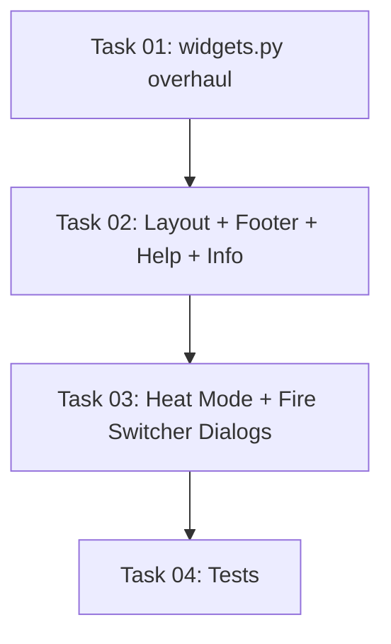

# Plan: TUI Visual Polish & Layout Restructuring

## Original Work Order

> I have multiple tasks. In the text UI, boost should show Off instead of `1min` when boost mode is not engaged. Research if it is best to show the status texts in all uppercase or sentence case, and standardize them to all be the same (as they are mixed right now). Move the top section with the fireplace info to the lower status bar. The lower status bar should instead show the fireplace info line, quit, refresh, and palette options. Also add a Help option bound to ? to show the right-hand "keys" panel that is currently available. Fix the fireplace ASCII art. See screenshot.png for the current behaviour. It should fill the container it's in, and improve to look more like a fireplace if possible.

## Plan Clarifications

| Question | Answer |
|----------|--------|
| By "palette" in the status bar, do you mean Textual's built-in command palette (Ctrl+P)? | Yes — the Textual command palette, which provides a searchable list of all available actions. |

## Executive Summary

This plan addresses nine visual and UX issues in the FlameConnect TUI: a boost duration display bug, inconsistent status text casing, a cluttered layout with redundant info placement, missing help panel access, a broken fireplace ASCII art visual, a non-functional heat mode cycling mechanism, missing brand/model metadata in the fireplace info display, and no ability to switch between fireplaces after startup.

The approach standardises all enum status values to Title Case (research-backed recommendation over uppercase — see Background), restructures the dashboard layout to move fireplace metadata into a condensed bottom info bar while removing the dense keybinding status bar in favour of Textual's native `HelpPanel` (toggled by `?`) and command palette (`Ctrl+P`), replaces the current ASCII fireplace art with a larger, container-filling design, replaces the broken heat mode cycling with a selection dialog supporting Normal, Eco, and Boost (with duration input), enhances the fireplace info display with brand and model, and adds a fireplace switcher dialog accessible via keybinding.

## Context

### Current State vs Target State

| Current State | Target State | Why? |
|---|---|---|
| Boost always shows `"1min"` even when boost mode is not engaged | Shows `"Off"` when `heat_mode != BOOST`, duration only when active | Misleading status display |
| Status values are mixed case: `.name` produces `"ON"`, `"KALEIDOSCOPE"`, `"FAN_ONLY"` (uppercase); lookup dicts produce `"High"`, `"Low"` (Title Case) | All status values use Title Case consistently (e.g., "On", "Kaleidoscope", "Fan Only") | Visual inconsistency hurts readability |
| `FireplaceInfo` widget sits at the top in a bordered section, taking vertical space | Fireplace info moves to bottom status bar as a condensed single line | Free up vertical space for the main content |
| Bottom has a dense 18-keybinding status bar + Textual Footer (redundant) | Bottom shows: fireplace info line, then Textual Footer with only `q`uit, `r`efresh, `?` Help, `Ctrl+P` Palette | Declutter — full bindings available via Help panel |
| No `?` keybinding for help | `?` toggles Textual's native `HelpPanel` showing all keybindings | Discoverability of the 18 keybindings |
| ASCII fireplace art is small, misaligned, doesn't fill its container (see screenshot) | Art fills the `#fireplace-visual` container and looks more like a fireplace | Visual quality |
| Heat mode `h` key cycles through 4 modes (incl. Fan Only) via `replace()` — changes don't actually apply on the fireplace; Boost has no duration prompt | `h` opens a selection dialog with Normal, Eco, Boost; Boost prompts for duration (1-20 min); uses read-modify-write with both `heat_mode` and `boost_duration` | Heat mode changes are non-functional; cycling is error-prone for modes requiring parameters |
| Fireplace info shows name, ID, and connection state — no brand or model | Info bar shows name, brand, model, connection state, and last-updated time | Brand and model are available from the API (`Fire.brand`, `Fire.product_model`) but never displayed; users with multiple fireplaces need to identify which product they're looking at |
| No way to switch fireplaces after the initial startup selection; user must quit and restart the TUI | A keybinding opens a dialog listing all connected fireplaces; selecting one switches the dashboard | Multi-fireplace users need to move between fireplaces without restarting |

### Background

**Text Casing Research**: UX research consistently shows that ALL CAPS text reduces reading speed by 13-20% and feels "shouted" ([How Letter Casing Affects Comprehension](https://uxdesign.cc/how-letter-casing-affects-comprehension-of-ui-content-34a21235cc73), [UPPERCASE in UI Design](https://medium.com/level-up-web/uppercase-in-ui-design-ea55f4ce2802)). For status values in dashboards, **Title Case** is the recommended convention — it provides clear visual hierarchy without the readability penalty of uppercase. This aligns with Home Assistant's display conventions (the downstream consumer of this library) and the existing Title Case values already used in some formatter lookup dicts. Google uses Sentence Case; Apple uses Title Case. For short status labels like "On", "Off", "Boost", "Kaleidoscope", Title Case and Sentence Case are effectively identical.

**Textual Native Features**: Textual provides `action_show_help_panel()` and `action_hide_help_panel()` which mount/unmount a `HelpPanel` widget displaying all registered `BINDINGS`. However, `action_show_help_panel()` is show-only (silently no-ops if already visible), so a custom toggle action is needed for the `?` key. The command palette (`Ctrl+P`, via `ENABLE_COMMAND_PALETTE = True`) is already active by default. Both features eliminate the need for the manual keybinding status bar.

**Boost Duration Semantics**: `HeatParam.boost_duration` always holds a value (minimum 1 from the wire protocol). The `heat_mode` field indicates whether boost is actually engaged. When `heat_mode != HeatMode.BOOST`, the duration is irrelevant and should display as "Off".

**Fireplace Metadata**: The `Fire` dataclass in `models.py` (line 167) includes `brand: str`, `product_type: str`, `product_model: str`, and `item_code: str` — all populated from the API response in `client.get_fires()` (line 145 in `client.py`). The `FireOverview` returned by `get_fire_overview()` also contains the full `Fire` object, so brand/model are available on every refresh cycle without extra API calls. Currently, `DashboardScreen.__init__` only receives `fire_id` and `fire_name` — not the full `Fire` object — so brand/model aren't accessible at display time. The fix is to pass the full `Fire` object (or add brand/model parameters) to `DashboardScreen`.

**Fireplace Switching**: The startup selector in `app.py` (`_load_fires`, line 81) shows an `OptionList` on a plain screen. Once a fireplace is selected, `_push_dashboard(fire)` pushes a `DashboardScreen` and the selection UI is no longer accessible. To switch fireplaces, the app must pop the current `DashboardScreen`, push a new one for the selected fire, and update `self.fire_id` (used by all action methods for writes). The `self.fires` list is already cached on the app instance from the initial load.

**Heat Mode Write Issue**: The current `action_cycle_heat_mode` in `app.py` (line 768) cycles through `[NORMAL, BOOST, ECO, FAN_ONLY]` using `replace(current, heat_mode=new_mode)`. This only modifies `heat_mode` while preserving the existing `boost_duration`. In practice, heat mode changes are not being applied by the fireplace — the cycling approach appears to be insufficient. Additionally, cycling through Boost without explicitly setting `boost_duration` is semantically incorrect (the fireplace needs a valid duration for Boost mode). The CLI `_set_heat_mode` (line 577 in `cli.py`) has the same `replace(current, heat_mode=...)` pattern and the same limitation. The wire protocol (`_encode_heat_settings` in `protocol.py`) encodes all fields (status, mode, temperature, boost_duration) in every write — so the write payload itself is complete. The root cause likely relates to the fireplace requiring `boost_duration` to be explicitly set when transitioning to Boost, and possibly requiring `heat_status` to be `ON` for mode changes to take effect. The selection dialog approach eliminates cycling (which was unreliable) and ensures Boost always includes a user-specified duration.

## Architectural Approach

```mermaid
graph TD
    A[widgets.py] --> A1["Fix _format_heat boost display"]
    A --> A2["Add _display_name() helper"]
    A --> A3["Update all 15 .name refs + connection state"]
    A --> A4["Redesign FireplaceVisual art"]
    A --> A5["Remove FireplaceInfo widget class"]

    B[screens.py] --> B1["Remove FireplaceInfo from compose"]
    B --> B2["Render info in #status-bar directly"]
    B --> B3["Remove dense keybinding bar"]
    B --> B4["Update CSS: remove #fire-info styles"]

    C[app.py] --> C1["Add ? binding + toggle action"]
    C --> C2["Hide control bindings from Footer"]
    C --> C3["Set COMMAND_PALETTE_DISPLAY"]
    C --> C4["Replace action_cycle_heat_mode with dialog"]

    C --> C5["Add fireplace switcher binding + action"]

    D[heat_mode_screen.py] --> D1["HeatModeScreen modal: Normal / Eco / Boost"]
    D --> D2["Boost duration Input (1-20 min)"]
    D --> D3["Return HeatMode + optional duration"]

    E[fire_select_screen.py] --> E1["FireSelectScreen modal: list all fires"]
    E --> E2["Show name, brand, model, connection"]
    E --> E3["Return selected Fire or None"]
```

### Boost Duration Bug Fix

**Objective**: Show "Off" for boost duration when boost mode is not engaged, and only show the duration in minutes when it is active.

The `_format_heat()` function in `widgets.py` currently unconditionally shows `f"Boost: {param.boost_duration}min"`. The fix checks `param.heat_mode`: if it equals `HeatMode.BOOST`, show the duration; otherwise show "Off". This requires importing `HeatMode` in the function body.

### Status Text Case Standardisation

**Objective**: Convert all status value displays from raw enum `.name` (UPPERCASE with underscores) to Title Case for visual consistency and readability.

Currently, 15 places in `widgets.py` use `.name` directly on enum values, producing strings like `"ON"`, `"KALEIDOSCOPE"`, `"YELLOW_RED"`, `"FAN_ONLY"`, `"NOT_CONNECTED"`, `"SOFTWARE_DISABLED"`. Meanwhile, three lookup dicts already use Title Case (`_MODE_DISPLAY`, `_BRIGHTNESS_NAMES`, `_PULSATING_NAMES`).

The approach adds a `_display_name(enum_value)` helper function that converts any enum's `.name` to Title Case by replacing underscores with spaces and applying `.title()` (e.g., `"YELLOW_RED"` → `"Yellow Red"`, `"FAN_ONLY"` → `"Fan Only"`). All 15 raw `.name` references are replaced with calls to this helper.

Regarding the three existing lookup dicts:
- **`_MODE_DISPLAY`**: Must be **kept** — it maps `FireMode.MANUAL` to the display string `"On"` (not `"Manual"`), which is an intentional UX override.
- **`_BRIGHTNESS_NAMES`** and **`_PULSATING_NAMES`**: Can be **removed** — `_display_name()` produces the same `"High"`, `"Low"`, `"On"`, `"Off"` results from the enum member names `HIGH`, `LOW`, `ON`, `OFF`.

The `_format_connection_state()` function (line 219-230 in `widgets.py`) also uses `.name` on `ConnectionState` enum values. This should be updated to use `_display_name()` as well. The display name conversion must happen before the Rich colour markup wrapping (i.e., call `_display_name(state)` and then wrap the result in colour tags).

Additionally, `app.py` has 4 `.name` usages that should also use `_display_name()`:
- Line 108: `fire.connection_state.name` in the startup fireplace selector — replace with `_display_name(fire.connection_state)`.
- Line 572: `color.name.replace("_", " ").title()` in flame color log message — replace with `_display_name(color)`.
- Line 633: `theme.name.replace("_", " ").title()` in media theme log message — replace with `_display_name(theme)`.
- Line 794: `new_mode.name.replace("_", " ").title()` in heat mode log message — this method is being replaced by `action_set_heat_mode`, but the new `_apply_heat_mode` log message should use `_display_name()`.

The `_display_name()` helper should be importable from `widgets.py` (or duplicated as a tiny utility) for use in `app.py`.

### Layout Restructuring

**Objective**: Move fireplace metadata from the top bordered section to the bottom status bar, and replace the dense keybinding bar with a clean info line.

**Changes to `widgets.py`**:
- Delete the `FireplaceInfo` widget class (lines 254-271) — it becomes unused once the info is rendered directly in the status bar.
- Remove `FireplaceInfo` from the `__all__` or import surface.

**Changes to `DashboardScreen.compose()` in `screens.py`**:
- Remove `yield FireplaceInfo(id="fire-info")` from the layout
- Remove the `FireplaceInfo` import
- The `#status-bar` Static at the bottom becomes the fireplace info bar

**Changes to `_update_display()` in `screens.py`**:
- Replace the current keybinding text update with a condensed fireplace info line in `#status-bar`
- Remove `self.query_one("#fire-info", FireplaceInfo)` and its property updates
- The exact format includes brand and model (see Enhanced Fireplace Info section): `f"[bold]{name}[/bold] | {brand} {model} | {connection} | Updated: {time}"` — gracefully omit brand/model segment if empty

**CSS updates**:
- Remove `#fire-info` styles (height, padding, border)
- Adjust `#dashboard-container` padding if needed

### Help Panel & Footer Simplification

**Objective**: Add a `?` keybinding to toggle Textual's native `HelpPanel`, and reduce the Footer to show only essential bindings.

**`?` Keybinding**: Add a binding `("question_mark", "toggle_help", "Help")` to `FlameConnectApp.BINDINGS`. This must invoke a **custom** `action_toggle_help()` method because Textual's built-in `action_show_help_panel()` is show-only (silently no-ops if the panel is already visible — it does not toggle). The custom action should check if a `HelpPanel` is mounted: if yes, call `action_hide_help_panel()`; if no, call `action_show_help_panel()`.

**Footer Simplification**: Most of the 18 control bindings should be hidden from the Footer using `show=False` in the `Binding` constructor, so the Footer only shows: `q` Quit, `r` Refresh, `?` Help. The command palette binding (`Ctrl+P`) is displayed by Textual automatically when `COMMAND_PALETTE_DISPLAY` is set on the App class. All hidden bindings remain fully functional and are discoverable via the Help panel.

Set `COMMAND_PALETTE_DISPLAY = "Palette"` as a class variable on `FlameConnectApp`. This causes Textual to render the command palette trigger in the Footer alongside the other visible bindings.

The Textual `Binding` class supports a `show` parameter: `Binding(key, action, description, show=False)` hides the binding from the Footer while keeping it active. The existing tuple shorthand `("key", "action", "desc")` should be expanded to `Binding(...)` for entries that need `show=False`.

### Fireplace ASCII Art Improvement

**Objective**: Replace the current small, misaligned ASCII art with a larger design that fills the `#fireplace-visual` container and looks more like a fireplace.

The current `FireplaceVisual.render()` returns a fixed 12-line, 24-character-wide string that doesn't fill the container it lives in (the `1fr`-wide bordered panel). The screenshot shows it leaving significant empty space.

The improved design should:
- Be wider and taller to better fill the container (target ~40-50 chars wide, ~16-20 lines tall)
- Include a more recognizable fireplace shape: a mantel/surround frame, a firebox opening, flame shapes inside, and a hearth/base
- Use Rich markup for colour: red/yellow/orange for flames, dim grey for the stone/brick surround
- Continue to use the `Static` widget's `render()` method (no animation needed)

The `#fireplace-visual` CSS should be updated to ensure the art centres within its container, with `content-align: center middle;` and appropriate sizing.

### Heat Mode Selection Dialog

**Objective**: Replace the non-functional `action_cycle_heat_mode` with a selection dialog offering Normal, Eco, and Boost modes. Boost requires a duration input (1-20 minutes).

**Problem**: The current `h` keybinding cycles through `[NORMAL, BOOST, ECO, FAN_ONLY]` using `replace(current, heat_mode=new_mode)`. Heat mode changes are not being applied by the fireplace. Additionally, cycling into Boost without setting a meaningful `boost_duration` is semantically invalid — the fireplace requires a duration for Boost mode.

**New file: `heat_mode_screen.py`** — follows the `FlameSpeedScreen` pattern:
- `HeatModeScreen(ModalScreen[tuple[HeatMode, int | None] | None])` — a modal dialog that returns a `(mode, boost_minutes)` tuple or `None` on cancel.
- Constructor accepts `current_mode: HeatMode` and `current_boost: int` to highlight the active selection.
- Layout: title showing current mode, three buttons (Normal, Eco, Boost) arranged horizontally, and a conditionally-visible boost duration input.
- Keyboard shortcuts: `n` for Normal, `e` for Eco, `b` for Boost, `escape` to cancel.
- When Normal or Eco is pressed, dismiss immediately with `(mode, None)`.
- When Boost is pressed, show/focus a numeric `Input` widget for duration (1-20 minutes, pre-filled with the current `boost_duration`). An `Enter` keypress or "Confirm" button dismisses with `(HeatMode.BOOST, duration)`. Validation ensures 1 ≤ duration ≤ 20. If the user changes their mind while the duration input is visible, pressing `n` or `e` should dismiss immediately with that mode (no need to press Escape first).
- Only three modes are offered: Normal, Eco, Boost. Fan Only and Schedule are intentionally excluded from the user-facing dialog.

**Changes to `app.py`**:
- Replace `action_cycle_heat_mode` with `action_set_heat_mode` that opens the `HeatModeScreen` dialog (following the `action_set_flame_speed` / `FlameSpeedScreen` pattern).
- The callback receives `(mode, boost_minutes)` or `None`. On non-None result, call `_apply_heat_mode(mode, boost_minutes)`.
- `_apply_heat_mode` does a read-modify-write: fetch current `HeatParam`, then `replace(current, heat_mode=mode, boost_duration=boost_minutes)` when Boost, or `replace(current, heat_mode=mode)` when Normal/Eco.
- Update the `BINDINGS` entry for `h` from `"cycle_heat_mode"` to `"set_heat_mode"`.

**Changes to CLI `_set_heat_mode` in `cli.py`**:
- Restrict the valid modes to `normal`, `eco`, `boost` (remove `fan-only` from `_HEAT_MODE_LOOKUP`).
- For Boost, the duration is encoded in the value argument using colon syntax: `set <fire_id> heat-mode boost:15` (boost for 15 minutes). This preserves the existing 3-positional-arg argparse structure (`fire_id`, `param`, `value`). The `_set_heat_mode` function parses the value: if it starts with `boost:`, split on `:` to extract mode and duration; otherwise treat as a plain mode name. Validation ensures 1 ≤ duration ≤ 20.
- When writing Boost, use `replace(current, heat_mode=HeatMode.BOOST, boost_duration=minutes)`. For Normal/Eco, use `replace(current, heat_mode=mode)` as before.
- CLI syntax examples: `set <id> heat-mode normal`, `set <id> heat-mode eco`, `set <id> heat-mode boost:15`.

### Enhanced Fireplace Info (Brand & Model)

**Objective**: Show the fireplace name, brand, and model in the info display so users can identify which product they're controlling.

**Problem**: The `Fire` dataclass has `brand` and `product_model` fields populated from the API, but neither the TUI nor the status bar displays them. Users with multiple fireplaces (or unfamiliar setups) cannot identify the product.

**Changes to `DashboardScreen` in `screens.py`**:
- Replace the `fire_id: str` and `fire_name: str` constructor parameters with a single `fire: Fire` parameter. Store as `self._fire`. Derive `self.fire_id = fire.fire_id` and `self.fire_name = fire.friendly_name` from it for backwards-compatible access. This gives the screen access to `brand` and `product_model` without extra parameters.
- In `_update_display()`, use `self._fire` for brand/model (which are static) and `overview.fire` for connection state (which changes). The status bar format: `f"[bold]{name}[/bold] | {brand} {model} | {connection} | Updated: {time}"`. If brand or model is empty, omit that segment gracefully.

**Changes to `_push_dashboard` in `app.py`**:
- Pass the full `Fire` object to `DashboardScreen` instead of just `fire.fire_id` and `fire.friendly_name`.

### Fireplace Switcher Dialog

**Objective**: Allow users to switch between connected fireplaces without restarting the TUI.

**New file: `fire_select_screen.py`** — follows the `FlameSpeedScreen` modal pattern:
- `FireSelectScreen(ModalScreen[Fire | None])` — a modal dialog that returns the selected `Fire` or `None` on cancel.
- Constructor accepts `fires: list[Fire]` and `current_fire_id: str` to highlight the currently active fireplace.
- Layout: a title ("Switch Fireplace"), and a vertical list of buttons — one per fireplace. Each button shows the fireplace's friendly name, brand, model, and connection state. The currently active fireplace's button uses the `"primary"` variant.
- Keyboard shortcuts: number keys `1`-`9` for quick selection (matching button order), `escape` to cancel.
- On button press or number key: dismiss with the selected `Fire` object. If the selected fire is the same as the current one, dismiss with `None` (no-op).

**Changes to `app.py`**:
- Add a new keybinding: `Binding("w", "switch_fire", "Switch Fire", show=False)` — `w` is mnemonic for "sWitch" and is not currently bound.
- `action_switch_fire()` opens the `FireSelectScreen` dialog, passing `self.fires` and `self.fire_id`.
- The callback receives `Fire | None`. On non-None result:
  1. Pop the current `DashboardScreen` via `self.pop_screen()`.
  2. Update `self.fire_id` to the new fire's ID.
  3. Call `self._push_dashboard(fire)` with the new `Fire` object.
- This reuses the existing `_push_dashboard` method (updated per the Enhanced Fireplace Info section to accept a full `Fire` object).

**Fresh fire list**: `action_switch_fire` should re-fetch `self.fires = await self.client.get_fires()` before opening the dialog, so that connection states and any newly added/removed fireplaces are current. The `get_fires()` call is lightweight (single API request).

**Guard**: If `self.fires` has only one entry (after re-fetch), `action_switch_fire` should notify "Only one fireplace available" and return without opening the dialog.

## Risk Considerations and Mitigation Strategies

Technical Risks

- **Title Case edge cases**: Some enum names may not convert cleanly (e.g., single-letter names or abbreviations).
    - **Mitigation**: All 13 enums in `models.py` were reviewed — all use standard `UPPER_SNAKE_CASE` naming. `_display_name()` handles them correctly. The one override (`MANUAL` → `"On"`) is handled by the retained `_MODE_DISPLAY` lookup.

- **Help panel interaction with modal dialogs**: The `?` keybinding could conflict with modal dialog keybindings.
    - **Mitigation**: Textual's binding system naturally scopes bindings to the active screen. Modal screens override app-level bindings, so `?` won't fire when a modal is open. The `action_toggle_help` method also guards against non-DashboardScreen contexts.

- **Heat mode writes not taking effect**: The root cause of heat mode changes not applying is not fully determined — the wire protocol encodes all fields correctly, so the issue may be fireplace-side behaviour (e.g., requiring `heat_status=ON` or a specific field combination).
    - **Mitigation**: The selection dialog ensures Boost always includes a valid duration. If mode writes still fail after the dialog change, the issue is in the protocol/fireplace interaction, not the TUI. The dialog approach is still an improvement over cycling regardless.

- **Fireplace switcher state leakage**: Popping a `DashboardScreen` and pushing a new one could leave stale state (e.g., log handler, timer intervals, cached parameters).
    - **Mitigation**: `DashboardScreen.on_unmount()` already removes the log handler. The new screen starts fresh with `_initial_load`. The `_previous_params` dict resets in the new instance. No shared mutable state exists between screen instances.

Implementation Risks

- **Footer `show=False` syntax**: The existing BINDINGS list uses 3-tuples. Switching entries to `Binding(...)` objects requires importing `Binding` from `textual.app`.
    - **Mitigation**: Textual supports mixing tuple and Binding entries in the BINDINGS list. Only entries that need `show=False` need to be converted. Verified via Textual API inspection.

- **ASCII art terminal width**: Different terminal sizes may truncate the wider fireplace art.
    - **Mitigation**: Target 40-50 chars wide which fits standard 80-column terminals. The `1fr` container width adapts to terminal size, and the art is centered.

## Success Criteria

### Primary Success Criteria
1. Boost shows "Off" when `heat_mode` is not `BOOST`, and shows duration only when active
2. All status text values display in consistent Title Case (no raw UPPERCASE enum names visible)
3. Fireplace info appears in the bottom status bar, not in a top bordered section
4. Footer shows only: Quit, Refresh, Help, and Palette — all other bindings hidden but functional
5. `?` key toggles Textual's native HelpPanel (show/hide) showing all keybindings
6. Fireplace ASCII art fills its container and renders correctly
7. `h` key opens a heat mode selection dialog with Normal, Eco, and Boost options; Boost prompts for duration (1-20 min)
8. CLI `set heat-mode` supports `normal`, `eco`, and `boost:<minutes>` (no `fan-only`)
9. Status bar info line shows fireplace name, brand, model, connection state, and last-updated time
10. `w` key opens a fireplace switcher dialog; selecting a different fire replaces the dashboard
11. All quality gates pass: `ruff check`, `mypy --strict`, `pytest`

## Resource Requirements

### Development Skills
- Python with Textual framework (Binding, HelpPanel, CSS layout)
- ASCII art design with Rich markup
- Existing codebase patterns for parameter formatting

### Technical Infrastructure
- Existing test fixtures and toolchain (ruff, mypy, pytest)
- No new dependencies required — all features use Textual built-ins

## Integration Strategy

Most changes are to existing TUI files (`widgets.py`, `screens.py`, `app.py`). Two new files are needed: `heat_mode_screen.py` for the heat mode selection dialog and `fire_select_screen.py` for the fireplace switcher dialog (both following the `flame_speed_screen.py` pattern). The `_display_name()` helper is a module-level function in `widgets.py` — it must be added to the import surface (exported from widgets) since `app.py` also needs it for 4 log-message `.name` usages. Existing tests in `test_tui_actions.py` and `test_cli_set.py` do not assert on status display text strings, so no test modifications are needed for the casing or layout changes. The heat mode dialog replaces `action_cycle_heat_mode` — the existing `TestCycleHeatMode` test class in `test_tui_actions.py` must be updated to test the new dialog-based flow. The CLI `_set_heat_mode` changes (including `boost:<minutes>` parsing) require updates to the corresponding CLI test. The fireplace switcher requires testing that `action_switch_fire` re-fetches fires, pops/pushes screens, and updates `self.fire_id`. The `DashboardScreen` constructor change (accepting a `Fire` object instead of separate `fire_id`/`fire_name`) affects the test fixture setup in `test_tui_actions.py`.

## Dependency Visualization

## Execution Blueprint

**Validation Gates:**
- Reference: `/config/hooks/POST_PHASE.md`

### ✅ Phase 1: Widget Formatter Overhaul
**Parallel Tasks:**
- ✔️ Task 01: Overhaul widgets.py — formatters, display name helper, case standardisation, ASCII art, FireplaceInfo deletion

### ✅ Phase 2: Layout & Footer Restructuring
**Parallel Tasks:**
- ✔️ Task 02: Restructure layout, simplify footer, add help panel, enhance fireplace info (depends on: 01)

### ✅ Phase 3: Dialog Screens & CLI
**Parallel Tasks:**
- ✔️ Task 03: Add heat mode selection dialog, fireplace switcher dialog, CLI heat-mode update (depends on: 02)

### ✅ Phase 4: Tests
**Parallel Tasks:**
- ✔️ Task 04: Tests for heat mode dialog, fire switcher, CLI heat-mode, DashboardScreen constructor (depends on: 03)

### Execution Summary
- Total Phases: 4
- Total Tasks: 4
- Maximum Parallelism: 1 task (sequential pipeline — all tasks modify overlapping files)
- Critical Path Length: 4 phases

## Notes

- The `Binding` import from `textual.app` is needed alongside the existing `App` and `ComposeResult` imports in `app.py`.
- All 13 enums in `models.py` were verified to use standard `UPPER_SNAKE_CASE` member names. No special-case handling is needed in `_display_name()` beyond `name.replace("_", " ").title()`.

### Change Log
- 2026-02-24: Initial plan created.
- 2026-02-24: Refinement pass — specified custom `action_toggle_help` (Textual's `show_help_panel` doesn't toggle); clarified `_MODE_DISPLAY` must be kept while `_BRIGHTNESS_NAMES` and `_PULSATING_NAMES` can be removed; added `FireplaceInfo` widget class deletion to architecture; promoted `COMMAND_PALETTE_DISPLAY` and `_format_connection_state` from Notes into architecture sections; corrected Binding type (class, not namedtuple); verified no tests need changes for casing.
- 2026-02-24: Added heat mode selection dialog — replaces non-functional `action_cycle_heat_mode` with `HeatModeScreen` offering Normal, Eco, Boost (with duration input 1-20 min); removed Fan Only from user-facing options; updated CLI `_set_heat_mode` to support `boost <minutes>` syntax; added new `heat_mode_screen.py` file to architecture.
- 2026-02-24: Added fireplace switcher dialog (`fire_select_screen.py`, `w` keybinding) and enhanced fireplace info to show brand + model in status bar; `DashboardScreen` now receives full `Fire` object; documented `Fire` metadata fields available from API.
- 2026-02-24: Refinement pass — fixed CLI boost syntax to `boost:15` (preserves 3-arg argparse structure); consolidated status bar format across Layout Restructuring and Enhanced Info sections; expanded Status Text Case to cover 4 `.name` usages in `app.py`; specified `_display_name()` must be exported from `widgets.py`; added fire list re-fetch before switcher dialog; clarified HeatModeScreen allows switching from Boost input back to Normal/Eco directly; resolved `DashboardScreen` constructor ambiguity (single `Fire` param, not "or"); added fireplace switcher state leakage risk entry.

## Execution Summary

**Status**: ✅ Completed Successfully
**Completed Date**: 2026-02-24

### Results
All 4 phases executed successfully in sequence:
- **Phase 1** (`ccc86eb`): Overhauled `widgets.py` — added `_display_name()` helper, fixed boost display, standardised all 15 enum `.name` references to Title Case, removed `_BRIGHTNESS_NAMES`/`_PULSATING_NAMES`, deleted `FireplaceInfo` widget, redesigned fireplace ASCII art (48x16, Rich colour markup).
- **Phase 2** (`e21516e`): Restructured layout — moved fire info to status bar with brand/model, replaced keybinding bar with HelpPanel (`?` toggle), simplified Footer to Quit/Refresh/Help/Palette, converted BINDINGS to `Binding` class with `show=False`, updated `DashboardScreen` to accept `Fire` object.
- **Phase 3** (`3c7c7cd`): Created `HeatModeScreen` (Normal/Eco/Boost with duration input) and `FireSelectScreen` (fire switcher with re-fetch). Replaced `action_cycle_heat_mode` with dialog-based `action_set_heat_mode`. Updated CLI for `boost:N` syntax, removed `fan-only`.
- **Phase 4** (`0876e17`): Added 15 new tests — `TestSetHeatModeDialog`, `TestApplyHeatMode`, `TestSwitchFire`, CLI heat-mode tests. 225 total tests passing.

### Noteworthy Events
- Phase 1 required an immediate fix to `screens.py` because deleting `FireplaceInfo` from `widgets.py` broke the import in `screens.py`. The import removal and `compose()` update were done in Phase 1 to keep tests green, rather than waiting for Phase 2.
- Phase 3 agent proactively added core tests alongside the implementation (TestApplyHeatMode and CLI boost tests), reducing the scope needed for Phase 4.
- DashboardScreen test fixtures did not need updating — existing tests use `MagicMock(spec=DashboardScreen)` which bypasses the constructor.

### Recommendations
- Verify heat mode changes work on a real fireplace — the root cause of mode changes not applying may be fireplace-side, not TUI-side.
- Consider adding integration tests for the full dialog flow (open screen → select → verify write) once Textual's `Pilot` testing API is adopted.
