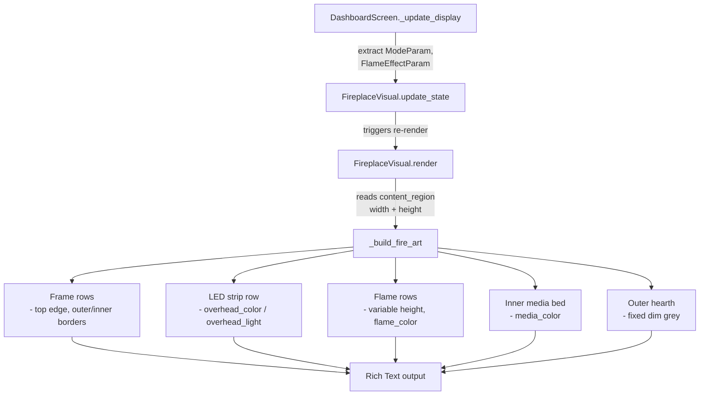
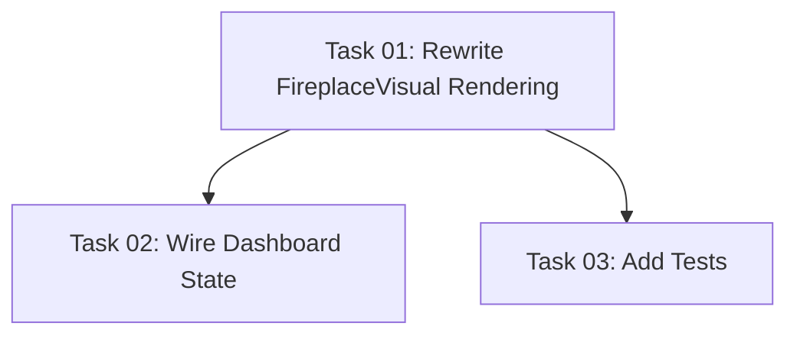

# Plan: Fireplace Visual Overhaul

## Original Work Order

> I'd like to update the fireplace representation. I'm pasting the ASCII I would like. I've also added a screenshot for colour reference called screenshot.png. The key components of the fireplace from top to bottom are the upper LED, the flames, and the media bed currently in red. Each of those will need to be able to be updated to match the actual state of the fireplace. Also, the height of the fireplace should adapt to the height of its container by reducing the height of the flames as needed.

## Plan Clarifications

| Question | Answer |
|---|---|
| The ASCII art has two `▓▓▓` rows — one inside the inner frame and one between the inner and outer frames. In the screenshot, the inner one is bright red while the outer one is light grey. Should the outer row also change color based on the media bed state? | Only the inner `▓` row reflects `media_color`. The outer `▓` row is a fixed structural color (dim grey), representing the hearth ledge. |

## Executive Summary

The current `FireplaceVisual` widget renders a static ASCII fireplace with hardcoded flame colors and no connection to the live fireplace state. This plan replaces it with a new design matching the user-provided ASCII art, where three distinct visual zones — upper LED strip, flames, and media bed — each reflect the actual parameter state (colors, on/off). The flame zone is the variable-height section that shrinks or grows to fill the container, while the structural frame (outer border, inner border, LED strip, media bed) always occupies a fixed number of rows.

The new design features a double-frame structure with multiple distinct flame columns spread across the width (matching the user's reference), replacing the current single-flame centered design.

The implementation modifies only the `FireplaceVisual` widget and its rendering function in `widgets.py`, plus the state-passing plumbing in `screens.py` to feed parameter data into the widget. No changes to the protocol, models, or client layers are needed.

## Context

### Current State vs Target State

| Current State | Target State | Why? |
|---|---|---|
| Static flame colors hardcoded in `_FLAME_DEFS` | Flame colors driven by `FlameColor` enum from `FlameEffectParam` | Visual should reflect actual fireplace flame color setting |
| No upper LED strip in the art | `░░░` LED strip row colored by `overhead_color` / `overhead_light` from `FlameEffectParam` | Matches real fireplace hardware which has an overhead LED |
| Coal bed rendered as dim `▓` characters | Inner media bed rendered as `▓` colored by `media_color` from `FlameEffectParam`; outer hearth row stays fixed dim grey | Matches the real colored media bed visible in the screenshot |
| Single centered flame design | Multiple flame columns spread across the width, matching the reference ASCII art | Matches the user's reference which shows ~8 distinct flame columns |
| Fixed number of flame rows (8) regardless of container height | Flame rows scale down to fit available container height | Prevents visual overflow when the panel is short |
| Single-border frame (`═`, `┌─┐`, `└─┘`, `█`) | Double-frame structure (outer + inner borders) matching user's ASCII art | Matches the user's reference design |
| Widget is a plain `Static` with no reactive state input | Widget accepts parameter data via an `update_state` method and re-renders when state changes | Required for the visual to stay in sync with the fireplace |
| Flames always shown regardless of fire mode | Flames shown only when `FireMode.MANUAL`; blank/dark when `FireMode.STANDBY` | Visual should reflect whether the fire is actually on |

### Background

The user provided both an ASCII art reference and a `screenshot.png` showing the color design. From the screenshot:

- **Upper LED strip**: rendered as `░░░` characters across the full inner width, colored to match `overhead_color` (appears as a golden/dark tone in the screenshot)
- **Flames**: multiple distinct flame columns using `( \ | / )` characters. Colors graduate from yellow tips at the top, through orange/white middles, to red bases at the bottom. Each column is independently shaped, with varying heights for a natural look. The specific color palette maps from the `FlameColor` enum presets
- **Inner media bed**: a full-width `▓▓▓` row inside the inner frame in bright red (matching `media_color` from `FlameEffectParam`)
- **Outer hearth row**: a full-width `▓▓▓` row between the inner and outer frames in fixed dim grey (structural, not state-driven — *per clarification*)

The ASCII art structure from top to bottom:
1. `▁▁▁` — thin top edge (full outer width)
2. `┌──┐` — outer frame top
3. `│┌──┐│` — inner frame top
4. `││░░░░││` — upper LED strip (1 row, state-driven color)
5. Empty rows + flame rows (variable height, state-driven color)
6. `││▓▓▓▓││` — inner media bed (1 row, state-driven color)
7. `│└──┘│` — inner frame bottom
8. `│▓▓▓▓│` — outer hearth (1 row, fixed dim grey)
9. `└──┘` — outer frame bottom

## Architectural Approach

The entire change is confined to two files: `widgets.py` (rendering) and `screens.py` (state plumbing).



### New ASCII Art Structure and Frame Rendering

**Objective**: Replace `_build_fire_art` with a new function that produces the user's double-frame design and adapts to container height.

The new rendering function builds the fireplace from structural constants. The frame chrome (top edge, outer border, inner border, LED strip, media bed, hearth, bottom) occupies a fixed number of rows. The available height minus the fixed rows gives the flame zone height. If the available height is unknown or too small, a sensible minimum (e.g. 4 flame rows) is used.

The width nesting is: outer width `w`, inner width between outer borders `w-2`, innermost width between inner borders `w-4`. The LED strip, flames, and inner media bed render at innermost width. The outer hearth renders at inner width.

The fixed structural rows are:
- Top edge (`▁` row): 1 row
- Outer frame top (`┌─┐`): 1 row
- Inner frame top (`│┌─┐│`): 1 row
- LED strip: 1 row
- Inner media bed (`▓`): 1 row
- Inner frame bottom (`│└─┘│`): 1 row
- Outer hearth (`▓`): 1 row
- Outer frame bottom (`└─┘`): 1 row

Total fixed: **8 rows**. Everything else is the flame zone (flames + blank spacing above flames).

### Flame Row Definitions and Scaling

**Objective**: Define the flame art to match the user's reference and scale the number of rendered rows based on available height.

The user's ASCII shows ~8 distinct flame columns spread across the width, each at varying heights, producing approximately 8 rows of flame art. Each row is defined as a list of atom groups (text, style, gap weight), reusing the existing `_expand_flame` gap-distribution algorithm to scale horizontally. The atom groups per row will define multiple flame columns per row (vs the current single-flame approach).

When the container provides fewer rows than the full 8, the renderer trims flame rows from the top (removing the tallest/most sparse tips first), preserving the denser base rows. When more rows are available, blank space is added above the flames.

### State-Driven Coloring

**Objective**: Make each visual zone reflect the live fireplace parameters.

The renderer accepts state information from `ModeParam` and `FlameEffectParam`:

1. **Upper LED**: Driven by `overhead_light` (on/off) and `overhead_color` (RGBW) from `FlameEffectParam`. When off, the LED strip renders as dim/dark. When on, the `░` characters are colored using an `rgb(r,g,b)` Rich style derived from the RGBW values.

2. **Flames**: Driven by `flame_color` from `FlameEffectParam` and `mode` from `ModeParam`. When `FireMode.STANDBY`, no flames are shown (blank area). When `FireMode.MANUAL`, flames render with colors mapped from the `FlameColor` enum:
   - `YELLOW_RED` (default): yellow tips → orange mid → red base (as in the screenshot)
   - `BLUE`: blue gradient
   - `RED`: red gradient
   - `YELLOW`: yellow gradient
   - `YELLOW_BLUE`: yellow tips → blue base
   - `BLUE_RED`: blue tips → red base
   - `ALL`: multi-color / rainbow

   Each flame row's atom groups reference a "tip", "mid", and "base" style slot. A color palette lookup maps `FlameColor` to concrete Rich color strings for these three slots.

3. **Inner media bed**: Driven by `media_color` (RGBW) from `FlameEffectParam`. The `▓` characters are colored using an `rgb(r,g,b)` Rich style derived from the RGBW values.

4. **Outer hearth**: Fixed dim grey, not state-driven (*per clarification*).

**RGBW-to-RGB mapping**: Textual/Rich supports 24-bit color via `rgb(r,g,b)` style strings. The white channel is blended by adding it equally to R, G, B, clamped to 255: `r' = min(r + w, 255)`, etc. This is a simple helper function.

### Widget State Interface

**Objective**: Pass live parameter data from the dashboard into the visual widget.

`FireplaceVisual` gains an `update_state` method (mirroring `ParameterPanel.update_parameters`) that accepts `ModeParam` and `FlameEffectParam` and stores them as instance attributes, then calls `refresh()`. `DashboardScreen._update_display` already iterates the parameters — it will extract the relevant params and pass them to the visual widget.

The widget uses `content_region.height` alongside `content_region.width` to determine the flame zone size during `render()`.

### Height Adaptation

**Objective**: The fireplace visual fills its container by adjusting the flame row count.

The widget reads `self.content_region.height` in `render()`. From the total available height it subtracts the 8 fixed structural rows to determine how many rows are available for the flame zone. The flame zone is then rendered with that many rows (clamping to a minimum of 2 and maximum of the full flame definition count). This works naturally with the existing `height: 100%` CSS on `#fireplace-visual`.

When height is 0 (first render before layout), fall back to a sensible default total height.

## Risk Considerations and Mitigation Strategies

<details>
<summary>Technical Risks</summary>

- **Terminal color support varies**: Not all terminals support 24-bit RGB color.
    - **Mitigation**: Rich/Textual automatically downgrades to 256-color or 8-color when needed. The `rgb(r,g,b)` style strings degrade gracefully.

- **Box-drawing characters may not render in all fonts**: The `░`, `▓`, `▁` characters require Unicode support.
    - **Mitigation**: The current implementation already uses Unicode box-drawing characters (`═`, `┌`, `│`, `▓`), so this is not a new risk.
</details>

<details>
<summary>Implementation Risks</summary>

- **Height detection may return 0 on first render**: Textual's `content_region` may not be sized before the first layout pass.
    - **Mitigation**: Fall back to a sensible default (e.g. 12 rows total) when height is 0, matching the current behavior.

- **Flame trimming may look awkward at very small sizes**: Below a certain threshold, the flames may not be recognizable.
    - **Mitigation**: Enforce a minimum flame row count (2 rows) and let the widget overflow gracefully if the container is truly tiny.
</details>

## Success Criteria

### Primary Success Criteria
1. The fireplace visual matches the user-provided ASCII art structure (double frame, LED strip, multiple flame columns, media bed)
2. Upper LED strip color reflects `overhead_color` / `overhead_light` from live state
3. Flame colors reflect `flame_color` from live state, and flames are hidden in standby mode
4. Inner media bed color reflects `media_color` from live state; outer hearth is fixed dim grey
5. Flame row count adapts to the available container height
6. All existing tests pass; new tests cover the rendering function with various parameter states

## Resource Requirements

### Development Skills
- Python with Rich/Textual framework knowledge for styled text rendering
- Understanding of the existing `_build_fire_art` and `_expand_flame` rendering pattern

### Technical Infrastructure
- Existing Textual and Rich dependencies (no new packages needed)
- Existing test infrastructure with pytest

## Task Dependencies



## Execution Blueprint

**Validation Gates:**
- Reference: `/config/hooks/POST_PHASE.md`

### ✅ Phase 1: Core Rendering Implementation
**Parallel Tasks:**
- ✔️ Task 01: Rewrite FireplaceVisual rendering with new ASCII art structure, state-driven coloring, height adaptation, and update_state method

### ✅ Phase 2: Integration and Testing
**Parallel Tasks:**
- ✔️ Task 02: Wire dashboard state to FireplaceVisual (depends on: 01)
- ✔️ Task 03: Add tests for new rendering function (depends on: 01)

### Execution Summary
- Total Phases: 2
- Total Tasks: 3
- Maximum Parallelism: 2 tasks (in Phase 2)
- Critical Path Length: 2 phases

## Execution Summary

**Status**: ✅ Completed Successfully
**Completed Date**: 2026-02-24

### Results
- Replaced the static single-flame `FireplaceVisual` with a new double-frame design featuring 7 multi-column flames, an upper LED strip, and an inner media bed
- Three state-driven zones wired to live `FlameEffectParam` and `ModeParam` data via `update_state()` method
- Flame zone scales vertically (8 row definitions, trims from top when container is small)
- 7 `FlameColor` palettes defined (tip/mid/base Rich style triplets)
- RGBW-to-RGB helper converts fireplace color values to Rich `rgb()` style strings
- 245 total tests passing (228 existing + 17 new rendering tests)

### Noteworthy Events
- Flame row atom groups can overflow width at very narrow sizes; width consistency test was adapted to verify `>=w` for flame-on mode and exact width for standby/structural rows
- Pre-existing lint errors in `screens.py` (lines 136, 229) were not introduced by this plan

### Recommendations
- Consider adding animation support for flame pulsating effect in a future plan
- The `FlameColor.ALL` palette could be enhanced with a multi-color per-column approach

## Notes

### Complexity Analysis
```
Task 01: Technical=5, Decision=4, Integration=3, Scope=5, Uncertainty=3 → Composite=5.0 → PASS
Task 02: Technical=2, Decision=1, Integration=2, Scope=2, Uncertainty=1 → Composite=2.0 → PASS
Task 03: Technical=3, Decision=2, Integration=2, Scope=3, Uncertainty=2 → Composite=3.0 → PASS
```
All tasks ≤5 — no decomposition required.

### Change Log
- 2026-02-24: Initial plan created
- 2026-02-24: Refined — clarified inner media bed vs outer hearth coloring (only inner is state-driven); noted multi-column flame design vs current single-flame; clarified `FlameEffectParam` as sole color source for media bed; updated mermaid diagram and state-driven coloring section
- 2026-02-24: Generated 3 tasks with execution blueprint (2 phases)
