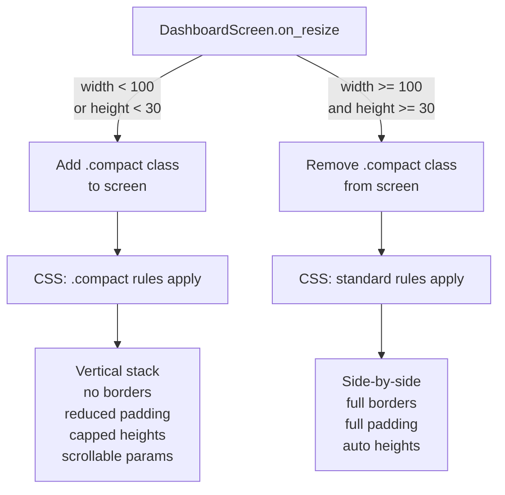
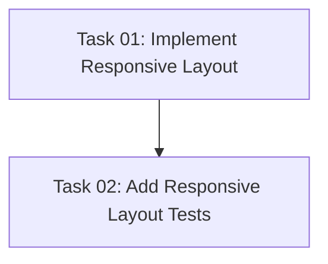

# Plan: Responsive TUI Layout

## Original Work Order

> The text UI does not work well at an 80x24 window size. The fireplace is unreadable and the messages window is not visible. Plan how to improve this so the UI is usable at 80x24, but responds well to larger terminal window sizes too to take advantage of the additional space.

## Plan Clarifications

| Question | Answer |
|---|---|
| Should modal screens (auth, fire select, color picker, etc.) also be made responsive? | No. The 7 modal screens use fixed-width dialogs (40–72 chars) by design and work fine at 80x24. Only `DashboardScreen` needs responsive treatment. |
| Can `layout: vertical` be applied via CSS to override a `Horizontal` container? | No. Verified in Textual 8.0.0 source: `Horizontal` sets `layout: horizontal` in its `DEFAULT_CSS`. While CSS specificity can technically override it, this fights the widget's purpose and is fragile. Use a generic `Container` instead and control direction entirely via CSS. |
| Can `Static` widgets (like `ParameterPanel`) support `overflow-y: auto` scrolling via CSS? | No. `Static` widgets don't have scroll functionality built-in. The `ParameterPanel` must be wrapped in a `VerticalScroll` container to enable scrolling in compact mode. |
| Does `on_resize` fire on initial mount? | Yes. Verified in Textual source — `Resize` events are posted to newly mounted widgets during the first compositor refresh, so the compact class will be applied immediately. |

## Executive Summary

At 80x24 the current dashboard layout requires ~28 vertical rows but only has 24 available. The side-by-side horizontal split gives the fireplace only ~25 characters of width (unreadable), and the messages panel is pushed completely off-screen. The root cause is a fixed layout designed for large terminals — side-by-side panels with borders, padding, and margins that consume excessive chrome at small sizes.

This plan introduces a responsive layout system using Textual's `on_resize` event to toggle a `.compact` CSS class based on terminal dimensions. At compact sizes (width < 100 or height < 30) the layout switches to vertical stacking with reduced chrome, making the fireplace readable at full width and keeping the messages panel visible. At larger sizes the current side-by-side layout is preserved with full styling.

The changes are confined to `screens.py`: the `compose()` method switches from `Horizontal` to a generic `Container` (for CSS-controllable layout direction), wraps `ParameterPanel` in a `VerticalScroll` (for scrolling in compact mode), adds an `on_resize` handler, and defines compact CSS rules. No changes to `widgets.py`, the protocol layer, or models are needed.

## Context

### Current State vs Target State

| Current State | Target State | Why? |
|---|---|---|
| Fixed side-by-side layout (1fr:2fr) at all sizes | Vertical stacking when terminal width < 100 | At 80 wide, the fireplace gets only ~25 chars — unreadable |
| Borders + padding on all panels (~4 rows overhead each) | Reduced chrome in compact mode (no borders, minimal padding) | Saves ~8 vertical rows, critical for fitting at 24 rows |
| Messages panel pushed off-screen at small heights | Messages panel always visible (smaller at compact sizes) | User explicitly wants to see messages |
| `#status-section` uses `Horizontal` container (hardcoded direction) | Generic `Container` with CSS-controlled `layout` direction | Enables switching between horizontal (standard) and vertical (compact) via CSS class |
| `ParameterPanel` is a bare `Static` (no scroll support) | `ParameterPanel` wrapped in `VerticalScroll` with `max-height` in compact mode | Prevents param panel from consuming all vertical space; content remains scrollable |
| `margin-top: 1` on messages label | No margin in compact mode | Saves 1 row |
| No `on_resize` handler | Resize handler toggles `.compact` CSS class based on terminal dimensions | Enables responsive layout switching |
| `#dashboard-container` has `padding: 1 2` always | Reduced padding in compact mode | Saves 2 vertical rows |

### Background

**Vertical budget at 80x24 (current layout — overflows by ~4 rows):**

| Component | Rows |
|---|---|
| Header + Footer | 2 |
| Container padding (top + bottom) | 2 |
| Status section: max(fireplace, params) with borders + padding | ~14 |
| Messages label + margin | 2 |
| Messages panel (border + min 4) | 6 |
| **Total** | **~26** (overflows 24 by ~2, plus fireplace unreadable at ~25 chars wide) |

**Vertical budget at 80x24 (proposed compact layout):**

| Component | Rows |
|---|---|
| Header + Footer | 2 |
| Fireplace visual (no border/padding, 10 content rows) | 10 |
| Parameter panel (no border, capped height, scrollable) | 7 |
| Messages label (no margin) | 1 |
| Messages panel (no border, min 2) | 3 |
| **Total** | **23** (fits in 24 with 1 row spare) |

**Scope note:** Only `DashboardScreen` needs responsive treatment. The 7 modal screens (`AuthScreen`, `FireSelectScreen`, `ColorScreen`, `FlameColorScreen`, `FlameSpeedScreen`, `HeatModeScreen`, `MediaThemeScreen`) use fixed-width dialogs (40–72 chars) centered on screen, which already work well at 80x24.

## Architectural Approach

### Responsive CSS Class Toggling

**Objective**: Detect terminal size changes and switch between compact and standard layouts dynamically.

Add an `on_resize` handler to `DashboardScreen` that adds or removes a `.compact` CSS class on the screen based on terminal dimensions. The threshold is `width < 100 or height < 30` for compact mode. This approach uses Textual's built-in CSS class system with descendant selectors (`.compact #widget-id`).

The `on_resize` event fires on initial mount (verified in Textual source — `Resize` events are posted to newly mounted widgets during the first compositor refresh) and on every terminal resize, so the layout adapts immediately without needing a separate `on_mount` handler.

### Container Type Change

**Objective**: Enable CSS-controlled layout direction switching for the status section.

Replace the `Horizontal` container for `#status-section` with a generic `Container` (from `textual.containers`). Textual's `Horizontal` widget hardcodes `layout: horizontal` in its `DEFAULT_CSS`, making CSS overrides fragile. A generic `Container` has no default layout, so direction is controlled entirely via CSS:

- **Standard mode**: `#status-section { layout: horizontal; }` (default rule)
- **Compact mode**: `.compact #status-section { layout: vertical; }` (override rule)

This is the only `compose()` structural change needed for direction switching.

### Parameter Panel Scroll Wrapper

**Objective**: Enable scrolling on the parameter panel in compact mode.

Textual's `Static` widget (which `ParameterPanel` extends) does not support `overflow-y: auto` scrolling natively. Wrap `ParameterPanel` in a `VerticalScroll` container in `compose()`. In standard mode, the scroll container's height is `auto` (no scrolling needed). In compact mode, `max-height` is applied so the content scrolls when it exceeds the available space.

The `VerticalScroll` wrapper is always present in the DOM but only constrains height in compact mode — no conditional mounting or display toggling needed.

### Compact Layout CSS

**Objective**: Define CSS rules under the `.compact` selector that make the layout fit at 80x24.

Key compact CSS changes:

1. **`.compact #dashboard-container`**: Remove vertical padding (`padding: 0 1`)
2. **`.compact #status-section`**: Switch to `layout: vertical`
3. **`.compact #fireplace-visual`**: Remove border, remove padding, set `max-height: 10` so it doesn't consume all space. Width becomes `width: 1fr` (full width).
4. **`.compact #param-scroll`** (the VerticalScroll wrapper): Set `max-height: 7`, `height: auto`
5. **`.compact #param-panel`**: Remove border, remove padding, `width: 1fr`
6. **`.compact #messages-label`**: Remove `margin-top`
7. **`.compact #messages-panel`**: Remove border, reduce `min-height` to 2

### Standard Layout CSS

**Objective**: Preserve the current layout for large terminals.

The existing CSS rules remain as the default (no `.compact` class). The `#status-section` container gets an explicit `layout: horizontal` rule in the default CSS (since it's now a generic `Container` rather than `Horizontal`). The `#param-scroll` wrapper gets `height: auto` with no `max-height` constraint, so it doesn't interfere with the existing layout.

### Fireplace Visual Height Capping

**Objective**: Prevent the fireplace from consuming excessive vertical space in compact mode.

In compact mode, the fireplace visual gets a `max-height: 10` constraint. The `_build_fire_art` function already adapts to available height via `content_region.height`, so it will automatically render fewer flame rows when the container is shorter. No changes to `widgets.py` are needed.

## Risk Considerations and Mitigation Strategies

Technical Risks

- **Generic `Container` may not behave identically to `Horizontal`**: The switch from `Horizontal` to `Container` with explicit `layout: horizontal` CSS should be equivalent, but edge cases in sizing or overflow behavior may differ.
    - **Mitigation**: The `Container` widget is the base class that `Horizontal` extends. Adding `layout: horizontal` via CSS replicates the same behavior. Verify the standard layout is visually unchanged before working on compact mode.

- **`VerticalScroll` wrapper may add unwanted height or chrome**: Wrapping `ParameterPanel` in `VerticalScroll` could introduce extra spacing or scrollbar artifacts in standard mode.
    - **Mitigation**: Set the wrapper's default CSS to `height: auto; overflow-y: hidden;` in standard mode (no scrollbar). Only enable `overflow-y: auto` and `max-height` in compact mode via `.compact` selector.

Implementation Risks

- **Resize flicker**: Toggling CSS classes on resize may cause a brief visual glitch.
    - **Mitigation**: Textual batches layout updates, so class changes within `on_resize` are applied atomically. No visible flicker expected.

- **Edge cases at exact breakpoint**: Terminal at exactly 100 wide or 30 tall may toggle between modes on slight resize.
    - **Mitigation**: This is standard responsive behavior and acceptable. The transition is instant and non-destructive.

## Success Criteria

### Primary Success Criteria
1. The fireplace visual is readable at 80x24 (full-width rendering, recognizable flame art)
2. The messages panel is visible at 80x24 (at least 2-3 rows of log output)
3. The parameter panel is accessible at 80x24 (scrollable if content exceeds available height)
4. At larger terminal sizes (e.g. 120x40), the layout uses the current side-by-side design with full chrome
5. Resizing the terminal dynamically switches between layouts without errors
6. All existing tests pass

## Resource Requirements

### Development Skills
- Textual CSS responsive patterns (class toggling, layout overrides)
- Understanding of Textual's `on_resize` event and CSS specificity

### Technical Infrastructure
- Existing Textual and Rich dependencies (no new packages needed)
- Existing test infrastructure with pytest

## Task Dependency Graph

## Execution Blueprint

**Validation Gates:**
- Reference: `/config/hooks/POST_PHASE.md`

### ✅ Phase 1: Responsive Layout Implementation
**Parallel Tasks:**
- ✔️ Task 01: Implement responsive layout in DashboardScreen (compose, CSS, resize handler)

### ✅ Phase 2: Testing
**Parallel Tasks:**
- ✔️ Task 02: Add tests for responsive layout behavior (depends on: 01)

### Execution Summary
- Total Phases: 2
- Total Tasks: 2
- Maximum Parallelism: 1 task (in Phase 1)
- Critical Path Length: 2 phases

## Notes

## Execution Summary

**Status**: Completed Successfully
**Completed Date**: 2026-02-24

### Results
- Implemented responsive layout in `screens.py` with `Container` replacing `Horizontal`, `VerticalScroll` wrapper for parameter panel, `on_resize` handler toggling `.compact` CSS class, and compact CSS rules for vertical stacking at small terminal sizes.
- Added 6 tests covering compose structure verification and compact class toggling at various sizes including boundary conditions.
- All 251 tests pass. No new lint issues.

### Noteworthy Events
- No significant issues encountered. The `Container` + CSS `layout: horizontal` approach worked as a drop-in replacement for `Horizontal` without any side effects.
- The `on_resize` event fires on initial mount as expected, so compact mode activates immediately at small terminal sizes.

### Recommendations
- Manual visual verification at 80x24 is recommended to confirm the fireplace art is readable and the messages panel is visible.
- If the parameter panel's 7-row cap in compact mode feels too tight, it can be adjusted by changing `max-height: 7` in the `.compact #param-scroll` CSS rule.

### Change Log
- 2026-02-24: Initial plan created
- 2026-02-24: Refinement — replaced `Horizontal` → `Container` approach (verified Textual source: `Horizontal` hardcodes layout direction), added `VerticalScroll` wrapper for param panel scrolling (verified `Static` doesn't support `overflow-y`), confirmed `on_resize` fires on mount, noted modal screens don't need changes, updated executive summary and risk section
