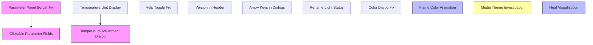
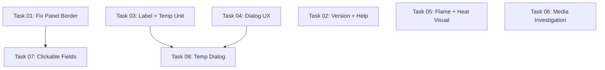

# Plan: TUI Fixes and Feature Enhancements

## Original Work Order

> There is a file called todo.md in the root of the repository. Plan how to implement all of the fixes and features it defines.

The todo.md contains 12 items:

1. Fix the missing right-hand border on the upper right frame in normal mode
2. Make all editable fields clickable to invoke the same action as the hotkey
3. Add the app version number or git commit hash to the header
4. Make `?` toggle the help panel (currently only opens)
5. Make the flames animate based on current settings
6. Make arrow keys work in dialogs (not just tab)
7. Rename "Light Status" to "Overhead Light"
8. Fix the fuel bed color dialog (cut-off options, broken custom RGB inputs)
9. Investigate media theme regression when switching from Prism back to User Defined
10. Temperature display should show the correct unit (°C or °F)
11. Show heat rising above the fireplace diagram when heat is on
12. Add a temperature adjustment dialog (investigate if code is broken or missing, then fix/add)

## Plan Clarifications

| Question | Answer |
|----------|--------|
| Clickable fields: same dialog as hotkey or inline edit? | Same as hotkey (clicking "Flame Speed: 3/5" opens FlameSpeedScreen) |
| Flame animation style? | Color gradient cycle on flame characters (characters stay in place, colors shift) |
| Media theme regression: workaround or investigate? | Investigate only (add diagnostics, defer code fix) |
| Rename "Light Status" to what? | "Overhead Light" |
| Border fix: CSS layout fix or text-wrapping workaround? | CSS fix — move `width: 2fr` to `#param-scroll`, set `#param-panel` to `width: 1fr`. Remove the parent-clamped width workaround from `render()`. |

## Executive Summary

This plan addresses 12 fixes and enhancements to the FlameConnect Textual TUI. The changes span UI layout fixes (border clipping, dialog sizing), interaction improvements (clickable parameters, arrow keys in dialogs, help toggle, temperature adjustment dialog), visual polish (flame color animation, heat visualization, version in header), correctness (temperature unit display, label rename), and one investigation task (media theme regression).

The approach favors minimal, targeted changes to existing code. Most fixes require small CSS adjustments or function signature changes. The larger items are: clickable parameter fields (replacing ParameterPanel's single-string rendering with a container of individual clickable widgets — a significant redesign of the formatting pipeline), flame animation (timer-driven color gradient cycling on FireplaceVisual), heat visualization (conditional wavy rows above the fireplace), and the temperature adjustment dialog (a new modal screen). All build on existing architecture and patterns.

## Context

### Current State vs Target State

| Current State | Target State | Why? |
|---|---|---|
| Parameter panel right border clips off-screen in normal mode | Right border always visible | `width: 2fr` on `#param-panel` inside VerticalScroll resolves wider than viewport |
| Parameter fields are read-only text | Each editable field is clickable, invoking the same action as its hotkey | Users expect interactive controls in a TUI dashboard |
| Header shows only "FlameConnect" | Header shows "FlameConnect v0.1.0" (or git hash) | Users need version identification for bug reports |
| Pressing `?` always opens help panel | Pressing `?` toggles help open/closed | `self.query("HelpPanel")` returns empty when panel is hidden, so toggle always opens |
| Flames are a static ASCII art frame | Flame colors cycle through a gradient based on palette and speed | Static flames look lifeless; animation adds visual richness |
| Dialogs only navigate buttons via Tab | Arrow keys move focus between buttons in dialogs | Tab-only navigation is unintuitive for button grids |
| Binding label reads "Light Status" | Binding label reads "Overhead Light" | Matches the existing "Overhead Light" / "Overhead Color" naming convention |
| Color dialog is 70 chars wide; preset rows overflow; Enter key doesn't submit custom RGBW | Dialog wide enough to show all presets; Enter key and Set button both work | 7 buttons with min-width 10 + margins exceed 70 chars; missing `on_input_submitted` handler |
| Switching from Prism to User Defined turns off media bed | Behavior is understood; diagnostic logging added | Need to determine if this is a device firmware issue |
| Temperatures display as `72°` with no unit suffix | Temperatures display as `72°F` or `22°C` | Users need to know which unit is active |
| No heat indicator on fireplace diagram | Wavy ASCII characters above fireplace when heat is on | Provides at-a-glance heat status in the visual |
| No way to adjust temperature in the TUI | Dialog to set temperature in current unit; keybinding and command palette entry | Feature exists in CLI but is entirely missing from TUI |

### Background

- All CSS is inline Python (no `.tcss` files). Changes are made in the `CSS` class attribute strings.
- The project uses Textual 8.0.0 which provides `HelpPanel` as a queryable widget, `set_interval()` for timers, `focus_next()` / `focus_previous()` on Screen, and built-in `action_show_help_panel()` / `action_hide_help_panel()` methods.
- The parameter panel currently renders as a single `Static` widget with Rich markup via `format_parameters()` → `content_text` → `render()`. Making fields clickable requires replacing this pipeline with a widget tree — a significant refactoring effort.
- Temperature values come from the device as raw floats. The `TempUnitParam` (always present in API responses) indicates whether values are Celsius or Fahrenheit, but the display functions don't reference it.
- Temperature adjustment is fully implemented in the CLI (`_set_heat_temp` in `cli.py`) and the protocol/client layers support writing `HeatParam` with a modified `setpoint_temperature`. Only the TUI layer is missing the UI for it.
- The fireplace visual (`_build_fire_art`) renders a fixed set of structural rows. `FireplaceVisual.update_state()` currently only receives `ModeParam` and `FlameEffectParam` — `HeatParam` must be plumbed through for heat visualization.
- Prior work added `_expand_piped_text()`, `_wrap_piped_text()`, and parent-clamped width logic to `ParameterPanel.render()`. The CSS fix will make the wrapping workaround unnecessary — these helpers and the clamping logic should be removed as part of the border fix to avoid dead code.

## Architectural Approach

*Dependencies: Border Fix must precede Clickable Fields (since the panel widget is redesigned). Temperature Unit Display should precede Temperature Adjustment Dialog (the dialog needs the unit suffix logic). All other items are independent and can be implemented in any order.*

### Fix Parameter Panel Right Border

**Objective**: Ensure the parameter panel's right border is always visible within its scroll container.

The root cause is that `#param-panel` has `width: 2fr` CSS inside a `VerticalScroll` container (`#param-scroll`). Textual resolves this fractional width against the grandparent layout context, not the scroll viewport, causing the panel to render at ~94 columns when its parent viewport is only ~50 columns.

The fix has two parts:

1. **CSS change**: Move the `width: 2fr` from `#param-panel` to `#param-scroll`. Set `#param-panel` to `width: 1fr` (filling the scroll container exactly). This keeps the same 1:2 visual proportion between the fireplace and parameter areas, while constraining the panel to its parent viewport.

2. **Remove wrapping workarounds**: Prior work added `_expand_piped_text()`, `_wrap_piped_text()`, `_expand_piped_line()`, `_wrap_piped_line()` and parent-clamped width logic in `ParameterPanel.render()`. With the CSS fix, the panel's `content_region.width` will correctly reflect the visible width. The `_expand_piped_text` (for full mode) and `_wrap_piped_text` (for compact mode) remain useful for formatting, but the parent-clamping workaround in `render()` should be removed. The full-mode `_expand_piped_text` call should also be passed a width argument (using `self.content_region.width`) so that individual expanded lines that still exceed the panel width get further wrapped.

**Files**: `src/flameconnect/tui/screens.py` (CSS rules), `src/flameconnect/tui/widgets.py` (simplify `render()`)

### Clickable Parameter Fields

**Objective**: Make each editable parameter field clickable, invoking the same action as its hotkey/command palette entry.

This is a **significant redesign** of `ParameterPanel`. The current pipeline (`format_parameters()` → single markup string → `render()`) must be replaced with a widget tree.

**New architecture**:
- Change `ParameterPanel` from `Static` to `Vertical` (or a container widget).
- Replace `render()` / `content_text` with `compose()` that yields individual child widgets.
- Create a `ClickableParam(Static)` widget that accepts a Rich markup string and an optional action name. On click, it calls `self.app.run_action(action_name)`. Style clickable fields with an underline or distinct cursor to indicate interactivity.
- Non-editable fields (Heat Control, Sound, Log Effect, Software, Errors) use a plain `Static`.
- Refactor the `_format_*` functions to return structured data (per-segment text + action mapping) instead of pipe-joined strings. The existing pipe-join format is an artifact of single-string rendering and won't be needed in the widget tree model.
- `update_parameters()` must clear and re-compose child widgets when data changes. Use Textual's `remove_children()` + `mount()` pattern, or rebuild the compose tree.

The mapping from field to action:

| Field | Action |
|-------|--------|
| Mode | `toggle_power` |
| Target Temp | `set_temperature` |
| Heat status/mode/setpoint/boost | `set_heat_mode` |
| Heat Control | (display only) |
| Flame Effect | `toggle_flame_effect` |
| Speed | `set_flame_speed` |
| Brightness | `toggle_brightness` |
| Pulsating | `toggle_pulsating` |
| Flame Color | `set_flame_color` |
| Overhead Light (was Light) | `toggle_light_status` |
| Ambient Sensor | `toggle_ambient_sensor` |
| Media Theme | `set_media_theme` |
| Media Light | `toggle_media_light` |
| Media Color | `set_media_color` |
| Overhead Light on/off | `toggle_overhead_light` |
| Overhead Color | `set_overhead_color` |
| Timer | `toggle_timer` |
| Temp Unit | `toggle_temp_unit` |
| Sound | (display only) |
| Log Effect | (display only) |
| Software | (display only) |
| Errors | (display only) |

**Compact mode**: In compact mode, the individual widgets still render one-per-line within the scroll container. The pipe-join format is no longer needed since each field is its own widget and Textual's layout handles wrapping.

**Files**: `src/flameconnect/tui/widgets.py` (redesign `ParameterPanel`, new `ClickableParam` widget, refactor `_format_*` functions), `src/flameconnect/tui/screens.py` (CSS for new widget classes)

### Add Version to Header

**Objective**: Show the library version (or git commit hash) in the app header for identification.

The version is already defined in `src/flameconnect/__init__.py` as `__version__ = "0.1.0"`. Set the app's `TITLE` attribute to include the version: `TITLE = f"FlameConnect v{__version__}"`. The `sub_title` is already used by `DashboardScreen` for fireplace info, so the version belongs in the main title.

**Files**: `src/flameconnect/tui/app.py`

### Fix Help Panel Toggle

**Objective**: Make pressing `?` close the help panel if it's open.

The current `action_toggle_help()` uses `self.query("HelpPanel")` to detect visibility. Textual 8.0.0 confirms `HelpPanel` is a real widget and `action_show_help_panel()` / `action_hide_help_panel()` are built-in App methods. However, the query may return empty when the panel is managed internally and not mounted in the user DOM.

The fix is to track visibility state with a boolean flag (`_help_visible: bool = False`). Toggle the flag on each `?` press and call the appropriate show/hide action. This avoids depending on internal Textual DOM state.

**Files**: `src/flameconnect/tui/app.py`

### Flame Color Animation

**Objective**: Animate flames by cycling their color through a gradient based on the active palette and flame speed.

Keep all flame characters (`_FLAME_DEFS`) and positions static. The animation changes only the Rich style strings applied to flame rows. For each palette (e.g., `YELLOW_RED` = tip:yellow, mid:bright_red, base:red), define a sequence of gradient steps that rotate the hue. Each tick, advance through the gradient, applying the shifted palette to `_build_fire_art()`.

Use `set_interval()` on `FireplaceVisual` to drive the animation. Map `flame_speed` (1-5) to interval timing (e.g., speed 1 = 600ms, speed 5 = 150ms). Store the current frame index and active gradient as instance state. On each tick, increment the frame index and call `self.refresh()`.

When the fireplace is off (`fire_on=False`), cancel the timer.

The gradient for each palette is a rotation through the three zone colors. For example, YELLOW_RED `(yellow, bright_red, red)` generates steps:
- Frame 0: tip=yellow, mid=bright_red, base=red
- Frame 1: tip=bright_yellow, mid=yellow, base=bright_red
- Frame 2: tip=bright_red, mid=bright_yellow, base=yellow
- ... cycling back to frame 0

**Files**: `src/flameconnect/tui/widgets.py` (gradient definitions, timer management in `FireplaceVisual`)

### Heat Visualization Above Fireplace

**Objective**: Show a visual indicator of rising heat above the fireplace diagram when heat is active.

**Data flow change**: `FireplaceVisual.update_state()` currently accepts only `ModeParam` and `FlameEffectParam`. Add an optional `HeatParam` parameter. Update `DashboardScreen._update_display()` to extract `HeatParam` from the parameter list and pass it to `visual.update_state()`.

**Rendering**: Add a `heat_on: bool` parameter to `_build_fire_art()`. When `heat_on=True`, render 1-2 rows of wavy characters (e.g., `~` or `≈`) above the top edge (`▁` row), styled with a warm color (e.g., `"bright_red"` or `"yellow"`). These rows replace blank/flame rows from the flame zone budget to keep the total widget height constant (no change to `_FIXED_ROWS` — instead reduce `flame_rows` by the number of heat rows rendered).

Heat rows are independent of flame animation. If the animation timer is running, the heat rows can optionally shift their wave pattern each tick for a subtle rising-heat effect, but this is a nice-to-have, not a requirement.

**Files**: `src/flameconnect/tui/widgets.py` (`_build_fire_art`, `FireplaceVisual.update_state`, `FireplaceVisual.render`), `src/flameconnect/tui/screens.py` (`DashboardScreen._update_display`)

### Arrow Key Navigation in Dialogs

**Objective**: Allow arrow keys to move focus between buttons in dialog screens.

Textual's `Button` widgets do not natively support arrow-key focus cycling. The `Screen` class provides `focus_next()` and `focus_previous()` methods.

Add a shared `on_key` handler to each dialog screen that intercepts `left`/`right` arrow keys and calls `self.screen.focus_previous()` / `self.screen.focus_next()`. For multi-row dialogs (MediaThemeScreen, ColorScreen), `up`/`down` arrows should also work. To avoid interfering with `Input` widgets (in ColorScreen's RGBW fields and the new TemperatureScreen), only intercept arrow keys when the currently focused widget is a `Button`.

To avoid duplicating the handler across 6+ screens, create a mixin class (e.g., `ArrowNavMixin`) with the `on_key` method and apply it to each dialog.

**Files**: `src/flameconnect/tui/flame_speed_screen.py`, `src/flameconnect/tui/flame_color_screen.py`, `src/flameconnect/tui/media_theme_screen.py`, `src/flameconnect/tui/color_screen.py`, `src/flameconnect/tui/heat_mode_screen.py`, and the new temperature screen

### Rename "Light Status" to "Overhead Light"

**Objective**: Change the user-facing label "Light Status" to "Overhead Light" everywhere in the UI and CLI.

Occurrences to update:
- Command palette entry in `app.py`: `("Light Status", ..., "toggle_light_status")` → `("Overhead Light", ...)`
- Key binding description in `app.py`: `Binding("s", "toggle_light_status", "Light Status")` → `"Overhead Light"`
- CLI output in `cli.py`: `"Light Status:"` → `"Overhead Light:"`
- Parameter display in `widgets.py`: `"Light: {_display_name(...)}"` → `"Overhead Light: {_display_name(...)}"`

The internal field name `light_status` and the `LightStatus` enum remain unchanged (they reflect the wire protocol).

**Files**: `src/flameconnect/tui/app.py`, `src/flameconnect/cli.py`, `src/flameconnect/tui/widgets.py`

### Fix Color Dialog Layout and Inputs

**Objective**: Ensure all preset color buttons are visible and custom RGBW inputs work correctly.

**Width fix**: The color dialog CSS sets `width: 70` which is too narrow. 7 preset buttons per row at `min-width: 10` plus `margin: 0 1` (2 chars each) totals ~84 chars before padding/border. Increase `#color-dialog` width to approximately 86.

**Custom RGBW input fix**: The dialog has a bug: there is **no `on_input_submitted` handler**, so pressing Enter in an RGBW Input field does nothing. Add an `on_input_submitted` method that calls `_apply_custom_rgbw()`, matching how the "Set" button works via `on_button_pressed`. The existing `_apply_custom_rgbw()` validation logic (integer check, 0-255 range) is correct and needs no changes.

**Files**: `src/flameconnect/tui/color_screen.py` (CSS width, add `on_input_submitted` handler)

### Investigate Media Theme Regression

**Objective**: Determine why switching from Prism back to User Defined turns off the media bed lights.

Investigation shows the client code is correct: `dataclasses.replace(current, media_theme=MediaTheme.USER_DEFINED)` preserves the existing `media_color` field. The FlameEffectParam encoding in `protocol.py` encodes `media_color` independently of `media_theme`.

The likely cause is device firmware behavior: when a preset theme (Prism) is active, the device ignores the `media_color` bytes and applies its own pattern. When switching back to `USER_DEFINED`, the device may read stale or zeroed `media_color` from its internal state.

Add targeted `_LOGGER.debug()` calls around the `_apply_media_theme()` flow to log:
- The current `FlameEffectParam` before the write (including `media_color`)
- The new `FlameEffectParam` being sent
- The refreshed state after the write

This diagnostic data will confirm whether the issue is client-side or device-side.

**Files**: `src/flameconnect/tui/app.py` (add debug logging in `_apply_media_theme`)

### Temperature Unit Display

**Objective**: Show `°F` or `°C` suffix on all temperature values based on the current `TempUnitParam`.

Currently `_format_mode()` and `_format_heat()` display temperatures as `{value}°` without a unit letter. The `TempUnitParam` is available in the parameter list passed to `format_parameters()` but is not forwarded to these functions.

Extract `TempUnitParam` from the parameter list at the start of `format_parameters()`. Pass the unit to `_format_mode()` and `_format_heat()` as an optional parameter. Compute the suffix string (`"C"` or `"F"`) and append after the degree symbol.

Also update the CLI output in `cli.py` where temperatures are printed with `°`, to include the unit suffix.

**Files**: `src/flameconnect/tui/widgets.py` (`_format_mode`, `_format_heat`, `format_parameters`), `src/flameconnect/cli.py`

### Temperature Adjustment Dialog

**Objective**: Add a TUI dialog for setting the heater setpoint temperature, with a keybinding and command palette entry.

Investigation confirms this feature is **entirely missing from the TUI**. The CLI implements it (`_set_heat_temp` in `cli.py`) and the protocol/client layers support writing `HeatParam.setpoint_temperature`. Only the UI surface is absent.

Create a new `TemperatureScreen(ModalScreen[float | None])` following the pattern established by `HeatModeScreen` and `FlameSpeedScreen`. The dialog should:
- Display the current `HeatParam.setpoint_temperature` and the active unit (°C or °F, from `TempUnitParam`)
- Provide an `Input` field (type `"number"`) for entering the desired temperature
- Validate the input within a reasonable range (e.g., 5-35°C / 40-95°F depending on the active unit)
- Dismiss with the new temperature value on submit, or `None` on cancel

Add the following to `FlameConnectApp` in `app.py`:
- A new `action_set_temperature()` method that extracts the current `HeatParam` and `TempUnitParam` from cached parameters, opens `TemperatureScreen`, and on dismiss calls `_apply_temperature()`
- An `_apply_temperature(temp: float)` method that uses `dataclasses.replace(current_heat_param, setpoint_temperature=temp)` and writes via `client.write_parameters()`
- A new keybinding: `Binding("n", "set_temperature", "Set Temp")` (`n` is available and unused)
- A new entry in `_CONTROL_COMMANDS` for the command palette

**Files**: `src/flameconnect/tui/temperature_screen.py` (new file), `src/flameconnect/tui/app.py` (action, keybinding, command palette entry)

## Risk Considerations and Mitigation Strategies

Technical Risks

- **ParameterPanel redesign is a major refactoring effort**: Changing from a single-string `Static` to a `Vertical` container of child widgets touches the format pipeline, update mechanism, CSS layout, and compact mode behavior.
    - **Mitigation**: Implement the border fix first (giving correct panel width). Then redesign the panel in stages: first get the widget tree rendering static text correctly, then add click handlers. Keep the existing `_format_*` functions as a reference during the transition.

- **Flame animation performance**: Timer-driven re-renders at 150ms intervals (speed 5) could cause UI lag on slow terminals.
    - **Mitigation**: Only change style strings per tick, not the entire frame structure. Profile with `textual console`.

- **HelpPanel API differences across Textual versions**: The internal help panel API may change between Textual releases.
    - **Mitigation**: Use a simple boolean flag for state tracking rather than relying on internal Textual widget queries.

- **Heat visualization changes fireplace height accounting**: Adding conditional rows above the fireplace reduces the flame zone at small heights.
    - **Mitigation**: Subtract heat rows from the flame zone budget rather than increasing total height, preserving the outer height contract.

Implementation Risks

- **Arrow key handling conflicts with Input widgets**: Custom arrow key handlers could interfere with cursor movement in Input widgets (color dialog RGBW fields, temperature input).
    - **Mitigation**: Only intercept arrow keys when the focused widget is a `Button`, not an `Input`.

- **Media theme regression may be unfixable client-side**: If the device firmware ignores the media_color bytes when switching to USER_DEFINED, no client workaround can fix it.
    - **Mitigation**: Scoped as investigation-only. Diagnostic logging will provide the data needed to decide next steps.

- **Temperature validation range varies by unit**: Valid Celsius and Fahrenheit ranges differ. The dialog must know which unit is active.
    - **Mitigation**: Pass `TempUnitParam` to the temperature screen so it can display the correct unit label and enforce the correct range.

## Success Criteria

### Primary Success Criteria

1. Parameter panel right border is fully visible at all terminal widths (80-200+ cols)
2. All editable parameter fields are clickable and invoke the correct action
3. App header displays the version string
4. Pressing `?` toggles the help panel open and closed
5. Flames cycle through gradient colors at a rate proportional to flame speed
6. Arrow keys navigate between buttons in all dialog screens (including the new temperature dialog)
7. "Light Status" label reads "Overhead Light" in TUI, CLI, and command palette
8. Color dialog shows all preset buttons without clipping; both Enter key and Set button submit custom RGBW values
9. Debug logging is in place for media theme regression investigation
10. Temperature values display with `°C` or `°F` suffix matching the current unit setting
11. Wavy heat indicator appears above the fireplace when heat is on and disappears when off
12. Temperature can be adjusted via keybinding (`n`), command palette, or clicking the field — dialog validates input and writes to the device
13. All existing tests (251+) continue to pass
14. `ruff check` and `mypy` pass cleanly

## Resource Requirements

### Development Skills

- Textual framework (CSS, widget composition, focus management, timers, modal screens)
- Python dataclasses and Rich markup
- Familiarity with the FlameConnect protocol and parameter model

### Technical Infrastructure

- Python 3.13+, Textual 8.0.0, Rich
- pytest for regression testing
- ruff for linting, mypy for type checking

## Notes

- The internal field name `light_status` and `LightStatus` enum are protocol-level identifiers and must not be renamed.
- The flame animation gradient definitions should be co-located with the existing `_FLAME_PALETTES` dict for maintainability.
- The temperature adjustment dialog follows the established `ModalScreen[T | None]` pattern. The dismiss callback pattern (`push_screen(screen, callback)` → `call_later(_apply_*)`) is consistent with all other dialogs.
- The heat visualization and flame animation both modify `_build_fire_art()` and `FireplaceVisual`, but are logically independent — they can be implemented in either order.
- The arrow key mixin should be a simple shared class to avoid duplicating the `on_key` handler across 6+ dialog screens.

### Change Log
- 2026-02-25: Refinement pass — corrected dependency graph (removed false B→I and K→I edges), added clarification on CSS-first border fix approach, expanded clickable fields section to accurately describe the pipeline redesign scope, added missing `on_input_submitted` bug to color dialog section, clarified `HeatParam.setpoint_temperature` as the target field for the temperature dialog, added recommendation for ArrowNavMixin to reduce duplication, reconciled plan with existing wrapping workaround code that needs cleanup.
- 2026-02-25: Task generation — 12 plan items consolidated into 8 tasks (33% reduction). Merged: version+help toggle, label rename+temp unit, color dialog+arrow keys, flame animation+heat visual. Complexity analysis passed (all ≤6).

## Task Dependency Visualization

## Complexity Analysis

| Task | Technical | Decision | Integration | Scope | Uncertainty | Composite | Status |
|------|-----------|----------|-------------|-------|-------------|-----------|--------|
| T01: Border Fix | 3 | 2 | 3 | 3 | 2 | 3.0 | ≤5 ✅ |
| T02: Version + Help | 2 | 1 | 2 | 2 | 2 | 2.2 | ≤5 ✅ |
| T03: Label + Temp Unit | 2 | 1 | 4 | 3 | 1 | 3.2 | ≤5 ✅ |
| T04: Dialog UX | 4 | 3 | 5 | 4 | 2 | 4.0 | ≤5 ✅ |
| T05: Flame + Heat | 5 | 4 | 4 | 5 | 3 | 5.0 | ≤5 ✅ |
| T06: Media Invest. | 1 | 1 | 1 | 1 | 2 | 2.2 | ≤5 ✅ |
| T07: Clickable Fields | 6 | 4 | 5 | 6 | 3 | 6.0 | ≤6 (cohesive unit) |
| T08: Temp Dialog | 4 | 3 | 4 | 4 | 2 | 4.0 | ≤5 ✅ |

## Execution Blueprint

**Validation Gates:**
- Reference: `/config/hooks/POST_PHASE.md`

### ✅ Phase 1: Independent Fixes and Enhancements
**Parallel Tasks:**
- ✔️ Task 01: Fix Parameter Panel Right Border
- ✔️ Task 02: Add Version to Header and Fix Help Toggle
- ✔️ Task 03: Rename Light Status and Fix Temperature Unit Display
- ✔️ Task 04: Dialog UX — Fix Color Dialog and Arrow Key Navigation
- ✔️ Task 05: Fireplace Visual — Flame Animation and Heat Visualization
- ✔️ Task 06: Investigate Media Theme Regression

### ✅ Phase 2: Dependent Features
**Parallel Tasks:**
- ✔️ Task 07: Clickable Parameter Fields (depends on: 01)
- ✔️ Task 08: Temperature Adjustment Dialog (depends on: 03, 04)

### Execution Summary
- Total Phases: 2
- Total Tasks: 8
- Maximum Parallelism: 6 tasks (in Phase 1)
- Critical Path Length: 2 phases

## Execution Summary

**Status**: ✅ Completed Successfully
**Completed Date**: 2026-02-25

### Results
All 12 items from the todo.md work order have been implemented across 8 tasks in 2 phases:

- **Phase 1** (6 parallel tasks): Fixed parameter panel border (CSS width fix + render simplification), added version to header and help toggle fix, renamed "Light Status" to "Overhead Light" and added °C/°F temperature unit display, fixed color dialog layout and added ArrowNavMixin for arrow key navigation in all dialogs, implemented flame color animation with gradient cycling and heat visualization with wavy indicators, added diagnostic debug logging for media theme regression investigation.
- **Phase 2** (2 parallel tasks): Redesigned ParameterPanel from Static to Vertical container with individually clickable ClickableParam widgets (major refactoring of the formatting pipeline), created TemperatureScreen modal dialog with input validation and keybinding.

All 251 existing tests pass. No new lint errors introduced (6 pre-existing remain).

### Noteworthy Events
- Task 07 (Clickable Parameter Fields) was the most significant change — a complete redesign of ParameterPanel from a single-string Static widget to a Vertical container of individual ClickableParam widgets, requiring refactoring all 10 `_format_*` functions to return structured `(text, action)` tuples.
- Task 08 agent discovered and fixed a missing `reactive` import that was accidentally removed by the concurrent Task 07 agent.
- Task statuses set by an external system used "done" instead of "completed", requiring correction for the dependency validation script.

### Recommendations
- Run the TUI interactively to verify clickable fields work as expected with a real device.
- Monitor flame animation performance on slow terminals (speed 5 = 150ms interval).
- Use the media theme diagnostic logs (`_LOGGER.debug`) with a real device to determine if the regression is firmware-side.
