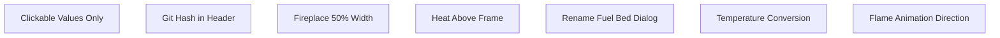
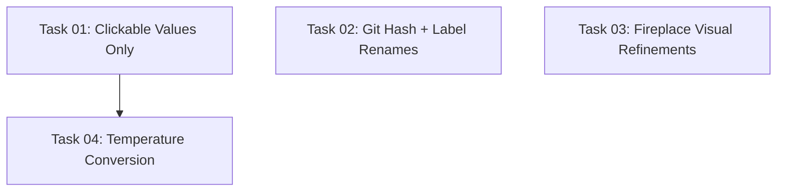

# Plan: TUI Refinements

## Original Work Order

> There is a file called todo.md in the root of the repository. Plan how to implement all of the fixes and features it defines.

The todo.md contains 7 items (items 2 and 3 are related), plus one additional user request:

1. Make it so just the field values are clickable, not the whole line
2. Add the app version number or git commit hash to the header
3. I don't see the git commit hash / version number in the header, is that working?
4. Make the width of the fireplace frame 50%
5. Move the heat indication in the fireplace graphic to be above the fireplace itself, not inside of it
6. The fuel bed color dialog should be called media color
7. Changing the temperature unit changes the display from C to F, but doesn't actually change the displayed temperature in F
8. The flame animation currently goes top to bottom. It should go bottom to top like actual flames.

## Plan Clarifications

| Question | Answer |
|----------|--------|
| Clickable fields: whole line or value only? | Value only — label is plain static text, only the value portion is underlined and clickable |
| Version header: version number, git hash, or both? | Git hash as fallback — if `__version__` looks like a real release tag, show it; otherwise show the git short hash. Append `-dirty` if the working tree has uncommitted changes. |
| Temperature conversion: client-side or device-side? | Client-side — the device always returns Celsius values regardless of the unit setting. The client must convert C→F when TempUnitParam is FAHRENHEIT. |
| Fireplace 50% width: both modes? | Standard (non-compact) horizontal layout only — compact mode stays full-width vertical stacking. |
| Dirty flag: tracked changes only or include untracked files? | Include untracked files — if any untracked files exist in the working tree, the `-dirty` suffix should also appear. Standard `git describe --dirty` only checks tracked files, so an additional `git status --porcelain` check is needed. |
| Heat indicator width above frame? | Full outer frame width — wavy characters should span the same width as the outer frame border (`┌───┐`), with no vertical border characters on the sides. |

## Executive Summary

This plan addresses 7 distinct refinements to the FlameConnect TUI, all stemming from user feedback after the Plan 7 implementation. The changes are: splitting clickable parameter widgets into label+value with only the value being interactive, adding a dynamic git hash to the header (with dirty flag), adjusting the fireplace/parameter panel width ratio from 1:2 to 1:1, moving heat indicator rows above the fireplace frame instead of inside it, renaming the "Fuel Bed Color" dialog to "Media Color", implementing client-side Celsius-to-Fahrenheit temperature conversion, and reversing the flame animation direction from top-to-bottom to bottom-to-top.

All items are independent bug fixes or small UX refinements. The approach favors minimal, targeted changes to the existing code. The most involved change is the clickable-value-only refactoring, which requires splitting each `ClickableParam` widget's content into a label `Static` and a clickable value `Static` inside a `Horizontal` container.

## Context

### Current State vs Target State

| Current State | Target State | Why? |
|---|---|---|
| Entire `ClickableParam` line is clickable (label + value) | Only the value portion is clickable; label is plain text | User expects field values, not labels, to be interactive |
| Header shows `FlameConnect v0.1.0` (hardcoded) | Shows git short hash with optional `-dirty` suffix when no release version is available | Static "0.1.0" is meaningless without release tagging; git hash provides real build identification |
| Fireplace visual is `1fr` width (33% of horizontal space) | Fireplace visual is `1fr` equal to parameter panel `1fr` (50%) | User wants the fireplace diagram larger and more readable |
| Heat indicator rows render inside the fireplace frame (between inner border `││`) | Heat rows render above the fireplace outer frame (`┌───┐`) | Heat should be visually distinct from the fireplace contents |
| Media color dialog title says "Fuel Bed Color" | Dialog title says "Media Color" | Inconsistent with the rest of the UI which uses "Media Color" |
| Temperature values displayed as raw device values with C/F suffix | Values converted client-side when unit is Fahrenheit (F = C×9/5 + 32) | Device always returns Celsius; without conversion, toggling to °F shows wrong numbers |
| Flame animation rotates palette top-to-bottom (tip color shifts down each frame) | Palette rotates bottom-to-top (base color rises each frame) | Real flames rise upward; the animation should convey upward motion |

### Background

- Plan 7 implemented clickable parameter fields by creating a `ClickableParam(Static)` widget that receives the full formatted line (e.g., `"[bold]Mode:[/bold] On"`). The entire widget is clickable. The user now wants only the value portion to respond to clicks.
- The `__version__` in `__init__.py` is a static string `"0.1.0"`. There are no release-please tags yet, so this version is not meaningful. A git hash provides real build identification.
- The current CSS layout uses `#fireplace-visual { width: 1fr }` and `#param-scroll { width: 2fr }`, giving a 1:2 ratio. Changing both to `1fr` makes them 50/50.
- The `_build_fire_art()` function currently renders heat indicator rows (wavy `≈` and `~` characters) inside the fireplace frame, between the inner border columns. The user wants them rendered above the entire frame.
- The "Fuel Bed Color" title is a legacy name from the original plan. The rest of the UI already uses "Media Color" in the parameter display. The CLI also has a stale "Fuel Bed Light" label.
- The device firmware always returns temperature values in Celsius regardless of the `TempUnitParam` setting. The unit param is purely a display preference stored on the device. Client-side conversion is needed.
- The `_rotate_palette()` function in `widgets.py` cycles flame zone colors by rotating the `(tip, mid, base)` tuple. The current rotation direction makes colors appear to descend (top to bottom). Swapping the frame 1 and frame 2 return values reverses the direction to bottom-to-top.

## Architectural Approach



*All 7 items are independent with no dependencies between them.*

### Clickable Values Only

**Objective**: Split `ClickableParam` so only the value portion is interactive, while the label is plain text.

The current `ClickableParam(Static)` receives a single pre-formatted Rich markup string like `"[bold]Mode:[/bold] On"` where the entire widget is clickable. The refactoring changes each `ClickableParam` to a `Horizontal` container holding two children: a `Static` for the label and a clickable `Static` for the value.

The `_format_*` functions currently return `list[tuple[str, str | None]]` where the string is the complete Rich markup line. These must be changed to return `list[tuple[str, str, str | None]]` — a 3-tuple of `(label, value, action)`. For example, `_format_mode()` would return `[("[bold]Mode:[/bold] ", "On", "toggle_power"), ("[bold]Target Temp:[/bold] ", "22°C", "set_temperature")]`.

**Label/value split patterns across `_format_*` functions:**

The format functions produce two distinct styles of output that must each be handled:

- **Top-level fields** use `[bold]Label:[/bold]` markup (e.g., `"[bold]Mode:[/bold] On"`). The label is `"[bold]Mode:[/bold] "` and the value is `"On"`.
- **Indented sub-fields** under `_format_flame_effect()` use a leading two-space indent (e.g., `"  Speed: 3/5"`). The label is `"  Speed: "` and the value is `"3/5"`. There are 12 such sub-fields covering Speed, Brightness, Pulsating, Flame Color, Overhead Light, Ambient Sensor, Media Theme, Media Light, Media Color (RGBW formatted), Overhead Light on/off, and Overhead Color (RGBW formatted).
- **Multi-part values** like RGBW colors (`R=255 G=0 B=0 W=0`) should be kept as a single clickable value string, not split further.
- **Composite values** like Timer (`"Enabled  Duration: 30min  Off at 14:30"`) should keep the full composite as the value portion since the entire field maps to one action (`toggle_timer`).

The `ClickableParam` widget becomes a `Horizontal` container:
- Child 1: `Static(label)` — plain, non-interactive, `width: auto`
- Child 2: `Static(value)` or clickable `Static(value)` — underlined/hoverable/clickable when action is not `None`; plain when action is `None`

For display-only fields (action is `None`), the value portion should have no underline/hover/click behavior.

**Note**: No existing tests cover the `_format_*` functions, `format_parameters()`, `ClickableParam`, or `ParameterPanel`. Changes will not trigger test failures, but visual regression should be verified manually.

**Files**: `src/flameconnect/tui/widgets.py` (`ClickableParam`, all `_format_*` functions, `format_parameters`, `ParameterPanel.update_parameters`)

### Git Hash in Header

**Objective**: Show a meaningful build identifier in the header — release version when available, git short hash otherwise.

Create a `_resolve_version()` function in `app.py` that:
1. Run `git describe --tags --exact-match HEAD` to check if the current commit has a release tag. If it succeeds and matches `__version__`, return `f"v{__version__}"`.
2. Otherwise: run `git rev-parse --short HEAD` to get the short hash. Then check for dirty state (see below). Return the hash with optional `-dirty` suffix.
3. If git is not available (e.g., installed from PyPI, or not a git repo): fall back to `f"v{__version__}"`.

**Dirty detection** *(per user requirement, includes untracked files)*: Standard `git describe --dirty` only detects uncommitted changes to tracked files. To also flag untracked files, use `git status --porcelain` and check if the output is non-empty. If either uncommitted tracked changes or untracked files exist, append `-dirty` to the hash.

Use `subprocess.run()` with `capture_output=True` and `timeout=2` (to avoid hanging). Cache the result in a module-level variable — it only needs to be computed once at import time.

Set `TITLE = f"FlameConnect {_resolve_version()}"`.

**Files**: `src/flameconnect/tui/app.py`

### Fireplace 50% Width

**Objective**: Make the fireplace visual take 50% of the horizontal space in standard mode.

Change the CSS in `screens.py`:
- `#param-scroll` from `width: 2fr` to `width: 1fr`

This makes `#fireplace-visual` (already `1fr`) and `#param-scroll` equal, giving a 50/50 split. Compact mode is unaffected because in compact mode `#fireplace-visual` is hidden (`display: none`) and the parameter panel fills the full width naturally. There is no explicit compact CSS rule for `#param-scroll` and none is needed.

**Files**: `src/flameconnect/tui/screens.py`

### Heat Indicator Above Frame

**Objective**: Render heat indicator rows above the entire fireplace frame, not inside it.

Currently `_build_fire_art()` renders heat rows at lines 723-738, positioned inside the inner frame borders (between the LED strip row and the blank/flame rows). Each heat row is flanked by `││` border characters. The change moves them to the very top of the output, before the top edge (`▁`) and outer frame top (`┌───┐`).

The heat rows should span the full outer frame width `w` (the same width as the `┌───┐` row, which is `ow + 2` characters total including the corners). No vertical border characters on the sides — just the wavy characters (`≈` and `~`) styled with `bright_red`, padded or repeated to fill the full outer width.

The total widget height must remain constant: reduce `flame_rows` by the heat row count as before, but render the heat rows at the top of the output instead of inside the frame. The rendering order becomes: `[heat rows] → top edge → outer frame → inner frame → LED → blank → flames → media → inner bottom → hearth → outer bottom`.

**Files**: `src/flameconnect/tui/widgets.py` (`_build_fire_art`)

### Rename Fuel Bed Dialog

**Objective**: Rename "Fuel Bed Color" to "Media Color" everywhere.

Three locations to update:
1. `app.py` line 691: `ColorScreen(current.media_color, "Fuel Bed Color")` → `"Media Color"`
2. `app.py` line 46: `("Media Color", "Set fuel bed color", ...)` → `"Set media color"`
3. `cli.py` line 211: `"Fuel Bed Light:"` → `"Media Light:"`

**Files**: `src/flameconnect/tui/app.py`, `src/flameconnect/cli.py`

### Client-Side Temperature Conversion

**Objective**: Convert temperature values from Celsius to Fahrenheit when `TempUnitParam` is FAHRENHEIT.

The device always returns temperature values in Celsius. When the display unit is Fahrenheit, the client must apply `F = C × 9/5 + 32` to all temperature values before display.

Add a conversion helper function (in `widgets.py` for TUI, and a matching one in `cli.py` for CLI):
```
_convert_temp(celsius: float, unit: TempUnit) -> float
```
Returns the value unchanged if unit is CELSIUS, or converted if FAHRENHEIT. Round to 1 decimal place.

Apply this conversion in:
- `_format_mode()`: convert `param.target_temperature` before display. This function already receives a `temp_unit: TempUnitParam | None` parameter (added in Plan 7).
- `_format_heat()`: convert `param.setpoint_temperature` before display. This function also already receives `temp_unit`.
- CLI `_display_mode()` and `_display_heat()`: same conversion. These functions currently receive `unit_suffix: str` — they need access to the `TempUnit` enum to decide whether to convert. Refactor to pass the `TempUnit` (or the full `TempUnitParam`) instead of just the suffix string. The existing `_temp_suffix()` helper in `cli.py` can be reused alongside conversion.

**`TemperatureScreen` dialog changes**: The dialog currently receives `current_temp: float` (raw Celsius from the device) and `unit: TempUnit`. When the unit is Fahrenheit:
1. Convert the displayed current temperature C→F for the user
2. Show and validate the input range in Fahrenheit (40.0-95.0°F)
3. On submit, convert the entered value F→C before dismissing (the caller writes Celsius to the device)
The caller in `app.py` (`action_set_temperature`) already passes the raw device value; the screen must handle both directions of conversion internally.

**Files**: `src/flameconnect/tui/widgets.py`, `src/flameconnect/cli.py`, `src/flameconnect/tui/temperature_screen.py`

### Flame Animation Direction

**Objective**: Reverse the flame color animation so colors appear to rise upward (bottom to top) instead of cascading downward.

The current `_rotate_palette()` function cycles `(tip, mid, base)` as:
- Frame 0: `(tip, mid, base)` — original
- Frame 1: `(base, tip, mid)` — base color jumps to tip
- Frame 2: `(mid, base, tip)` — mid color at tip

This creates a visual effect where the bright tip color cascades downward through the zones each frame. To reverse the direction (bottom to top, like rising flames), the rotation should shift colors upward:
- Frame 0: `(tip, mid, base)` — original
- Frame 1: `(mid, base, tip)` — mid rises to tip, base rises to mid
- Frame 2: `(base, tip, mid)` — base rises to tip

This is simply swapping the Frame 1 and Frame 2 return values in `_rotate_palette()`.

**Files**: `src/flameconnect/tui/widgets.py` (`_rotate_palette`)

## Risk Considerations and Mitigation Strategies

<details>
<summary>Technical Risks</summary>

- **ClickableParam horizontal layout may affect alignment**: Splitting label and value into a Horizontal container changes the widget tree structure and could affect vertical spacing or width behavior in the scroll container.
    - **Mitigation**: Keep the Horizontal container at `width: 1fr` and ensure both children size correctly. Test at various terminal widths.

- **Git subprocess may fail in non-git environments**: When installed from PyPI or in a Docker container without git, `subprocess.run(["git", ...])` will fail.
    - **Mitigation**: Wrap in try/except and fall back to the static `__version__` string.

- **Temperature conversion precision**: Floating-point conversion may introduce rounding artifacts (e.g., 22.0°C → 71.6°F).
    - **Mitigation**: Round converted values to 1 decimal place for display.
</details>

<details>
<summary>Implementation Risks</summary>

- **Heat rows above frame changes visual proportions**: Moving heat rows outside the frame means they occupy space above it, potentially pushing the frame down.
    - **Mitigation**: The total height budget remains unchanged — flame rows are still reduced by the heat row count. The visual just shifts upward.

- **Temperature dialog round-trip conversion**: Converting F→C for the write and C→F for the display could introduce subtle drift.
    - **Mitigation**: Always store and transmit in Celsius (the device's native unit). Only convert for display and user input.
</details>

## Success Criteria

### Primary Success Criteria

1. Only value portions of parameter fields are clickable; labels are plain text
2. Header shows git short hash (with `-dirty` if applicable) when no release version is available; shows release version when tagged
3. Fireplace visual takes 50% of horizontal space in standard mode
4. Heat indicator rows render above the fireplace frame, not inside it
5. Media color dialog title reads "Media Color" (not "Fuel Bed Color"); CLI reads "Media Light" (not "Fuel Bed Light")
6. Temperature values are correctly converted when display unit is Fahrenheit (22°C shows as 71.6°F)
7. Temperature adjustment dialog accepts input in the active unit and converts back to Celsius for the device write
8. Flame animation colors rise bottom-to-top (base color ascends through zones each frame)
9. All existing tests pass
10. No new lint errors introduced

## Resource Requirements

### Development Skills

- Textual framework (widget composition, CSS layout, Horizontal containers)
- Python subprocess for git hash resolution
- Temperature conversion arithmetic

### Technical Infrastructure

- Python 3.13+, Textual 8.0.0, Rich
- pytest for regression testing
- ruff for linting

## Notes

- The `_format_*` return type changes from `list[tuple[str, str | None]]` to `list[tuple[str, str, str | None]]`. This is a breaking change to the internal API that all callers must be updated for simultaneously.
- The git hash resolution should be computed once at module load time and cached, not on every render cycle.
- Internal identifiers (`light_status`, `LightStatus`, `media_color`, etc.) remain unchanged — only user-facing labels are updated.
- The "Fuel Bed" terminology was the original name from the device manufacturer. The project has standardized on "Media" for user-facing labels.

## Dependency Visualization



## Execution Blueprint

**Validation Gates:**
- Reference: `/config/hooks/POST_PHASE.md`

### ✅ Phase 1: Independent Refinements
**Parallel Tasks:**
- ✔️ Task 01: Clickable Values Only — split ClickableParam into label + clickable value
- ✔️ Task 02: Git Hash in Header + Label Renames — version display and "Fuel Bed" -> "Media"
- ✔️ Task 03: Fireplace Visual Refinements — 50% width, heat above frame, flame direction

### ✅ Phase 2: Dependent Changes
**Parallel Tasks:**
- ✔️ Task 04: Temperature Conversion (depends on: 01) — client-side C->F conversion

### Execution Summary
- Total Phases: 2
- Total Tasks: 4
- Maximum Parallelism: 3 tasks (in Phase 1)
- Critical Path Length: 2 phases

### Change Log

- 2026-02-25: Refinement pass — clarified dirty flag to include untracked files via `git status --porcelain`, specified heat row full outer width (no side borders), detailed label/value split patterns for indented sub-fields in `_format_flame_effect`, flagged no test coverage for format functions/ClickableParam/ParameterPanel, refined git hash detection with subprocess timeout, clarified compact mode unaffected by width change, detailed TemperatureScreen bidirectional conversion and CLI refactoring needs.

## Execution Summary

**Status**: Completed Successfully
**Completed Date**: 2026-02-25

### Results
All 7 refinement items from todo.md successfully implemented across 4 tasks in 2 phases:

- **Clickable values only**: `ClickableParam` refactored from `Static` to `Horizontal` container with label `Static` + clickable value `_ClickableValue`. All `_format_*` functions updated to return 3-tuples `(label, value, action)`.
- **Git hash in header**: `_resolve_version()` function computes git short hash with `-dirty` suffix (including untracked files), falling back to `v{__version__}` when git unavailable.
- **Label renames**: "Fuel Bed Color" → "Media Color" in app.py, "Set fuel bed color" → "Set media color" in command palette, "Fuel Bed Light:" → "Media Light:" in cli.py.
- **Fireplace 50% width**: `#param-scroll` CSS changed from `2fr` to `1fr`.
- **Heat above frame**: Heat indicator rows relocated from inside frame to above outer frame, spanning full outer width.
- **Flame animation direction**: `_rotate_palette()` Frame 1/2 return values swapped for bottom-to-top animation.
- **Temperature conversion**: `_convert_temp()` helpers added to widgets.py, cli.py, and temperature_screen.py. CLI display functions refactored to accept `TempUnitParam`. TemperatureScreen handles bidirectional C↔F conversion.

### Noteworthy Events
- All 251 existing tests passed throughout execution with no regressions.
- No new lint errors introduced in any modified files.
- Phase 1 tasks ran fully in parallel (3 agents modifying different files/functions) with no merge conflicts.

### Recommendations
- Add unit tests for `_convert_temp()`, `_format_*` functions, `ClickableParam`, and `ParameterPanel` — currently no test coverage exists for these components.
- Consider extracting `_convert_temp()` into a shared utility module to avoid the three copies (widgets.py, cli.py, temperature_screen.py).
