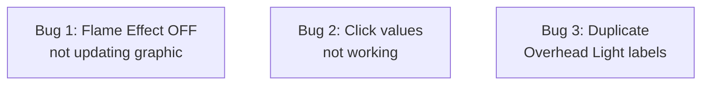

# Plan: TUI Bug Fixes

## Original Work Order

> Read todo.md and create a plan

The todo.md contains 3 bug reports:

1. Setting flame effect to off doesn't update the fireplace graphic
2. When I click field values, nothing happens
3. Something is confused with the overhead light. There are two overhead light settings, one bound to o and one bound to s. Investigate which one is wrong and fix it.

## Plan Clarifications

| Question | Answer |
|----------|--------|
| What does the `light_status` field (byte 18) control on the hardware? | Unknown — revert to its original label "Light Status" to distinguish it from `overhead_light`. |

## Executive Summary

This plan addresses three bugs discovered after the Plan 8 TUI refinements. The first bug is that toggling the flame effect to OFF still shows flames in the fireplace graphic — the render logic only checks power mode, not the flame effect state. The second bug is that clicking on field values does nothing — the `_ClickableValue.on_click()` handler calls `self.app.run_action()` which is a coroutine but is not awaited. The third bug is that two separate hardware fields (`overhead_light` and `light_status`) are both labeled "Overhead Light" in the UI and command palette, causing user confusion.

All three are targeted fixes to existing code with clear root causes identified through codebase investigation.

## Context

### Current State vs Target State

| Current State | Target State | Why? |
|---|---|---|
| `FireplaceVisual.render()` only checks `fire_on` (power mode) to decide whether to show flames | Also checks `flame_effect.flame_effect == FlameEffect.ON` | Toggling flame effect OFF should visually extinguish the flames |
| `_ClickableValue.on_click()` calls `self.app.run_action()` without `await` | `on_click` is async and awaits `run_action()` | `run_action()` returns a coroutine; without `await` the action never executes |
| Both `overhead_light` and `light_status` labeled "Overhead Light" in UI, command palette, and bindings | `light_status` reverted to "Light Status" with its own distinct label and key binding description | Users cannot distinguish the two settings |

### Background

- **Bug 1**: The `render()` method in `FireplaceVisual` (widgets.py lines 929-957) determines flame visibility solely from `mode.mode == FireMode.MANUAL`. The `FlameEffectParam.flame_effect` field (which has `FlameEffect.ON`/`OFF` values) is never checked for this purpose — it's only used to read palette and LED colors. When a user presses 'e' to toggle the flame effect OFF, the parameter is updated correctly but the visual continues to show flames.

- **Bug 2**: The `_ClickableValue` widget (widgets.py lines 56-76) has `on_click()` as a sync method that calls `self.app.run_action(self._action)`. In Textual, `run_action()` is a coroutine. When called without `await`, it creates a coroutine object that is never executed. The method also needs `self.app.param-label` CSS fix that was already applied (width: auto) for the value to be visible, but even when visible, clicking does nothing because the action is never awaited.

- **Bug 3**: Plan 7 renamed "Light Status" to "Overhead Light" across the UI. This was incorrect because `light_status` (byte 18 in the protocol) is a separate hardware field from `overhead_light` (byte 13). The result is two entries both labeled "Overhead Light" in:
  - `_format_flame_effect()` in widgets.py (lines 212 and 237)
  - `_CONTROL_COMMANDS` in app.py (lines 97 and 99)
  - BINDINGS in app.py (lines 162 and 164)
  - CLI display in cli.py

## Architectural Approach

*All 3 bugs are independent with no dependencies between them.*

### Flame Effect OFF Not Updating Graphic

**Objective**: Make the fireplace visual respect the `flame_effect` on/off state, not just the power mode.

In `FireplaceVisual.render()` (widgets.py), the `fire_on` variable currently derives only from `mode.mode == FireMode.MANUAL`. It should also require `flame_effect.flame_effect == FlameEffect.ON` (when flame_effect is available). When the flame effect is OFF but power is ON, the graphic should show the fireplace frame without active flames (similar to STANDBY mode visually), but the LED and media bed can still reflect the configured colors since the fireplace is powered on.

The fix is in the `render()` method, adding a check: if `flame_effect` is not None and `flame_effect.flame_effect != FlameEffect.ON`, set `fire_on = False`. This ensures `_build_fire_art()` renders a dark/empty fireplace when flames are disabled.

The animation timer should also stop when flames are off (no need to tick frames), and restart when flames come back on. The existing `_start_animation`/`_stop_animation` methods on `FireplaceVisual` handle this — they just need to be triggered when flame effect state changes.

**Files**: `src/flameconnect/tui/widgets.py` (`FireplaceVisual.render`)

### Click Values Not Working

**Objective**: Make field value clicks trigger the associated actions.

The `_ClickableValue.on_click()` method must be changed from sync to async, and `self.app.run_action()` must be awaited:

Change `def on_click(self) -> None:` to `async def on_click(self) -> None:` and `self.app.run_action(...)` to `await self.app.run_action(...)`.

**Files**: `src/flameconnect/tui/widgets.py` (`_ClickableValue.on_click`)

### Duplicate Overhead Light Labels

**Objective**: Revert `light_status` labels back to "Light Status" to distinguish them from `overhead_light`.

Four locations need to be updated:

1. **widgets.py** `_format_flame_effect()` line 212: Change label from `"  Overhead Light: "` to `"  Light Status: "` for `param.light_status`
2. **app.py** `_CONTROL_COMMANDS` line 99: Change from `("Overhead Light", "Toggle light status on/off", ...)` to `("Light Status", "Toggle light status on/off", ...)`
3. **app.py** BINDINGS line 164: Change description from `"Overhead Light"` to `"Light Status"` for the 's' key binding
4. **cli.py**: Find the `light_status` display line and change label from `"Overhead Light:"` back to `"Light Status:"`

**Files**: `src/flameconnect/tui/widgets.py`, `src/flameconnect/tui/app.py`, `src/flameconnect/cli.py`

## Risk Considerations and Mitigation Strategies

Technical Risks

- **Flame effect OFF visual ambiguity**: When flames are off but power is on, the graphic may look identical to STANDBY. Users might not realize the fireplace is still powered on.
    - **Mitigation**: The parameter panel still shows "Mode: Manual" and "Flame Effect: Off", providing clear textual indication. The LED/media bed styling can remain lit to differentiate from STANDBY.

## Success Criteria

### Primary Success Criteria

1. Toggling flame effect OFF visually extinguishes flames in the fireplace graphic
2. Clicking field values in the parameter panel triggers the corresponding action (dialog opens, toggle executes)
3. "Overhead Light" (key 'o') and "Light Status" (key 's') have distinct labels in the UI, command palette, and CLI
4. All existing tests pass
5. No new lint errors

## Resource Requirements

### Development Skills

- Textual framework (async event handling, widget rendering)
- Python async/await patterns

### Technical Infrastructure

- Python 3.13+, Textual, Rich
- pytest, ruff

## Notes

- The `param-label` CSS fix (`width: auto`) for the `ClickableParam` widget has already been applied in the working tree but not yet committed. It should be included in the same commit as the click fix (Bug 2), since both relate to the clickable values feature.

## Execution Blueprint

**Validation Gates:**
- Reference: `/config/hooks/POST_PHASE.md`

### ✅ Phase 1: All Bug Fixes
**Parallel Tasks:**
- ✔️ Task 01: Fix Flame Effect OFF Not Updating Graphic
- ✔️ Task 02: Fix Click Values Not Working
- ✔️ Task 03: Fix Duplicate Overhead Light Labels

### Execution Summary
- Total Phases: 1
- Total Tasks: 3
- Maximum Parallelism: 3 tasks (in Phase 1)
- Critical Path Length: 1 phase

## Execution Summary

**Status**: Completed Successfully
**Completed Date**: 2026-02-25

### Results
All 3 bugs fixed in a single phase with 3 parallel tasks:

- **Bug 1 (Flame effect graphic)**: Separated `power_on` from `fire_on` in `FireplaceVisual.render()`. LED/media styling applies when power is on; flames only render when both power is on AND `flame_effect.flame_effect == FlameEffect.ON`. Animation timer also stops when flames are off.
- **Bug 2 (Click values)**: Changed `_ClickableValue.on_click()` from sync to async and added `await` to `self.app.run_action()`. The coroutine was previously created but never executed.
- **Bug 3 (Duplicate labels)**: Reverted `light_status` labels from "Overhead Light" to "Light Status" in widgets.py, app.py (CONTROL_COMMANDS + BINDINGS), and cli.py.

### Noteworthy Events
No significant issues encountered. All 251 tests passed throughout execution.

### Recommendations
None — all bugs are fully resolved.
