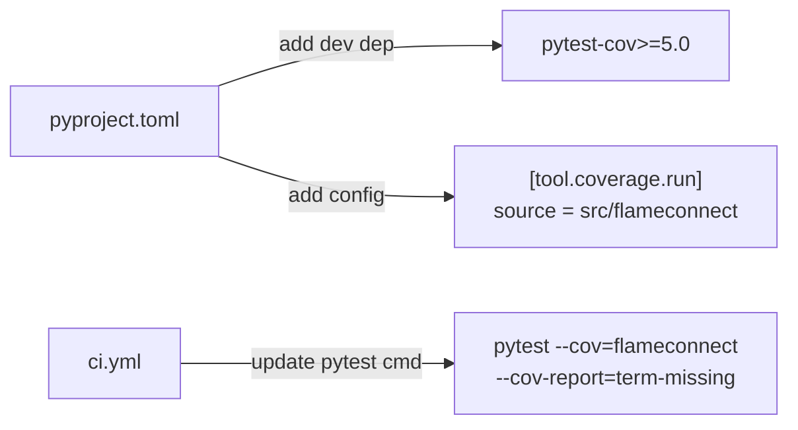

# Plan: Add Code Coverage Reporting with pytest-cov

## Original Work Order
> Add pytest-cov as a dev dependency and wire in code coverage into tests.

## Executive Summary

This plan adds code coverage measurement to the existing pytest test suite by introducing `pytest-cov` as a dev dependency and configuring it in `pyproject.toml`. The CI pipeline will also be updated to run tests with coverage enabled, producing a terminal summary of uncovered lines.

This is a minimal, targeted change: one new dependency, one config section, and one CI flag update. No new files, no coverage thresholds, no exclusions, no external reporting services.

## Context

### Current State vs Target State

| Current State | Target State | Why? |
|---|---|---|
| No `pytest-cov` dependency | `pytest-cov>=5.0` in dev dependencies | Required to measure coverage |
| `pytest --tb=short` in CI with no coverage | `pytest --cov=flameconnect --cov-report=term-missing --tb=short` in CI | Produces coverage report in CI output |
| No `[tool.coverage.run]` config | `[tool.coverage.run]` section in `pyproject.toml` with `source` pointing to `src/flameconnect` | Ensures coverage maps to the correct source tree |
| Developers have no visibility into test gaps | Terminal report shows uncovered lines per module | Enables informed decisions about test priorities |

### Background

The project already has a solid test suite (9 test files, ~3,950 lines of test code) and mutation testing on `protocol.py`. Adding coverage reporting complements the existing quality tooling by providing line-level visibility into which code paths are exercised by tests. The project philosophy calls for "a high level of test coverage including mutation testing."

Coverage flags are added to the CI pytest command rather than via `addopts` in pytest config. This avoids adding coverage overhead to mutmut's internal pytest invocations, which would slow mutation testing without benefit.

## Architectural Approach

### Dependency Addition
**Objective**: Make pytest-cov available in the dev environment.

Add `pytest-cov>=5.0` to the `[project.optional-dependencies] dev` list in `pyproject.toml`. This aligns with the existing pattern of pinning minimum versions for dev tools (e.g., `pytest>=8.0`, `ruff>=0.4`).

### Coverage Configuration
**Objective**: Configure coverage.py (via pytest-cov) to measure the correct source tree.

Add a `[tool.coverage.run]` section to `pyproject.toml` with `source = ["src/flameconnect"]`. This tells coverage.py where the project source lives on disk, ensuring proper line-level mapping when the package is installed in the virtualenv.

No `omit` patterns and no `[tool.coverage.report]` section are needed — the goal is to measure everything and keep configuration minimal.

### CI Pipeline Update
**Objective**: Surface coverage data in every CI run.

Update the pytest invocation in `.github/workflows/ci.yml` to include `--cov=flameconnect --cov-report=term-missing`. The `term-missing` report format prints uncovered line numbers directly in the CI log, requiring no artifact uploads or external services.

## Risk Considerations and Mitigation Strategies

Technical Risks

- **Coverage slows test execution**: pytest-cov adds minor overhead to test runs.
    - **Mitigation**: Coverage measurement typically adds <10% overhead; acceptable for the current test suite size.

Implementation Risks

- **Source path mismatch**: If `source` is misconfigured, coverage may report 0% or miss files.
    - **Mitigation**: Verify by running `uv run pytest --cov=flameconnect` locally after the change and confirming output lists the expected modules.

## Success Criteria

### Primary Success Criteria
1. `pytest-cov>=5.0` is listed in dev dependencies and installs cleanly with `uv sync --all-extras --dev`.
2. The CI workflow runs tests with coverage and the coverage report appears in the CI log output.
3. All existing tests continue to pass.

## Resource Requirements

### Development Skills
- Familiarity with Python packaging (`pyproject.toml`) and pytest plugin configuration.

### Technical Infrastructure
- Existing `uv`-based dev environment and GitHub Actions CI pipeline — no new infrastructure needed.

## Notes
- No coverage enforcement threshold is being added. The goal is visibility, not gating.
- The `--cov-report=term-missing` format was chosen over HTML or XML because it requires no artifact handling and is immediately visible in CI logs.
- Coverage flags are on the CI command, not in `addopts`, to avoid adding overhead to mutmut's internal pytest runs.

### Change Log
- 2026-02-25: Initial plan creation.
- 2026-02-25: Refinement — removed TUI and `__main__.py` omit patterns (scope creep; not requested and TUI already has tests). Removed empty `[tool.coverage.report]` section. Added rationale for CI-flag approach over `addopts` (mutmut interference). Simplified diagram.
- 2026-02-25: Task generation and blueprint creation.

## Execution Blueprint

**Validation Gates:**
- Reference: `/config/hooks/POST_PHASE.md`

### ✅ Phase 1: Add pytest-cov and wire coverage
**Parallel Tasks:**
- ✔️ Task 01: Add pytest-cov dependency and coverage configuration — `completed`
- ✔️ Task 02: Update CI pytest command with coverage flags — `completed`

### Post-phase Actions
- Lint check (`ruff check`, `ruff format --check`) — pre-existing lint issues only, no new issues introduced
- Commit changes with conventional commit message — done (`fca4c04`)

### Execution Summary
- Total Phases: 1
- Total Tasks: 2
- Maximum Parallelism: 2 tasks (in Phase 1)
- Critical Path Length: 1 phase

## Execution Summary

**Status**: ✅ Completed Successfully
**Completed Date**: 2026-02-25

### Results
- Added `pytest-cov>=5.0` to dev dependencies (resolved to v7.0.0)
- Added `[tool.coverage.run]` config with `source = ["src/flameconnect"]`
- Updated CI pytest command to `uv run pytest --cov=flameconnect --cov-report=term-missing --tb=short`
- All 247 tests pass with coverage reporting: **57% overall coverage** across 24 source modules
- Committed on branch `pytest-cov-integration` (`fca4c04`)

### Noteworthy Events
- Pre-existing ruff lint issues exist in 5 files (protocol.py, tui/app.py, tui/auth_screen.py, tui/screens.py, test_tui_actions.py). These are unrelated to this change and were not introduced by it.

### Recommendations
- Merge the `pytest-cov-integration` branch into `main`
- Consider adding a coverage threshold later once the team agrees on a target percentage
