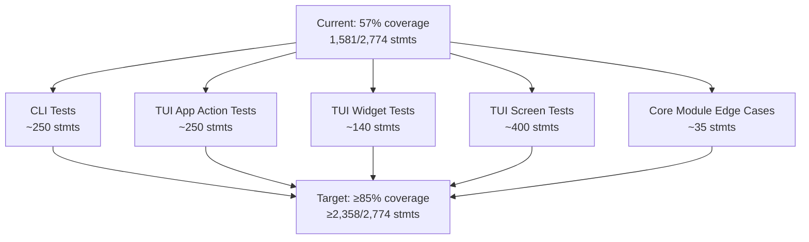

# Plan: Increase Test Coverage to 85%

## Original Work Order
> Increase test coverage to at least 85% of files in src. Stop increasing test coverage if files in src/ must change. DO NOT modify any files in src/.

## Executive Summary

The project's test suite currently covers 57% of source code (1,581 of 2,774 statements). This plan raises coverage to ≥85% (≥2,358 statements) by adding approximately 777+ covered statements through new test files only. No source files in `src/` will be modified.

Analysis of all 1,193 uncovered statements confirms that ~85-95% are testable without source changes, by leveraging existing test patterns (mocked clients, `aioresponses`, Textual's `run_test()` framework) and creating new test files for untested modules. The work is organized into five areas targeting the highest-impact modules first.

## Context

### Current State vs Target State

| Module | Current | Missed Stmts | Estimated Coverable | Impact on Overall |
|---|---|---|---|---|
| cli.py | 51% | 296 | ~250 | +9% |
| tui/app.py | 52% | 285 | ~250 | +9% |
| tui/widgets.py | 50% | 157 | ~140 | +5% |
| 6 TUI screens at 0% | 0% | 327 | ~280 | +10% |
| 3 TUI screens partial | 27-67% | 146 | ~120 | +4% |
| Core modules (auth, b2c, client, protocol, __main__) | 87-99% | 38 | ~35 | +1% |
| **Total** | **57%** | **1,193** | **~985** | **→ ~93%** |

The 85% target (777 new covered statements) is well within the ~985 estimated coverable, leaving margin for tests that turn out to be infeasible without src/ changes.

### Background

The project has a solid test infrastructure: 9 test files with ~3,950 lines of test code, `pytest-asyncio` for async tests, `aioresponses` for HTTP mocking, and Textual's native testing framework already demonstrated in `test_tui_actions.py` and `test_fireplace_visual.py`. The existing patterns cover all the mocking techniques needed — no new testing libraries or src modifications are required.

**Critical constraint**: If any test requires a source change to be testable (e.g., hard-coded dependency that can't be mocked, missing injection point), that test must be skipped. The 85% target is a goal, not a mandate to modify production code.

## Architectural Approach

### CLI Command and Display Testing
**Objective**: Cover the ~296 missed statements in `cli.py` — the single largest coverage gap.

The uncovered code falls into three categories: (1) display functions (`_display_mode`, `_display_flame_effect`, `_display_heat`, etc.) that format parameter data for terminal output, (2) the `_display_parameter` dispatch function, and (3) CLI entry points (`cmd_set`, `cmd_turn_on`, `cmd_turn_off`, `async_main`, `main`). The existing `test_cli_set.py` demonstrates the pattern: mock the `FlameConnectClient` and test each function in isolation. Interactive terminal functions (`_masked_input`, `_cli_auth_prompt`) can be tested by mocking `asyncio.to_thread` and stdin.

New test file: `tests/test_cli_commands.py`

### TUI App Action Method Testing
**Objective**: Cover the ~285 missed statements in `tui/app.py`.

The uncovered code is primarily action methods (toggle power, brightness, flame effects, colors, heat, timer, etc.) and lifecycle methods (`_load_fires`, `show_auth_screen`, `_run_command`). The existing `test_tui_actions.py` already tests many action methods using mocked `DashboardScreen` with `current_parameters` and a mocked `FlameConnectClient`. The same pattern extends to cover the remaining action methods.

Expand: `tests/test_tui_actions.py` (add tests for uncovered action methods)

### TUI Widget Format Function Testing
**Objective**: Cover the ~157 missed statements in `tui/widgets.py`.

The uncovered code is predominantly pure formatting functions (`_format_mode`, `_format_flame_effect`, `_format_heat`, `_format_connection_state`, etc.) and the `format_parameters` dispatcher. These take model objects as input and return display tuples — straightforward to test by constructing model instances and asserting on output. The widget classes (`ParameterPanel`, `FireplaceSelector`) can be tested via Textual's `run_test()`.

New test file: `tests/test_widgets_format.py`

### TUI Modal Screen Testing
**Objective**: Cover the ~470 missed statements across 9 TUI screen files (6 at 0%, 3 partially covered).

All screen files follow the same pattern: `ModalScreen` subclasses that accept an initial value, compose a UI with buttons/inputs, and return a selected value via `dismiss()`. Textual's `run_test()` framework supports pushing modal screens and interacting with them programmatically. Each screen can be tested by: (1) mounting it with test data, (2) simulating user interactions (button clicks, input), (3) asserting on the dismissed result.

New test file: `tests/test_tui_screens.py` (covers screens.py lifecycle + all modal screens)

### Core Module Edge Case Testing
**Objective**: Cover the ~38 remaining missed statements across `auth.py`, `b2c_login.py`, `client.py`, `protocol.py`, and `__main__.py`.

These are small gaps in already well-tested modules: error handling paths in auth token acquisition, HTTP edge cases in B2C login, context manager error paths in client, an unknown-parameter-type branch in protocol, and the trivial `__main__.py` entry point. Each can be covered by adding targeted edge-case tests to existing test files.

Expand: `tests/test_auth.py`, `tests/test_b2c_login.py`, `tests/test_client.py`, `tests/test_protocol.py`; new: `tests/test_main.py`

## Risk Considerations and Mitigation Strategies

Technical Risks

- **Textual testing complexity**: Some TUI screen interactions (nested modals, async workers) may behave unexpectedly in test mode.
    - **Mitigation**: Start with simpler screens (flame_speed, flame_color) before tackling complex ones (color_screen, auth_screen). Use existing test_tui_actions.py patterns as a reference.

- **Mocking depth for CLI entry points**: `async_main()` and `main()` orchestrate auth, client creation, and command dispatch — deep call stacks to mock.
    - **Mitigation**: Test at the function level (individual `_display_*` and `_set_*` functions) rather than full integration through `main()`. Skip `main()` if it requires disproportionate effort for 2-3 lines of coverage.

Implementation Risks

- **Source changes needed**: Some code paths may be untestable without src/ modifications (e.g., hard-coded singletons, missing injection points).
    - **Mitigation**: Per the work order, skip those tests and accept lower coverage on individual files. The 85% is an overall target — no per-file minimum is required.

- **Test fragility**: TUI tests that depend on exact widget structure may break if src/tui files change later.
    - **Mitigation**: Test behavior (what value is dismissed, what action is called) rather than internal widget IDs where possible. Follow the existing test patterns which have already proven stable.

## Success Criteria

### Primary Success Criteria
1. Overall coverage reaches ≥85% (≥2,358/2,774 statements) as reported by `pytest --cov=flameconnect --cov-report=term-missing`.
2. All existing 247 tests continue to pass.
3. All new tests pass.
4. No files in `src/` are modified — verified by `git diff --name-only src/` returning empty.

## Resource Requirements

### Development Skills
- Python testing with pytest and pytest-asyncio
- Textual TUI testing framework (`run_test()`, pilot interactions)
- Mocking patterns (unittest.mock, aioresponses)

### Technical Infrastructure
- Existing dev environment with pytest-cov, aioresponses, and textual[dev] already installed.

## Notes
- The 85% target applies to overall coverage across all src/ files, not per-file. Individual files may remain below 85% if testing them requires src/ changes.
- Coverage of `_masked_input()` and `_cli_auth_prompt()` in cli.py depends on whether terminal I/O can be mocked cleanly — skip if it requires src/ changes.

### Change Log
- 2026-02-25: Initial plan creation.
- 2026-02-25: Refinement — replaced per-file hard targets in state table with estimated-coverable/impact-on-overall columns to avoid misleading task generators. Added `git diff` verification to success criteria. Removed .gitignore scope creep from Notes. Clarified 85% is overall-only in risk mitigations.
- 2026-02-25: Task generation and blueprint creation.

## Execution Blueprint

**Validation Gates:**
- Reference: `/config/hooks/POST_PHASE.md`

### ✅ Phase 1: Add test coverage across all modules
**Parallel Tasks:**
- ✔️ Task 01: Add CLI command and display function tests — `completed` (150 tests, cli.py 51%→99%)
- ✔️ Task 02: Expand TUI app action method tests — `completed` (124 new tests, app.py 52%→92%)
- ✔️ Task 03: Add TUI widget format function tests — `completed` (96 tests, widgets.py 50%→97%)
- ✔️ Task 04: Add TUI modal screen tests — `completed` (156 tests, 6 screens 0%→100%, 3 screens →97-100%)
- ✔️ Task 05: Add core module edge case tests — `completed` (25 new tests, auth/b2c/client/protocol/main →95-100%)

### Post-phase Actions
- ✅ All 811 tests pass
- ✅ No src/ files modified (`git diff --name-only src/` empty)
- ✅ Overall coverage 97% (target was ≥85%)
- ✅ Lint clean (`ruff check tests/` — all checks passed)
- ✅ Committed (`eec8e99`)

### Execution Summary
- Total Phases: 1
- Total Tasks: 5
- Maximum Parallelism: 5 tasks (in Phase 1)
- Critical Path Length: 1 phase

## Execution Summary

**Status**: ✅ Completed Successfully
**Completed Date**: 2026-02-25

### Results
- Coverage increased from **57% to 97%** (target was ≥85%) — 2,702 of 2,774 statements covered
- Added **564 new tests** (247→811 total), all passing
- Created 4 new test files: `test_cli_commands.py`, `test_widgets_format.py`, `test_tui_screens.py`, `test_main.py`
- Expanded 5 existing test files: `test_tui_actions.py`, `test_auth.py`, `test_b2c_login.py`, `test_client.py`, `test_protocol.py`
- **Zero source files modified** — all changes in `tests/` only
- 14 of 22 source modules at 100% coverage; remaining 8 modules at 92-99%

### Noteworthy Events
- All uncovered code was testable without src/ modifications — the "stop if src/ changes needed" constraint was never triggered.
- Lint auto-fix resolved most issues; manual fixes needed for line-length and unused variable patterns in test files.
- 72 statements remain uncovered (3%) — primarily in Textual app lifecycle methods and a few deep error paths.

### Recommendations
- Merge the `increase-test-coverage` branch
- The 72 remaining uncovered lines are in: `tui/app.py` CSS/compose methods (lines 1021-1081), `b2c_login.py` redirect chain edge cases, and `cli.py` set-command return paths
