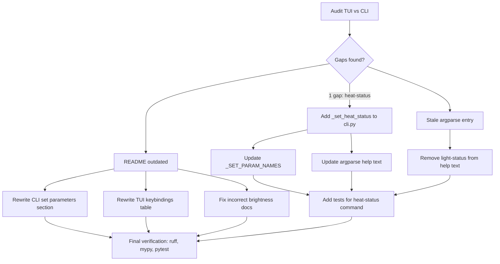

# Plan: CLI/TUI Parity and README Update

## Original Work Order
> Verify that all TUI options to modify fire settings are available in the CLI. Make sure to update the README to cover all CLI commands.

## Executive Summary

An audit of all 22 TUI keybindings against their CLI equivalents reveals one functional gap: the TUI's heat on/off toggle (`action_toggle_heat`, key `s`) has no corresponding CLI `set heat-status` command. All other 15 settable TUI fire parameters already have CLI counterparts. A secondary issue was found: the `set` subparser help text in `build_parser()` lists a stale `light-status` parameter that has no handler in `cmd_set()`.

The README's CLI section is significantly outdated: it documents only 6 of the 16 `set` parameters, one incorrectly (`brightness 200` instead of `brightness low/high`), and the TUI keybindings table lists only 3 of the 20 user-facing keys. This plan adds the missing CLI command, removes the stale argparse entry, and rewrites the README CLI/TUI sections to be complete and accurate.

## Context

### Current State vs Target State

| Current State | Target State | Why? |
|---|---|---|
| TUI heat toggle (`s` key) has no CLI equivalent | `flameconnect set <id> heat-status on/off` command exists | Users need heat on/off control from scripts and the CLI |
| README documents 6 of 16 `set` parameters | README documents all 17 `set` parameters (including new `heat-status`) | Users cannot discover features they don't know exist |
| README shows `brightness 200` (0-255) | README shows `brightness high` or `brightness low` | Current docs are wrong and will confuse users |
| README heat-mode lists `fan-only` as valid | README lists only `normal`, `eco`, `boost`, `boost:<min>` | `fan-only` is not in the CLI lookup and will produce an error; the TUI also only offers Normal/Eco/Boost |
| README TUI table shows only 3 keys (p, r, q) | README TUI table shows all 20 user-facing keys | Users miss the full TUI capability |
| Argparse help lists stale `light-status` param | `light-status` removed from argparse help text | No handler exists for `light-status` in `cmd_set()`; the `overhead-light` command already controls the same `light_status` field |

### Background

The CLI dispatches `set` parameters through `cmd_set()` in `cli.py`, which matches the `param` string against an if-chain and delegates to a `_set_*` helper. Each helper fetches the current parameter state via `get_fire_overview`, creates a modified copy with `dataclasses.replace`, and writes it back via `write_parameters`. The TUI follows an identical pattern but triggers from keybindings.

The `HeatMode` enum defines `FAN_ONLY` and `SCHEDULE` values, but neither the TUI nor the CLI exposes them. Since this plan is scoped to TUI/CLI parity (not expanding beyond what the TUI offers), these modes are intentionally excluded.

**Note on `overhead_light` vs `light_status` fields:** The `FlameEffectParam` model has two distinct wire-protocol fields: `overhead_light` (byte 13) and `light_status` (byte 18). Both the CLI's `_set_overhead_light` and the TUI's `action_toggle_overhead_light` modify `light_status` (byte 18), which is the correct field for controlling the overhead light from the user's perspective. The `overhead_light` field (byte 13) is not user-modifiable in either interface. This is existing, consistent behavior — no changes needed.

## Architectural Approach

### Add `heat-status` CLI Command

**Objective**: Provide CLI parity with the TUI's heat on/off toggle.

The implementation follows the exact same pattern as every other `_set_*` helper in `cli.py`:

1. Add `_set_heat_status()` async function that accepts `"on"` or `"off"`, fetches the current `HeatParam` via `get_fire_overview`, replaces `heat_status` with the corresponding `HeatStatus` enum value, and writes it back. This targets `HeatParam` (ParameterId 323), not `FlameEffectParam`.
2. Add an `if param == "heat-status"` branch in `cmd_set()`.
3. Append `"heat-status"` to `_SET_PARAM_NAMES`.
4. Add `heat-status` and remove the stale `light-status` from the argparse help text in `build_parser()`.
5. Add tests following the existing `_set_*` pattern in `tests/test_cli_set.py`: use `aioresponses` to mock the GET (overview) and POST (write) calls, verify the request body contains ParameterId 323 with the correct heat_status value, and add an error-case test using `pytest.raises(SystemExit)` for invalid values.

### Remove Stale `light-status` From Argparse Help

**Objective**: Fix the misleading argparse help text that lists a parameter with no handler.

The `build_parser()` function (cli.py line 864-870) includes `light-status` in the `param` argument help string, but no `if param == "light-status"` branch exists in `cmd_set()`. Remove it from the help text. The `overhead-light` parameter already controls the same underlying `light_status` field.

### Update README CLI Documentation

**Objective**: Make the README accurately reflect all available CLI commands.

The "Set parameters" subsection under "CLI Usage" will list all 17 `set` parameters (the current 16 plus the new `heat-status`), using the existing code-block-with-comments format for consistency. Parameters grouped logically:

- **Fire control**: `mode`
- **Flame**: `flame-effect`, `flame-speed`, `flame-color`, `brightness`, `pulsating`
- **Media lighting**: `media-theme`, `media-light`, `media-color`
- **Overhead lighting**: `overhead-light`, `overhead-color`
- **Ambient**: `ambient-sensor`
- **Heat**: `heat-status`, `heat-mode`, `heat-temp`
- **Timer & units**: `timer`, `temp-unit`

Each entry shows the exact command syntax with an inline comment listing accepted values. The incorrect `brightness 200` example is replaced with `brightness high`. The `heat-mode` entry lists only `normal`, `eco`, `boost`, `boost:<minutes>` (dropping the incorrect `fan-only`).

### Update README TUI Documentation

**Objective**: Document all TUI keybindings so users can discover the full feature set.

Replace the 3-row keybindings table with all 20 user-facing keys (the 22 total BINDINGS minus Ctrl+P command palette and `?` help toggle, which are standard Textual affordances — though `?` should be included as it's explicitly useful). The table will be grouped with visual separators or sub-headings by category: flame settings, lighting, heat, timer/units, and navigation.

Complete keybinding list for the README:

| Key | Action |
|-----|--------|
| `p` | Toggle power on/off |
| `f` | Set flame speed (1-5) |
| `e` | Toggle flame effect |
| `c` | Set flame color |
| `b` | Toggle brightness (high/low) |
| `g` | Toggle pulsating effect |
| `m` | Set media theme |
| `l` | Toggle media light |
| `d` | Set media color (RGBW) |
| `o` | Toggle overhead light |
| `v` | Set overhead color (RGBW) |
| `a` | Toggle ambient sensor |
| `s` | Toggle heat on/off |
| `h` | Set heat mode |
| `n` | Set temperature |
| `u` | Toggle temp unit (°C/°F) |
| `t` | Set timer |
| `w` | Switch fireplace |
| `?` | Toggle help overlay |
| `r` | Manual refresh |
| `q` | Quit |

## Risk Considerations and Mitigation Strategies

Technical Risks

- **Incorrect HeatParam wire protocol**: Sending a modified `HeatParam` with only `heat_status` changed could have side effects on `heat_mode` or `setpoint_temperature`.
    - **Mitigation**: The implementation uses `dataclasses.replace` on the current state (fetched from the fireplace), only modifying the `heat_status` field. This is the exact same pattern used by the TUI's `action_toggle_heat` which is already working.

Implementation Risks

- **README drift**: The README could fall out of sync again as new parameters are added.
    - **Mitigation**: The README will use a structured format (grouped by category with consistent syntax) making omissions more obvious during code review.

## Success Criteria

### Primary Success Criteria
1. `flameconnect set <fire_id> heat-status on` and `heat-status off` work correctly, matching the TUI's heat toggle behavior.
2. Every `set` parameter available in the CLI is documented in the README with correct syntax and accepted values.
3. Every TUI keybinding is listed in the README keybindings table (21 keys).
4. The stale `light-status` is removed from the argparse help text.
5. All existing tests pass; new tests cover the `heat-status` command.
6. `ruff check`, `mypy`, and `pytest` all pass cleanly.

## Resource Requirements

### Development Skills
- Python async programming (aiohttp, dataclasses)
- Familiarity with the existing `cli.py` `_set_*` pattern and the `models.py` parameter dataclasses

### Technical Infrastructure
- Python 3.13+, uv, ruff, mypy, pytest (all already configured in the project)

## Execution Blueprint

**Validation Gates:**
- Reference: `/config/hooks/POST_PHASE.md`

### Phase 1: CLI Implementation and Tests
**Parallel Tasks:**
- ✔️ Task 001: Add heat-status CLI command and tests (status: completed)

### Phase 2: Documentation Update
**Parallel Tasks:**
- ✔️ Task 002: Update README CLI and TUI documentation (depends on: 001) (status: completed)

### Post-phase Actions

### Execution Summary
- Total Phases: 2
- Total Tasks: 2
- Maximum Parallelism: 1 task (in Phase 1)
- Critical Path Length: 2 phases

## Notes

### Change Log
- 2026-02-25: Initial plan created
- 2026-02-25: Refinement — added stale `light-status` argparse cleanup, corrected TUI keybinding count from "18" to 22 (21 user-facing), documented `overhead_light` vs `light_status` field distinction, specified test pattern (aioresponses-based), specified README format (code blocks with comments)

## Execution Summary

**Status**: Completed Successfully
**Completed Date**: 2026-02-26

### Results
- Added `_set_heat_status()` CLI command with on/off support (ParameterId 323), following existing `_set_*` pattern
- Updated `_SET_PARAM_NAMES` and argparse help text to include `heat-status` (stale `light-status` was already removed in Plan 13)
- Added 4 tests: on, off, invalid value, and cmd_set dispatch integration (65 total CLI set tests)
- Expanded README CLI "Set parameters" from 6 to all 17 parameters, grouped by category
- Expanded README TUI keybindings table from 3 to all 21 user-facing keys
- All 1048 tests pass, ruff and mypy clean

### Noteworthy Events
No significant issues encountered.

### Recommendations
None.
