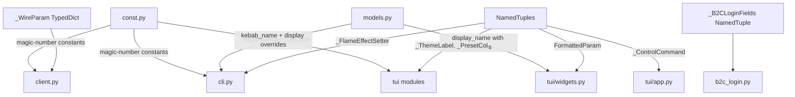
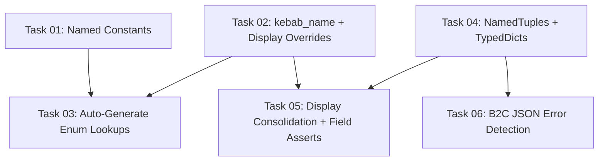

# Plan: Dynamic Typing Hardening

## Original Work Order

> Evaluate this project for any code or externally facing APIs that are subject to common mistakes in dynamically typed languages. For example, I'm thinking of issues like using strings instead of constants or named methods (since strings can't easily autocomplete), or arrays or dicts that should be full objects. Consider other types of issues like this common in Python too. We want to improve the library based on your findings.

## Plan Clarifications

| Question | Answer |
|---|---|
| The CLI shows FlameColor as `"Yellow/Red"` (slashes) while TUI shows `"Yellow Red"` (spaces). Should we standardize or keep separate? | **Standardize all.** Use a single display-name overrides mechanism in `models.py` so CLI and TUI show identical names everywhere. |
| The plan proposes `cli_name()` in `models.py` (library core). This couples library models to CLI formatting. Where should it live? | **In `models.py`**, alongside `display_name()`. Use a general-purpose name like `kebab_name()` to make it reusable. |
| For `_FEATURE_LABELS` and `_FLAME_EFFECT_SETTERS`, what validation mechanism to catch stale field-name strings? | **Module-level assert.** Validate at import time so field mismatches cause an immediate `AssertionError`. |

## Executive Summary

A thorough audit of the flameconnect codebase reveals it is already well-structured with good use of frozen dataclasses, IntEnums, and type annotations. However, several patterns common in dynamically-typed Python undermine the type safety the project already strives for. The most impactful issues fall into seven categories: **(1)** magic numbers scattered across multiple modules, **(2)** hand-maintained string-to-enum lookup tables that can drift, **(3)** unnamed tuples used as structured data, **(4)** plain dicts with known schemas, **(5)** stringly-typed field access via `getattr()`, **(6)** duplicate display-name overrides, and **(7)** fragile string-matching for error detection.

This plan addresses each category with targeted, minimal changes. The approach preserves the existing architecture while making it harder to introduce silent bugs from typos, field renames, or data structure drift.

## Context

### Current State vs Target State

| Current State | Target State | Why? |
|---|---|---|
| Magic `22.0` (default temp) in `client.py` (lines 296, 325) and `cli.py` (line 480) | `DEFAULT_TARGET_TEMPERATURE` constant in `const.py` | Single source of truth; discoverable |
| Magic `5` (max flame speed) in `cli.py`, `tui/widgets.py`, `tui/flame_speed_screen.py` | `MAX_FLAME_SPEED` constant in `const.py` | Single source of truth |
| Magic `480` (max timer), `20` (max boost), temp ranges `5.0/35.0/40.0/95.0` in TUI | Named constants in `const.py` | Eliminates scattered magic numbers |
| 5 hand-maintained `dict[str, EnumType]` lookup tables in `cli.py` | Auto-generated lookups derived from enum definitions via `kebab_name()` | Prevents drift when enum members are added/removed; less maintenance |
| `_FLAME_EFFECT_SETTERS` uses `tuple[str, dict[str, object], str]` | A `NamedTuple` with `field`, `lookup`, `label` attributes | Positional tuples are error-prone and not self-documenting |
| `_FEATURE_LABELS` maps field names as raw strings with `getattr()` | Validated at import time via module-level assert against `dataclasses.fields(FireFeatures)` | Prevents silent breakage on field rename |
| `_CONTROL_COMMANDS` is `list[tuple[str, str, str]]` in `tui/app.py` | A `NamedTuple` with `name`, `help_text`, `action` | Makes access by name instead of by index |
| `format_parameters()` returns `list[tuple[str, str, str \| None]]` | Returns `list[FormattedParam]` with named fields | Self-documenting; IDE autocomplete on `.label`, `.value`, `.action` |
| `_THEME_LABELS`, `_COLOR_LABELS`, `_PRESET_COLS` use unnamed tuples | NamedTuples with descriptive field names | Clarity and IDE support |
| `_parse_login_page()` returns `dict[str, str]` with 5 known keys | A `NamedTuple` `_B2CLoginFields` in `b2c_login.py` | Type checker catches key typos; IDE autocomplete |
| `wire_params` built as `list[dict[str, Any]]` in `client.py` | A `TypedDict` `_WireParam` for the wire parameter shape | Makes the JSON schema explicit |
| `_request()` takes `method: str` | `method: Literal["GET", "POST"]` | Narrows the type; catches invalid methods at type-check time |
| `_FIRE_MODE_DISPLAY` in `cli.py` and `_MODE_DISPLAY` in `tui/widgets.py` both override FireMode display names; TUI and CLI show FlameColor differently | Centralized overrides dict in `display_name()` in `models.py` | *Per clarification:* standardize all display names across CLI and TUI |
| `'"status":"400"' in body` string matching in `b2c_login.py` | Parse as JSON, check status field, `try/except` for non-JSON fallback | Robust error detection |

### Background

The project enforces mypy strict mode and uses frozen dataclasses with slots throughout. This means the infrastructure for strong typing is already in place. The findings in this plan are patterns that *bypass* that infrastructure — raw strings where enums exist, `getattr()` with string field names, positional tuples, and `dict[str, Any]` for known shapes. These are the seams where dynamic-language bugs sneak in despite a typed codebase.

**Verification findings from code audit:**
- All 24 field strings in `_FEATURE_LABELS` currently match `FireFeatures` fields exactly (no existing bugs, but no *protection* against future drift).
- All 8 field strings in `_FLAME_EFFECT_SETTERS` are valid `FlameEffectParam` fields (same situation).
- `format_parameters()` callers use both positional unpacking (`for label, value, action in fields`) and index access (`result[0][1]`). NamedTuple is backward-compatible with both.
- `display_name()` in `models.py` currently has no override logic — it simply does `value.name.replace("_", " ").title()`. This means `FlameColor.YELLOW_RED` → `"Yellow Red"` (not `"Yellow/Red"`), and `FireMode.MANUAL` → `"Manual"` (not `"On"`). The CLI overrides this to `"Yellow/Red"` and `"On"` via separate dicts; the TUI overrides `FireMode` but not `FlameColor`, creating an inconsistency.

## Architectural Approach



### Component 1: Named Constants for Magic Literals

**Objective**: Eliminate magic numbers and provide a single source of truth for domain-specific limits.

Add the following constants to `const.py`:
- `DEFAULT_TARGET_TEMPERATURE: float` (22.0) — used in `client.py:296`, `client.py:325`, `cli.py:480`
- `MAX_FLAME_SPEED: int` (5) — used in `cli.py:492`, `tui/widgets.py:169`, `tui/flame_speed_screen.py:73`
- `MIN_FLAME_SPEED: int` (1) — used in `cli.py:492`, `tui/flame_speed_screen.py:73`
- `MAX_TIMER_DURATION: int` (480) — used in `tui/timer_screen.py:85,100`
- `MAX_BOOST_DURATION: int` (20) — used in `cli.py:543`, `tui/heat_mode_screen.py:101,138`
- `MIN_BOOST_DURATION: int` (1) — used in `cli.py:543`
- `MIN_TEMP_CELSIUS: float` / `MAX_TEMP_CELSIUS: float` (5.0 / 35.0) — used in `tui/temperature_screen.py:89,119`
- `MIN_TEMP_FAHRENHEIT: float` / `MAX_TEMP_FAHRENHEIT: float` (40.0 / 95.0) — used in `tui/temperature_screen.py:89,121`
- `DEFAULT_TIMER_DURATION: int` (60) — used in `tui/app.py:851`

Replace all occurrences of the corresponding literals across `client.py`, `cli.py`, and the TUI modules. Add each new constant to `__all__` in `__init__.py` since these are part of the library's domain knowledge.

### Component 2: Auto-Generated String-to-Enum Lookups

**Objective**: Eliminate hand-maintained `dict[str, EnumType]` tables that can drift out of sync with enum definitions.

Add a `kebab_name()` utility function in `models.py` (alongside the existing `display_name()`) that converts an IntEnum member name to its CLI/kebab-case form (lowercase, underscores to hyphens). *Per clarification, this lives in `models.py` with a general-purpose name.* Then generate lookup dicts automatically:

```
{kebab_name(m): m for m in EnumClass}
```

This replaces the 5 manually written lookup dicts in `cli.py`:
- `_HEAT_MODE_LOOKUP` — **requires subsetting**: only exposes `NORMAL`, `BOOST`, `ECO` (not `FAN_ONLY`, `SCHEDULE`). Use explicit member list.
- `_PULSATING_LOOKUP` — full enum, auto-generate entirely.
- `_FLAME_COLOR_LOOKUP` — full enum, auto-generate entirely.
- `_MEDIA_THEME_LOOKUP` — full enum, auto-generate entirely.
- `_TEMP_UNIT_LOOKUP` — full enum, auto-generate entirely.

For `_HEAT_MODE_LOOKUP`, pass an explicit member list: `{kebab_name(m): m for m in (HeatMode.NORMAL, HeatMode.BOOST, HeatMode.ECO)}`. This preserves the current CLI behavior while still using the auto-generated pattern.

### Component 3: NamedTuples for Structured Internal Data

**Objective**: Replace positional tuples with named types for self-documentation and IDE autocomplete.

Introduce small NamedTuples (private to their modules unless noted):

- **`_FlameEffectSetter`** in `cli.py`: replaces `tuple[str, dict[str, object], str]` with fields `(field: str, lookup: dict[str, object], label: str)`.
- **`_ControlCommand`** in `tui/app.py`: replaces `tuple[str, str, str]` with fields `(name: str, help_text: str, action: str)`.
- **`FormattedParam`** in `tui/widgets.py`: replaces the `tuple[str, str, str | None]` return type of `format_parameters()` with fields `(label: str, value: str, action: str | None)`. This type is module-public since `format_parameters()` is consumed by other TUI modules. It does NOT need to be added to the top-level `__init__.py` `__all__` because `format_parameters()` itself is not exported from the top-level package.
- **`_ThemeLabel`** in `tui/media_theme_screen.py` and **`_ColorLabel`** in `tui/flame_color_screen.py`: replace `tuple[str, str]` with fields `(label: str, hotkey: str)`. Since both have identical structure, a single shared `_EnumLabel` NamedTuple could be defined once and imported, or defined independently in each module to avoid coupling.
- **`_PresetCol`** in `tui/color_screen.py`: replaces `tuple[str, str, str, str]` with fields `(key: str, label: str, dark_name: str, light_name: str)`.

All NamedTuples support positional unpacking and indexing, so existing code that does `for label, value, action in fields` or `result[0][1]` continues to work without modification.

### Component 4: Dataclass/TypedDict for Known Dict Schemas

**Objective**: Replace plain `dict[str, str]` and `dict[str, Any]` with typed structures where the key set is statically known.

- **`_B2CLoginFields`**: A `NamedTuple` (private) in `b2c_login.py` with fields `csrf: str`, `tx: str`, `p: str`, `post_url: str`, `confirmed_url: str`. Replaces the dict return of `_parse_login_page()`. Callers switch from `fields["csrf"]` to `fields.csrf`, gaining type-checked attribute access.
- **`_WireParam`**: A `TypedDict` (private) in `client.py` with `ParameterId: int` and `Value: str`. Replaces the `dict[str, Any]` used in `write_parameters()`. The list `wire_params: list[_WireParam]` is passed directly to `json=` in the request, which aiohttp serializes identically since TypedDicts are plain dicts at runtime.
- **`method` parameter typing**: Change `_request(method: str, ...)` to `_request(method: Literal["GET", "POST"], ...)`. Currently only `"GET"` and `"POST"` are used (verified).

### Component 5: Stringly-Typed Field Access Hardening

**Objective**: Reduce the risk of silent breakage from field renames in `getattr()` / `dataclasses.replace(**{field: ...})` patterns. *Per clarification, use module-level asserts for import-time validation.*

- **`_FEATURE_LABELS` validation**: Add a module-level assert at the end of `_FEATURE_LABELS` definition in `cli.py` that checks every field name string is in `{f.name for f in dataclasses.fields(FireFeatures)}`. This fires at import time if any field is renamed or removed. The display-label mapping itself remains hand-maintained because labels like `"7-Day Timer"` and `"PIR Smart Sense"` cannot be auto-derived from field names.

- **`_FLAME_EFFECT_SETTERS` validation**: Add a module-level assert that checks every `field` value (the first tuple/NamedTuple element) in `_FLAME_EFFECT_SETTERS` is in `{f.name for f in dataclasses.fields(FlameEffectParam)}`. This catches typos at import time rather than at runtime during a user's `set` command.

### Component 6: Consolidate Display Name Overrides

**Objective**: Eliminate duplicate display-name override dicts and standardize display formatting across CLI and TUI. *Per clarification, all display names should be standardized.*

Currently:
- `cli.py` has `_FIRE_MODE_DISPLAY = {FireMode.MANUAL: "On"}` and `_FLAME_COLOR_DISPLAY` with slash-separated names
- `tui/widgets.py` has `_MODE_DISPLAY = {FireMode.STANDBY: "Standby", FireMode.MANUAL: "On"}` (no FlameColor overrides, so TUI shows `"Yellow Red"` instead of `"Yellow/Red"`)

**Approach**: Add a private `_DISPLAY_OVERRIDES: dict[IntEnum, str]` mapping in `models.py` containing:
- `FireMode.MANUAL` → `"On"`
- `FlameColor.YELLOW_RED` → `"Yellow/Red"`
- `FlameColor.YELLOW_BLUE` → `"Yellow/Blue"`
- `FlameColor.BLUE_RED` → `"Blue/Red"`

Modify `display_name()` to check `_DISPLAY_OVERRIDES` first, falling back to the existing `name.replace("_", " ").title()` logic. Then remove `_FIRE_MODE_DISPLAY` and `_FLAME_COLOR_DISPLAY` from `cli.py`, and `_MODE_DISPLAY` from `tui/widgets.py`. All callers already use `display_name()` or can be switched to it.

Note: `FireMode.STANDBY` → `"Standby"` in `_MODE_DISPLAY` is redundant (the default `display_name()` already produces `"Standby"`), so it does not need an override entry.

### Component 7: Robust B2C Error Detection

**Objective**: Replace fragile string-matching error detection with proper JSON parsing.

In `b2c_login.py` line 242, the pattern `'"status":"400"' in body or '"status": "400"' in body` does substring matching on the raw response text. This is fragile because it relies on exact JSON formatting.

**Approach**: Replace with `json.loads(body)` and check the parsed `"status"` field. Wrap in `try/except (json.JSONDecodeError, KeyError, TypeError)` so that non-JSON responses (which would indicate an unexpected B2C behavior change) fall through gracefully — matching the current behavior where non-matching bodies simply proceed to the next step.

The B2C SelfAsserted endpoint is called with `X-Requested-With: XMLHttpRequest`, so responses should always be JSON. The `try/except` is a defensive measure, not an expected code path.

## Risk Considerations and Mitigation Strategies

<details>
<summary>Technical Risks</summary>

- **NamedTuple backward compatibility**: NamedTuples support positional unpacking, indexing, and named access. Verified that `format_parameters()` callers use positional unpacking (`for label, value, action in fields`) and index access (`result[0][1]`) — both work with NamedTuples.
    - **Mitigation**: Existing tests cover all caller patterns and will validate the change.
- **Auto-generated lookups may include unwanted enum members**: `HeatMode` has 5 members but the CLI only exposes 3 (`NORMAL`, `BOOST`, `ECO`).
    - **Mitigation**: Use an explicit member list for `HeatMode`. All other enums use full auto-generation. Document the subsetting pattern inline.
- **`display_name()` override change affects all callers**: Modifying `display_name()` to include overrides changes behavior for any caller that previously got the "raw" title-cased name.
    - **Mitigation**: Audit all `display_name()` call sites. The overrides (`"On"`, `"Yellow/Red"`) are the *intended* display strings everywhere, so this change aligns behavior rather than breaking it.
</details>

<details>
<summary>Implementation Risks</summary>

- **Large surface area of changes**: This plan touches `const.py`, `models.py`, `cli.py`, `client.py`, `b2c_login.py`, and 6+ TUI modules.
    - **Mitigation**: Components are independent and can be implemented as separate commits. Each component is self-contained and testable in isolation.
- **Mypy strict mode may surface new errors**: Adding `Literal`, `TypedDict`, and more precise NamedTuple types may reveal currently-hidden type mismatches.
    - **Mitigation**: Run `mypy src/` after each component. Fix any new errors as part of that component's work.
- **Module-level asserts in production code**: Asserts can be disabled with `python -O`. If the project ever runs with optimizations, the field validation would silently disappear.
    - **Mitigation**: The project does not use `-O` in any configuration. The asserts serve as development-time guardrails, not runtime safety checks. The existing test suite provides the runtime coverage.
</details>

## Success Criteria

### Primary Success Criteria

1. All magic numbers replaced with named constants from `const.py`; no bare `22.0`, `480`, `20`, or temp range literals remain in `src/` outside of `const.py`.
2. All hand-maintained string-to-enum lookup dicts replaced with `kebab_name()`-based auto-generation; adding a new enum member to a fully-generated lookup automatically appears in CLI validation.
3. All unnamed tuples used as structured data replaced with NamedTuples; `mypy src/` passes.
4. `_parse_login_page()` returns `_B2CLoginFields` NamedTuple; `write_parameters()` uses `_WireParam` TypedDict; `_request()` uses `Literal` for method. `mypy src/` passes.
5. Module-level asserts validate all field-name strings in `_FEATURE_LABELS` and `_FLAME_EFFECT_SETTERS` at import time.
6. `display_name()` produces consistent output across CLI and TUI, including override names like `"On"` and `"Yellow/Red"`. Duplicate override dicts removed.
7. All existing tests continue to pass (`uv run pytest`). `ruff check .` and `mypy src/` produce zero new warnings or errors.

## Resource Requirements

### Development Skills

- Python typing system (NamedTuple, TypedDict, Literal, dataclasses)
- Familiarity with the existing flameconnect architecture and enum/model patterns

### Technical Infrastructure

- Existing dev toolchain: `uv`, `ruff`, `mypy`, `pytest`
- No new dependencies required

## Notes

- The `_request() -> Any` return type is left as `Any` because the JSON response shape varies by endpoint. Over-typing this would require generic overloads that add complexity without proportional benefit.
- TUI button-ID string dispatch (e.g., `"speed-3"`) is a Textual framework pattern. While not ideal, replacing it would require fighting the framework. This plan does not attempt to change it.
- `FormattedParam` is public within `tui/widgets.py` but does not need top-level `__init__.py` export since `format_parameters()` is not part of the top-level package API.
- The `_FEATURE_LABELS` display labels (e.g., `"7-Day Timer"`, `"PIR Smart Sense"`) cannot be auto-derived from field names, so the label mapping remains hand-maintained. The module-level assert only validates the *field name* strings, not the labels.

### Change Log

- 2026-03-01: Initial plan created.
- 2026-03-01: Refinement — added clarification table (display name standardization, `kebab_name()` location, module-level asserts). Fixed executive summary to reference 7 categories (was incorrectly "four"). Added verified code locations for all magic numbers. Specified `_B2CLoginFields` as NamedTuple (was ambiguous dataclass-or-NamedTuple). Clarified `FormattedParam` visibility scope. Added `display_name()` override detail with specific entries. Added risk for module-level asserts with `-O`. Added defensive `try/except` requirement for B2C JSON parsing. Noted `HeatMode` subsetting requirement explicitly.
- 2026-03-01: Tasks and execution blueprint generated.

## Task Dependency Visualization



## Execution Blueprint

**Validation Gates:**
- Reference: `/config/hooks/POST_PHASE.md`

### ✅ Phase 1: Foundation
**Parallel Tasks:**
- ✔️ Task 01: Add named constants for magic literals
- ✔️ Task 02: Add kebab_name() and display name overrides to models.py
- ✔️ Task 04: Replace unnamed tuples with NamedTuples and add TypedDicts

### ✅ Phase 2: Consumers
**Parallel Tasks:**
- ✔️ Task 03: Auto-generate string-to-enum lookups in CLI (depends on: 02)
- ✔️ Task 06: Replace B2C string-matching with JSON parsing (depends on: 04)

### ✅ Phase 3: Consolidation
**Parallel Tasks:**
- ✔️ Task 05: Consolidate display overrides and add field validation asserts (depends on: 02, 04)

### Post-phase Actions
Run full validation: `uv run ruff check .`, `uv run mypy src/`, `uv run pytest`

### Execution Summary
- Total Phases: 3
- Total Tasks: 6
- Maximum Parallelism: 3 tasks (in Phase 1)
- Critical Path Length: 3 phases (Task 02 → Task 03/05, Task 04 → Task 05/06)

## Execution Summary

**Status**: ✅ Completed Successfully
**Completed Date**: 2026-03-01

### Results
All 6 tasks across 3 phases executed successfully. The codebase is now hardened against common dynamic-typing pitfalls:
- 11 named constants replace magic numbers across 8 files
- 5 hand-maintained enum lookup dicts replaced with auto-generated equivalents
- 10 unnamed tuples replaced with NamedTuples across 7 modules
- 2 plain dicts replaced with typed structures (_B2CLoginFields NamedTuple, _WireParam TypedDict)
- `_request()` method parameter narrowed to `Literal["GET", "POST"]`
- Centralized `display_name()` overrides eliminate duplicate dicts in cli.py and tui/widgets.py
- 2 module-level asserts validate field-name strings at import time
- Fragile B2C string matching replaced with proper JSON parsing

All 1075 tests pass. `ruff check`, `mypy src/`, and `pytest` produce zero issues.

### Noteworthy Events
- Task 02 discovered that `dict[IntEnum, str]` does not work correctly for `_DISPLAY_OVERRIDES` because IntEnum members with the same integer value hash-collide (e.g., `FireMode.MANUAL == FlameEffect.ON` since both are `1`). The fix uses `(type, int)` tuple keys to disambiguate.
- Ruff formatter required re-staging after some commits due to formatting adjustments on NamedTuple definitions.

### Recommendations
- Consider adding a `__init_subclass__` or metaclass hook to automatically validate enum-to-string mappings if more enums are added in the future.
- The `_request() -> Any` return type remains loosely typed. If endpoint-specific response shapes become important, consider per-endpoint TypedDicts or Pydantic models.
