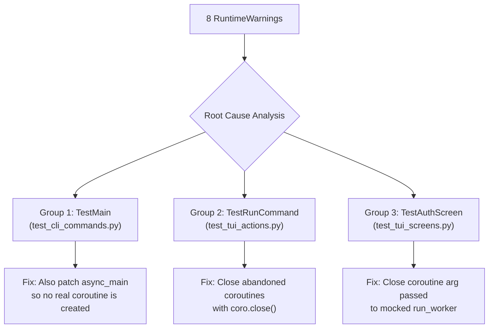
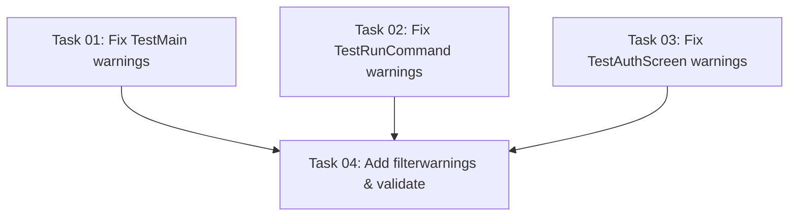

# Plan: Fix Unawaited Coroutine Warnings in Test Suite

## Original Work Order
> Fix warnings shown while running tests with `uv run pytest --cov=flameconnect --cov-report=term-missing --tb=short --cov-fail-under=95`.

## Executive Summary

Running the test suite produces 8 `RuntimeWarning: coroutine '...' was never awaited` warnings across three test files. All warnings share the same root cause pattern: async coroutines are created during test execution but never awaited or explicitly closed, causing Python's garbage collector to emit warnings when it finalizes them.

The warnings originate from three distinct patterns: (1) mocking `asyncio` without also mocking the async function passed to it, (2) creating `AsyncMock()()` coroutines that are intentionally abandoned by early-return guard clauses or never-executed workers, and (3) patching `run_worker` with a `MagicMock` that discards the coroutine argument without awaiting or closing it. Each pattern requires a targeted fix in the test code itself—no production code changes are needed.

## Context

### Current State vs Target State

| Current State | Target State | Why? |
|---|---|---|
| `pytest` emits 8 `RuntimeWarning` lines in the warnings summary | `pytest` emits 0 warnings | Clean test output improves signal-to-noise; unawaited coroutine warnings can mask real bugs |
| `TestMain` tests mock `asyncio` but leave `async_main` as the real function, creating unawaited coroutines | `TestMain` tests also mock `async_main` so no real coroutine is created | Prevents the coroutine from being passed to mocked `asyncio.run()` and discarded |
| `TestRunCommand` tests create `AsyncMock()()` coroutines that are intentionally never awaited | Unawaited coroutines are explicitly closed after assertions | `coro.close()` prevents the GC warning while preserving the test's intent |
| `TestAuthScreen` tests patch `run_worker` with `MagicMock`, discarding the `_do_credential_login` coroutine passed to it | Close the coroutine arg after assertions, same pattern as Group 2 | Prevents GC from emitting warnings when the abandoned coroutine is finalized |

### Background

All 8 warnings are `RuntimeWarning` instances about unawaited coroutines. Python emits these when a coroutine object is garbage-collected without ever being awaited. The warnings are often attributed to a *different* test than the one that created the coroutine, because GC timing is non-deterministic.

The 8 warnings reported by pytest originate from **7 source tests** across 3 test files. Note: GC timing is non-deterministic, so pytest attributes each warning to whichever test is running when GC collects the coroutine—not necessarily the test that created it.

| # | Source Test | Unawaited Coroutine | Count |
|---|---|---|---|
| 1–3 | `TestMain.test_main_calls_async_main`, `test_main_verbose_logging`, `test_main_no_verbose_logging` | `async_main(args)` | 3 |
| 4 | `TestRunCommand.test_no_op_when_not_dashboard` | `AsyncMock()()` | 1 |
| 5 | `TestRunCommand.test_sets_write_in_progress` | `AsyncMock()()` + `_worker()` | 2 |
| 6 | `TestAuthScreen.test_credential_submit_triggers_worker` | `_do_credential_login(email, password)` | 1 |
| 7 | `TestAuthScreen.test_password_submitted_triggers_on_submit` | `_do_credential_login(email, password)` | 1 |
| | **Total** | | **8** |

## Architectural Approach

All fixes are confined to test code. No production code changes are required.

### Group 1: `TestMain` in `test_cli_commands.py`

**Objective**: Eliminate the `coroutine 'async_main' was never awaited` warnings produced by all three `TestMain` tests.

All three tests (`test_main_calls_async_main`, `test_main_verbose_logging`, `test_main_no_verbose_logging`) patch `flameconnect.cli.asyncio` with a `MagicMock`, so `asyncio.run` becomes a no-op. However, `async_main(args)` at `cli.py:894` is the real function—calling it creates a real coroutine that is passed to the mocked `asyncio.run()` and discarded without being awaited.

The fix is to additionally patch `flameconnect.cli.async_main` in each test. When `async_main` is a `MagicMock`, calling `async_main(args)` returns a `MagicMock` instance (not a coroutine), so no `RuntimeWarning` is produced. The tests' existing assertions on `mock_asyncio.run.assert_called_once()` remain valid.

### Group 2: `TestRunCommand` in `test_tui_actions.py`

**Objective**: Eliminate the `coroutine 'AsyncMockMixin._execute_mock_call' was never awaited` and `coroutine '_worker' was never awaited` warnings from `test_no_op_when_not_dashboard` and `test_sets_write_in_progress`.

**`test_no_op_when_not_dashboard`** creates `coro = AsyncMock()()` and passes it to `_run_command`. Since `screen` is not a `DashboardScreen`, `_run_command` returns early and `coro` is abandoned. Fix: call `coro.close()` after the assertion to suppress the GC warning.

**`test_sets_write_in_progress`** creates `coro = AsyncMock()()` and passes it to `_run_command`. This time `_run_command` proceeds (mock_dashboard passes the guard), creating an inner `_worker()` coroutine stored via `_capture_worker`. The test intentionally never runs the workers. Both `coro` (inside `_worker`) and `_worker` itself are abandoned. Fix: close all captured workers after assertions with a loop over `app._captured_workers` calling `.close()`.

### Group 3: `TestAuthScreen` in `test_tui_screens.py`

**Objective**: Eliminate the `coroutine 'AuthScreen._do_credential_login' was never awaited` warnings from `test_credential_submit_triggers_worker` and `test_password_submitted_triggers_on_submit` (GC artifacts surface on later tests like `test_credential_login_success_dismisses` and `test_button_pressed_non_sign_in_ignored`).

Both source tests follow the same pattern: they set email/password input values, then trigger `_submit_credentials` (via button press or input submit). `_submit_credentials` calls `self.run_worker(self._do_credential_login(email, password), ...)`, creating a `_do_credential_login` coroutine. Since `run_worker` is already patched with a `MagicMock` in both tests, the mock receives and discards the coroutine without awaiting it.

The fix is the same pattern as Group 2: after assertions, retrieve the coroutine from `mock_worker.call_args[0][0]` and call `.close()` on it. This explicitly finalizes the coroutine without triggering the GC warning.

### Validation: Promote Warnings to Errors

**Objective**: Ensure no new unawaited-coroutine warnings are introduced in the future.

Add a `filterwarnings` entry to `pyproject.toml` under `[tool.pytest.ini_options]` that turns `RuntimeWarning` about unawaited coroutines into hard test failures. The filter pattern should match the specific warning message (e.g., `"error::RuntimeWarning:.*was never awaited"` or the broader `"error::RuntimeWarning"`). This makes the test suite self-enforcing — any new unawaited coroutine will fail the build immediately rather than producing a quiet warning.

## Risk Considerations and Mitigation Strategies

Technical Risks

- **GC non-determinism**: Warnings are attributed to different tests depending on GC timing. The fixes must eliminate the root cause (unawaited coroutine creation) rather than suppress the symptom.
    - **Mitigation**: Each fix prevents the unawaited coroutine from being created in the first place, or explicitly closes it. The `filterwarnings = error` setting will catch any remaining cases.

- **Coroutine arg retrieval from mock**: The fix for Groups 2 and 3 relies on `mock.call_args[0][0]` to retrieve the discarded coroutine. If the mock's call signature changes, this index could break.
    - **Mitigation**: The `filterwarnings = error` setting will catch any regressions immediately. The call_args pattern is well-established in unittest.mock.

Implementation Risks

- **Over-mocking in TestMain**: Adding a patch for `async_main` changes what the test verifies slightly (it no longer proves that the real `async_main` is called—just that something named `async_main` is called).
    - **Mitigation**: The test already only asserts `mock_asyncio.run.assert_called_once()`. The real integration between `main()` and `async_main()` is validated by the existing async tests that test `async_main` directly.

- **Closing coroutines may hide real bugs**: Explicitly closing unawaited coroutines in tests could mask issues if the production code is supposed to await them.
    - **Mitigation**: The tests in Group 2 intentionally test guard-clause and early-return paths where the coroutine is expected to be abandoned. Closing them is the correct cleanup.

## Success Criteria

### Primary Success Criteria
1. `uv run pytest --cov=flameconnect --cov-report=term-missing --tb=short --cov-fail-under=95` produces **0 warnings**
2. All 1080 tests continue to pass
3. Coverage remains at or above 95%
4. `filterwarnings` configuration in `pyproject.toml` promotes unawaited coroutine warnings to errors for future protection
5. `uv run ruff check .` and `uv run mypy src/` pass without new issues

## Resource Requirements

### Development Skills
- Python async/await patterns and coroutine lifecycle
- `unittest.mock` (`MagicMock`, `AsyncMock`, `patch`) expertise
- Textual framework test patterns (`run_test`, workers)

### Technical Infrastructure
- Existing `uv` + `pytest` + `pytest-asyncio` + `pytest-cov` toolchain (no new dependencies)

## Task Dependency Visualization

## Execution Blueprint

**Validation Gates:**
- Reference: `/config/hooks/POST_PHASE.md`

### ✅ Phase 1: Fix Unawaited Coroutine Sources
**Parallel Tasks:**
- ✔️ Task 01: Fix TestMain unawaited coroutine warnings in test_cli_commands.py
- ✔️ Task 02: Fix TestRunCommand unawaited coroutine warnings in test_tui_actions.py
- ✔️ Task 03: Fix TestAuthScreen unawaited coroutine warnings in test_tui_screens.py

### ✅ Phase 2: Add Filterwarnings and Full Validation
**Parallel Tasks:**
- ✔️ Task 04: Add filterwarnings to pyproject.toml and run full validation (depends on: 01, 02, 03)

### Post-phase Actions
Archive plan upon successful completion.

### Execution Summary
- Total Phases: 2
- Total Tasks: 4
- Maximum Parallelism: 3 tasks (in Phase 1)
- Critical Path Length: 2 phases

## Notes

- No production code changes are required; all fixes are in test files and `pyproject.toml`.
- The warning-to-error promotion in `pyproject.toml` ensures this class of bug is caught immediately in CI going forward.

### Change Log
- 2026-03-02: Initial plan created.
- 2026-03-02: Refinement — corrected Group 3 root cause analysis. Source tests are `test_credential_submit_triggers_worker` and `test_password_submitted_triggers_on_submit` (not `test_credential_login_success_dismisses`). Both already mock `run_worker`; fix is closing the coroutine arg, matching Group 2 pattern. Added missing source test to summary table. Specified `filterwarnings` pattern. Corrected source count from 5 to 7.

## Execution Summary

**Status**: Completed Successfully
**Completed Date**: 2026-03-02

### Results
All 8 original RuntimeWarnings eliminated. One additional unawaited coroutine (`test_sets_media_theme` in `TestApplyMediaTheme`) was discovered during validation — it was hidden among the original 8 GC-attributed warnings but became visible once the other sources were fixed. Total: 9 unawaited coroutines fixed across 4 test files + 1 config file.

**Files modified:**
- `tests/test_cli_commands.py` — patched `async_main` in 3 `TestMain` tests
- `tests/test_tui_actions.py` — closed abandoned coroutines in `TestRunCommand` (2 tests) and `TestApplyMediaTheme` (1 test)
- `tests/test_tui_screens.py` — closed coroutine args in `TestAuthScreen` (2 tests)
- `pyproject.toml` — added `filterwarnings = ["error::RuntimeWarning"]`

**Validation results:**
- 1080 tests passed, 0 warnings
- Coverage: 97.62% (above 95% threshold)
- ruff: all checks passed
- mypy: no issues found

### Noteworthy Events
- During Phase 2 validation, the `filterwarnings = ["error::RuntimeWarning"]` setting exposed a 9th unawaited coroutine in `TestApplyMediaTheme.test_sets_media_theme` that was not identified in the original plan. This test mocks `_run_command` with `MagicMock()`, which discards the `write_parameters` coroutine passed to it. This was fixed immediately during Phase 2.
- Task 2 agent replaced `AsyncMock()()` with plain `async def _noop()` functions in `TestRunCommand` tests (instead of just adding `.close()`). This is an equally valid approach that avoids the `AsyncMock` internal `_execute_mock_call` coroutine leak entirely.

### Recommendations
- The `filterwarnings = ["error::RuntimeWarning"]` setting now serves as a permanent safety net. Any future tests that create unawaited coroutines will fail immediately rather than producing silent warnings.
