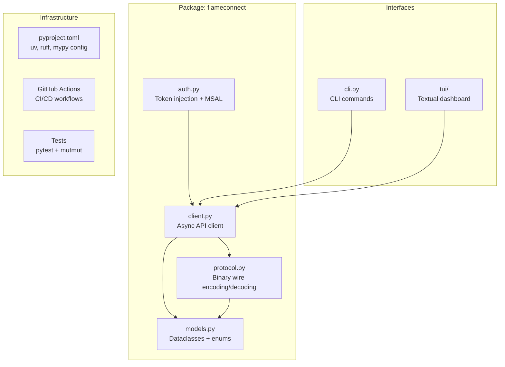
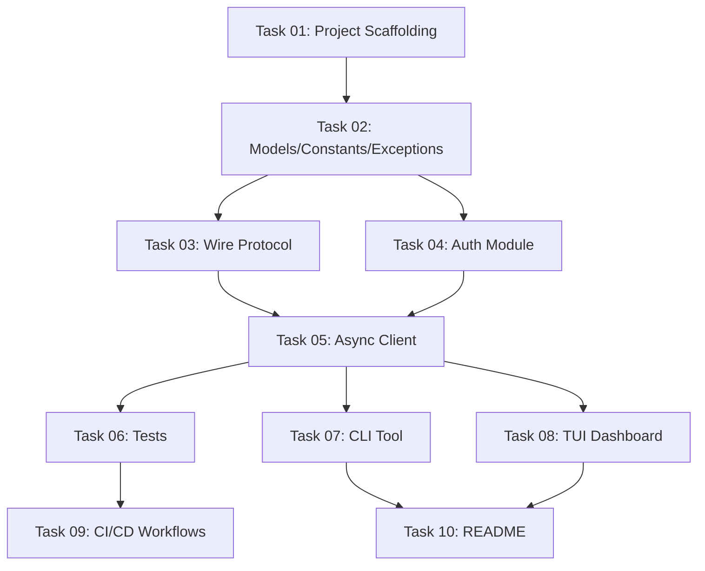

# Plan: FlameConnect Project Foundation

## Original Work Order
> Create a plan to implement all project philosophy and technology choices in the .ai/task-manager/config/TASK_MANAGER.md file.

## Plan Clarifications

| Question | Answer |
|----------|--------|
| Async strategy | Fully async: aiohttp for HTTP, msal wrapped with asyncio.to_thread() |
| Package name | `flameconnect` (confirmed available on PyPI) |
| Home Assistant integration | Library + CLI only; HA integration is a separate future project |
| API endpoint scope | Core control endpoints: GetFires, GetFireOverview, WriteWifiParameters. Note: there is no separate ReadWifiParameters endpoint — parameter reading is done via GetFireOverview. README documents what is and isn't implemented. |
| Auth library | msal with async wrapper (msal is well-tested for Azure AD B2C) |
| TUI mode | Included in this plan using textual |
| TUI dependency | Optional packaging extra: `pip install flameconnect[tui]` / `uv add flameconnect[tui]`. Keeps base library lightweight for HA consumers. |
| Mutation testing | Runs in the main CI pipeline on every push/PR alongside ruff, mypy, and pytest. |
| Live API testing | Permitted during development. Before making any live API call: explain what the call does, ask the user for confirmation, then ask if the result matched expectations. CI tests still use fixtures/mocks only. |

## Executive Summary

This plan transforms the existing `flameconnect_reader.py` standalone script into a production-quality, async-first Python library with a CLI and TUI interface. The project currently exists as a single 570-line script using synchronous `requests` and `msal` with no packaging, tests, type annotations, linting, or CI/CD.

The approach restructures the code into a proper Python package managed by `uv`, replaces synchronous HTTP calls with `aiohttp`, adds strict type annotations enforced by `mypy`, comprehensive tests with `pytest` and mutation testing via `mutmut`, a CLI tool, a textual-based TUI, and a complete CI/CD pipeline using GitHub Actions with conventional commits and release-please for automated releases to PyPI.

The plan prioritizes the three core control endpoints (GetFires, GetFireOverview, WriteWifiParameters) which together cover fireplace discovery, state reading, and parameter control. The remaining 30+ API endpoints are documented as future work in the README.

## Context

### Current State vs Target State

| Current State | Target State | Why? |
|---|---|---|
| Single script (`flameconnect_reader.py`, 570 lines) | Proper Python package with modular structure | Enables import as library, distribution via PyPI, and consumption by Home Assistant |
| Synchronous HTTP via `requests` | Async HTTP via `aiohttp` | Home Assistant is fully async; sync wrappers in executors add overhead and complexity |
| No type annotations in code | Full type annotations, mypy strict mode | Catches bugs at development time, enables IDE support, required by HA contribution guidelines |
| No tests (0% coverage) | pytest with fixtures + mutmut mutation testing | Ensures correctness, prevents regressions, validates test quality |
| No packaging (pyproject.toml, etc.) | uv-managed project with pyproject.toml | Enables dependency management, versioning, and PyPI distribution |
| No linting or formatting | ruff for linting + formatting | Consistent code style, catches common errors |
| No CI/CD | GitHub Actions workflows | Automated testing, linting, release management |
| No versioning or releases | Conventional commits + release-please + PyPI | Automated semantic versioning and package publishing |
| Hardcoded MSAL browser login only | Token injection + built-in credential handling | Supports both Home Assistant (token injection) and standalone use (browser login) |
| No CLI interface | CLI tool built on the async library | Command-line access to all fireplace operations |
| No TUI | Textual-based TUI mode | Interactive dashboard showing fireplace status and controls |
| README is an API report | Human-oriented README with usage docs | Clear onboarding for users and contributors |
| Uses `print()` for output | stdlib `logging` module | Proper log levels, follows HA conventions, no print() in library code |

### Background

The flameconnect project was created by reverse-engineering the Flame Connect Android APK (v2.22.0). The API report (`FLAMECONNECT_API_REPORT.md`) documents 30+ endpoints and a binary wire protocol for fireplace parameter control. The existing script demonstrates that the API integration works correctly - the challenge is now restructuring it into a well-engineered library.

Key constraints:
- **Minimal dependencies**: Prioritize packages already in Home Assistant (aiohttp is included, msal is not but is necessary for standalone auth)
- **Azure AD B2C auth**: The upstream API uses Microsoft's B2C tenant, making msal the most reliable auth option
- **Binary wire protocol**: Parameters use a base64-encoded binary format that must be carefully preserved during refactoring
- **Live API calls permitted during development**: To validate that the refactored code works against the real API, live calls are allowed during development. However, a strict protocol must be followed: (1) explain to the user what API call will be made and why, (2) get explicit user confirmation before making it, (3) ask the user to verify whether the result was correct. This respects the upstream API (no spam) while enabling real-world validation.
- **CI tests use fixtures/mocks only**: Automated tests must never make live API calls. All CI test fixtures should be derived from real API responses captured during development.

## Architectural Approach



### Package Structure
**Objective**: Organize the codebase into a proper Python package with clear module boundaries.

The `flameconnect` package will be structured as:

```
src/flameconnect/
    __init__.py          # Public API exports
    __main__.py          # Entry point for `python -m flameconnect`
    py.typed             # PEP 561 marker for typed package (enables mypy for consumers)
    auth.py              # Authentication (token injection + MSAL credential flow)
    client.py            # FlameConnectClient - async API client
    models.py            # Dataclasses for API responses, enums, typed parameters
    protocol.py          # Binary wire protocol encoding/decoding
    exceptions.py        # Custom exception hierarchy
    const.py             # Constants (API URLs, headers, parameter IDs)
    cli.py               # CLI entry point using argparse (stdlib, zero extra dependencies)
    tui/
        __init__.py
        app.py           # Textual App subclass
        screens.py       # TUI screens (dashboard, control)
        widgets.py       # Custom widgets (flame display, heat controls)
```

The `src/` layout is used because it prevents accidental imports of the uninstalled package and is the modern Python packaging standard. The `py.typed` marker file (PEP 561) signals to mypy that this package ships inline type annotations, enabling type checking for downstream consumers.

### Async Client Design
**Objective**: Provide a clean async API that supports both Home Assistant token injection and standalone credential handling.

The `FlameConnectClient` will accept an `aiohttp.ClientSession` (optional, creates its own if not provided) and authentication via either:
1. **Token injection**: A string token or an `async callable` that returns a token (for Home Assistant)
2. **Built-in credentials**: MSAL-based browser login with persistent token cache (for CLI/standalone use)

The client will be an async context manager:
```python
async with FlameConnectClient(auth=token_provider) as client:
    fires = await client.get_fires()
```

All API methods return typed dataclasses from `models.py`, not raw dicts. The binary wire protocol is encapsulated in `protocol.py` so callers never deal with base64/struct directly.

### Models and Type System
**Objective**: Replace raw dicts and magic numbers with typed dataclasses and enums enforced by mypy strict mode.

All API responses will be represented as `dataclass` or `NamedTuple` types. The existing enum mappings (FIRE_MODE, FLAME_EFFECT, HEAT_STATUS, etc.) become proper Python `Enum` classes. Parameter types will use typed dataclasses with proper field definitions.

The wire protocol encoding/decoding in `protocol.py` will accept and return these typed models, providing a clean boundary between the binary format and the rest of the library. Note: the existing script has incomplete decoders — Sound (369) and Log Effect (370) have display code but no binary decoding logic, and only Mode (321) and Flame Effect (322) have encoders. All 11 parameter types (236, 321, 322, 323, 325, 326, 327, 329, 369, 370) must have complete decode implementations, with encode implementations for all writable parameters. The `FLAMECONNECT_API_REPORT.md` documents the wire format for each.

### CLI Tool
**Objective**: Provide command-line access to all fireplace operations.

The CLI will use Python's `argparse` from stdlib (zero extra dependencies, aligning with the minimal-dependencies philosophy) to expose commands:
- `flameconnect list` - List registered fireplaces
- `flameconnect status <fire_id>` - Show current fireplace state
- `flameconnect on <fire_id>` - Turn on fireplace
- `flameconnect off <fire_id>` - Turn off fireplace
- `flameconnect set <fire_id> <param> <value>` - Set parameters (flame, heat, timer, etc.)
- `flameconnect tui` - Launch the textual TUI

The CLI will use `asyncio.run()` to bridge sync entry points to the async library. Authentication will use the built-in MSAL credential flow with token caching.

### TUI Dashboard
**Objective**: Provide an interactive terminal interface for monitoring and controlling fireplaces using textual.

The TUI will be a textual `App` that displays:
- A list of registered fireplaces with connection status
- A dashboard view for the selected fireplace showing:
  - Current mode (standby/manual)
  - Flame effect settings (speed, brightness, color)
  - Heat settings (status, temperature, mode)
  - Timer status
  - Error codes (if any)
- Interactive controls for toggling power, adjusting flame/heat settings
- Auto-refresh of fireplace state on a configurable interval

The TUI will be launched via `flameconnect tui` and requires the optional `tui` extra (`pip install flameconnect[tui]` or `uv add flameconnect[tui]`). The `textual` import is lazy — it only occurs when the `tui` command is invoked, so the base library remains lightweight for consumers like Home Assistant. If a user runs `flameconnect tui` without the extra installed, they will get a clear error message with installation instructions.

### Testing Strategy
**Objective**: Achieve high test coverage through two complementary approaches — automated fixture-based tests for CI, and live API validation during development.

**Automated tests (CI)**: Tests will use `pytest` with `aiohttp` test utilities and `pytest-aiohttp` for async test support. All API responses will be captured as JSON fixtures. Mutation testing with `mutmut` validates that tests catch real code changes.

**Live API validation (development)**: During implementation, the developer may make real API calls to validate correctness. This follows a strict three-step protocol:
1. **Explain**: Describe the API call (endpoint, parameters, expected effect)
2. **Confirm**: Wait for explicit user approval before executing
3. **Verify**: Ask the user to confirm whether the result matched expectations

This enables capturing real API response shapes for fixtures and verifying that encoded parameters produce the expected fireplace behavior. Live validation is especially valuable for the wire protocol (Task 03), async client (Task 05), and CLI (Task 07).

```
tests/
    conftest.py          # Shared fixtures, mock session factory
    test_auth.py         # Auth token injection and MSAL flow tests
    test_client.py       # API client method tests with mocked responses
    test_models.py       # Dataclass construction and validation
    test_protocol.py     # Wire protocol encode/decode round-trip tests
    test_cli.py          # CLI argument parsing and command execution
    fixtures/            # JSON response fixtures derived from real API responses
```

### CI/CD Pipeline
**Objective**: Automate linting, testing, and release management via GitHub Actions.

Three workflows:
1. **CI** (on push/PR): Run ruff lint + format check, mypy strict, pytest, and mutmut mutation testing. All checks must pass before merge.
2. **Conventional Commits** (on PR): Validate PR title and commit messages follow conventional commit format.
3. **Release** (on merge to main): release-please creates release PRs with changelog; on release, build and publish to PyPI. Initial version will be 0.1.0.

### Logging
**Objective**: Replace all `print()` calls with stdlib `logging` following Home Assistant conventions.

The library will use `logging.getLogger(__name__)` in each module. No `print()` in library code. The CLI/TUI will configure log handlers and levels. Debug logging will include API request/response details for troubleshooting.

## Risk Considerations and Mitigation Strategies

<details>
<summary>Technical Risks</summary>

- **MSAL async wrapping**: msal is synchronous and uses blocking I/O. Running in `asyncio.to_thread()` works but adds thread pool overhead.
    - **Mitigation**: Auth happens infrequently (once at startup, then token refresh). The overhead is negligible for this use case.
- **Binary protocol fidelity**: Refactoring the wire protocol encoding/decoding could introduce subtle byte-level bugs.
    - **Mitigation**: Create comprehensive round-trip tests using known-good encoded values from the existing script before refactoring.
- **aiohttp session lifecycle**: Mismanaged sessions can leak connections.
    - **Mitigation**: Use async context manager pattern consistently; provide both session injection and auto-creation.
</details>

<details>
<summary>Implementation Risks</summary>

- **Scope of refactoring**: Transforming a working script into a packaged library touches every line of code.
    - **Mitigation**: Extract and test the wire protocol first (it's the most delicate part), then build the client around tested primitives.
- **textual API stability**: textual is actively developed and APIs may change.
    - **Mitigation**: Pin textual version in dependencies; keep TUI as a separate module that can be updated independently.
</details>

<details>
<summary>Integration Risks</summary>

- **PyPI name availability**: ~~Resolved~~ — `flameconnect` is confirmed available on PyPI as of 2026-02-23.
- **Azure AD B2C token format changes**: The upstream auth API could change.
    - **Mitigation**: The auth module is isolated; changes only affect `auth.py` and its tests.
</details>

<details>
<summary>Quality Risks</summary>

- **Incomplete wire protocol in existing code**: The current `decode_parameter` function handles parameters 236, 321–327, and 329, but the display functions for Sound (369) and Log Effect (370) reference keys that are never populated by the decoder. These decoders and encoders must be completed during refactoring, not just ported.
    - **Mitigation**: Use the `FLAMECONNECT_API_REPORT.md` wire format documentation to implement complete encode/decode for all parameter types. Round-trip tests will verify correctness.
- **mutmut CI time**: Mutation testing can be slow on larger codebases.
    - **Mitigation**: Start with mutmut on the focused protocol and models modules. Expand coverage as the codebase grows. Consider parallelizing mutation runs in CI.
</details>

## Success Criteria

### Primary Success Criteria
1. `flameconnect` is installable via `pip install flameconnect` (or `uv add flameconnect`) from PyPI
2. The async library can discover fireplaces, read state, and control parameters (on/off, flame effect, heat, timer)
3. `flameconnect list`, `flameconnect status`, `flameconnect on/off`, and `flameconnect set` CLI commands work correctly
4. `flameconnect tui` launches an interactive terminal dashboard with live fireplace status and controls
5. mypy strict mode passes with zero errors
6. ruff lint and format checks pass with zero warnings
7. pytest achieves high test coverage with all tests passing using fixtures (no live API calls)
8. mutmut mutation testing demonstrates meaningful test coverage (mutants are caught)
9. GitHub Actions CI runs linting, type checking, and tests on every push/PR
10. Conventional commits are validated in CI
11. release-please automates versioning and PyPI publishing on merge to main
12. README is written for humans with clear installation, usage examples, and API coverage documentation

## Resource Requirements

### Development Skills
- Python async programming (aiohttp, asyncio)
- Python packaging (pyproject.toml, src layout, uv)
- Azure AD B2C authentication (msal)
- Binary protocol handling (struct, base64)
- Terminal UI development (textual)
- GitHub Actions CI/CD
- Type system (mypy strict mode)

### Technical Infrastructure
- **Python 3.13+**: Required runtime
- **uv**: Dependency management and virtual environment
- **ruff**: Linting and formatting
- **mypy**: Static type checking
- **pytest + pytest-aiohttp**: Test framework
- **mutmut**: Mutation testing
- **textual**: TUI framework
- **aiohttp**: Async HTTP client
- **msal**: Azure AD B2C authentication
- **GitHub Actions**: CI/CD platform
- **release-please**: Automated release management
- **PyPI**: Package distribution

## Integration Strategy

The library is designed as a standalone package that can be consumed by:
1. **Direct users**: Via the CLI and TUI for personal fireplace control
2. **Home Assistant**: Via token injection into the async client (HA passes its own aiohttp session and access token)
3. **Other integrations**: Any Python async application can use the library's public API

The token injection pattern ensures the library doesn't impose authentication decisions on consumers. The async-first design means no `executor` wrapping is needed in Home Assistant.

## Notes

- The existing `flameconnect_reader.py` will be preserved as a reference during development and can be removed once the library is feature-complete
- The `FLAMECONNECT_API_REPORT.md` serves as the canonical API reference and should be kept up to date
- The `decomp/` directory contains reverse-engineering artifacts and is gitignored; it stays as reference material
- Only three core control endpoints are in scope: **GetFires** (list fireplaces), **GetFireOverview** (read state and parameters), and **WriteWifiParameters** (send control commands). There is no separate `ReadWifiParameters` endpoint — all parameter reading is done via `GetFireOverview`. Additional endpoints documented in the API report can be added incrementally in future plans.
- The README should clearly document which endpoints are implemented and which are available for future contribution
- Initial PyPI release version: **0.1.0**

## Task Dependency Graph



## Execution Blueprint

**Validation Gates:**
- Reference: `/config/hooks/POST_PHASE.md`

### Phase 1: Project Foundation
**Parallel Tasks:**
- Task 01: Initialize project scaffolding with uv and configure tooling

### Phase 2: Core Types
**Parallel Tasks:**
- Task 02: Implement models, enums, constants, and exceptions (depends on: 01)

### Phase 3: Core Modules
**Parallel Tasks:**
- Task 03: Implement binary wire protocol encoding and decoding (depends on: 02)
- Task 04: Implement authentication module with token injection and MSAL (depends on: 02)

### Phase 4: API Client
**Parallel Tasks:**
- Task 05: Implement async API client (depends on: 03, 04)

### Phase 5: Interfaces and Testing
**Parallel Tasks:**
- Task 06: Implement tests for protocol, client, and auth modules (depends on: 05)
- Task 07: Implement CLI tool with argparse (depends on: 05)
- Task 08: Implement textual TUI dashboard (depends on: 05)

### Phase 6: Infrastructure and Documentation
**Parallel Tasks:**
- Task 09: Set up GitHub Actions CI/CD workflows (depends on: 06)
- Task 10: Write human-oriented README (depends on: 07, 08)

### Execution Summary
- Total Phases: 6
- Total Tasks: 10
- Maximum Parallelism: 3 tasks (in Phase 5)
- Critical Path Length: 6 phases (01 → 02 → 03 → 05 → 06 → 09)

### Refinement Changelog

- 2026-02-23: Corrected API endpoint list — removed non-existent `ReadWifiParameters` endpoint (reading is via `GetFireOverview`)
- 2026-02-23: Fixed architecture diagram dependency direction (protocol depends on models, not vice versa)
- 2026-02-23: Added `__main__.py` and `py.typed` marker to package structure
- 2026-02-23: Resolved CLI framework as `argparse` (removed "or click-minimal" ambiguity)
- 2026-02-23: Specified textual as optional packaging extra (`flameconnect[tui]`)
- 2026-02-23: Confirmed `flameconnect` name available on PyPI, removed from risk list
- 2026-02-23: Added quality risk about incomplete Sound/Log Effect wire protocol decoders in existing code
- 2026-02-23: Clarified mutmut runs in main CI pipeline per user preference
- 2026-02-23: Added initial version 0.1.0 specification
- 2026-02-23: Added live API testing policy — live calls permitted during development with explain/confirm/verify protocol; CI tests remain fixture-only
