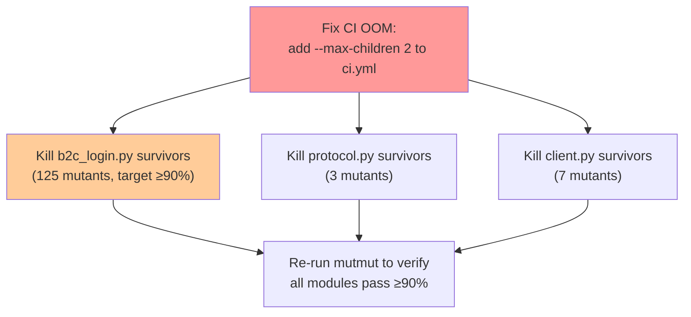
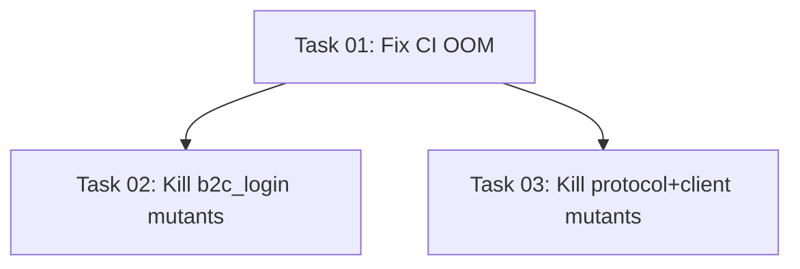

# Plan: Mutation Testing OOM Fix and Mutant Killing Campaign

## Original Work Order
> I would like to add more test cases to cover mutants. Last time, the server ran out of memory and the job was killed part way. We should run mutmut to identify mutants and fix them, but limit the number of parallel mutmut processes so we don't run out of resources.

## Plan Clarifications

| Question | Answer |
|----------|--------|
| Should this plan supersede or build on existing plan 12? | Overwrite plan 12 — standalone plan covering both the OOM fix and the mutant-killing work |
| What `--max-children` value for CI? (GitHub Actions ubuntu-24.04: 4 CPUs, 7GB RAM) | 2 (balanced — moderate memory, fits in 7GB comfortably) |
| Protocol/client/auth already pass ≥90%. Focus primarily on b2c_login.py? | Yes — primary effort on b2c_login.py (125 survivors), minor cleanup for protocol (3) and client (7). Drop auth task entirely. |
| Many b2c_login.py survivors are in `log_response`/`log_request` functions. Accept log-related equivalent mutants? | Yes — target ≥90% overall. Log function mutants that are truly equivalent can be documented and accepted. |

## Executive Summary

The CI pipeline runs mutation testing via `uv run mutmut run` across 4 core modules. By default, mutmut spawns `os.cpu_count()` child processes (4 on the CI runner), each running a full pytest suite. With ~989 tests and ~1600+ mutants, 4 concurrent pytest processes exceed the GitHub Actions runner's 7GB RAM limit, causing an OOM kill.

The fix is to pass `--max-children 2` to the mutmut CLI invocation in CI. This is a CLI-only flag (not configurable via `setup.cfg`).

After fixing the OOM issue, the mutation data reveals that 3 of the 4 modules already meet the ≥90% target. The primary test-writing effort is on `b2c_login.py` (73% kill rate, 125 survivors out of 463 mutants), with minor cleanup for `protocol.py` (3 survivors) and `client.py` (7 survivors). `auth.py` is at 100% and needs no work.

## Context

### Current State vs Target State

| Current State | Target State | Why? |
|---|---|---|
| CI `uv run mutmut run` uses default `--max-children` (= CPU count = 4) | `uv run mutmut run --max-children 2` | 4 concurrent pytest processes exceed 7GB RAM on GitHub Actions, causing OOM kill |
| b2c_login.py: 73% mutation kill rate (125 survivors / 463 mutants) | ≥90% kill rate | 125 surviving mutants in credential submission and logging code reveal untested behavioral paths |
| protocol.py: ~100% kill rate (3 survivors / 700 mutants) | 100% or document equivalent mutants | 3 survivors in encode/header functions — likely fixable with targeted assertions |
| client.py: 98% kill rate (7 survivors / 325 mutants) | ≥98% or document equivalent mutants | 7 survivors in `_request`, `get_fire_overview`, `turn_on`, `turn_off` |
| auth.py: 100% kill rate (0 survivors / 136 mutants) | No change needed | Already at 100% — no task required |

### Background

mutmut v3.5.0 determines parallelism via `--max-children`, defaulting to `os.cpu_count() or 4`. Each child process spawns a full pytest run against a mutated copy of the source. On GitHub Actions ubuntu-24.04 (4 CPUs, 7GB RAM), running 4 concurrent pytest sessions — each importing aiohttp, msal, textual, and the test fixtures — exhausts available memory.

**Important**: `--max-children` is a CLI-only flag. It is **not** a `setup.cfg` or `pyproject.toml` configuration option. The `Config` dataclass in mutmut does not include this field. The parallelism limit must be passed on the command line.

Task 01 (mutmut config setup: `setup.cfg`, `.gitignore`, CI expansion to 4 modules) was completed in the prior version of this plan. The only remaining configuration change is adding `--max-children 2` to the CI workflow command.

**b2c_login.py survivor breakdown:**
- `b2c_login_with_credentials`: ~111 survivors — the main function handling HTTP requests, HTML form parsing, credential submission, and redirect URL extraction
- `log_response`: 9 survivors — debug logging of HTTP responses (likely equivalent mutants — logging changes don't affect behavior)
- `log_request`: 5 survivors — debug logging of HTTP requests (same — likely equivalent)

**protocol.py survivors** (3): `encode_temperature` (1), `_make_header` (1), `encode_parameter` (1)

**client.py survivors** (7): `_request` (3), `get_fire_overview` (2), `turn_on` (1), `turn_off` (1)

## Architectural Approach

### OOM Fix

**Objective**: Prevent the CI runner from running out of memory during mutation testing.

Update the mutation test step in `.github/workflows/ci.yml` from `uv run mutmut run` to `uv run mutmut run --max-children 2`. This limits mutmut to 2 concurrent pytest child processes instead of 4, halving peak memory usage while still providing some parallelism. With 2 children, the expected peak memory is ~3-4GB, well within the 7GB limit.

### B2C Login Mutant Killing (primary effort)

**Objective**: Raise b2c_login.py mutation score from 73% to ≥90%.

Run `uv run mutmut run --paths-to-mutate=src/flameconnect/b2c_login.py --max-children 2` to confirm surviving mutants. The 125 survivors break down as:

- **~111 in `b2c_login_with_credentials`**: This function handles multi-step HTTP interaction (fetching login page, parsing HTML forms, submitting credentials, following redirects). Tests need to assert on specific HTTP request URLs, form field names/values, redirect handling, and error extraction from HTML responses.
- **14 in `log_response` / `log_request`**: These are debug logging helpers. Mutations here (e.g., changing a log level or format string) don't affect program behavior. Accept these as equivalent mutants if they truly don't change observable output.

The ≥90% target means killing at least ~88 of the 125 survivors (allowing up to ~37 equivalent/unkillable mutants, primarily from the log functions).

### Protocol and Client Minor Cleanup

**Objective**: Kill the remaining 3 protocol.py and 7 client.py survivors, or document them as equivalent mutants.

- **protocol.py** (3 survivors): `encode_temperature` mutant, `_make_header` mutant, `encode_parameter` mutant. Add targeted assertions to `tests/test_protocol.py` for specific encoded byte values.
- **client.py** (7 survivors): 3 in `_request` (likely HTTP header or response-status mutations), 2 in `get_fire_overview` (field parsing), 1 each in `turn_on`/`turn_off` (likely related to the `get_fire_overview` read-before-write pattern). Add assertions to `tests/test_client.py`.

## Risk Considerations and Mitigation Strategies

Technical Risks

- **Equivalent mutants**: Some surviving mutants — especially in `log_response` and `log_request` — may be semantically equivalent (the mutation doesn't change observable behavior). These cannot be killed.
    - **Mitigation**: Target ≥90% overall per module. Document known equivalent mutants rather than writing brittle tests for them.

- **`--max-children 2` may still OOM if tests grow significantly**: Adding more tests increases per-process memory.
    - **Mitigation**: Monitor CI memory usage. If OOM recurs, drop to `--max-children 1`. The current test suite fits well in ~2GB per process.

Implementation Risks

- **Test brittleness for b2c_login.py**: The B2C login function makes multi-step HTTP calls with HTML parsing. Overly specific assertions on HTML structure may break if the upstream login page format changes.
    - **Mitigation**: Assert on behavioral outcomes (correct redirect URL returned, correct error raised) rather than internal HTML element names. Follow existing test patterns in `tests/test_b2c_login.py`.

- **CI time with `--max-children 2`**: Halving parallelism roughly doubles wall-clock time for mutation testing.
    - **Mitigation**: The prior 4-way parallel run took ~27s before OOM. At 2-way parallelism, expect ~45-60s total — well within acceptable CI budgets.

## Success Criteria

### Primary Success Criteria

1. CI mutation test step completes without OOM on GitHub Actions ubuntu-24.04.
2. CI workflow uses `--max-children 2` for the mutmut run.
3. b2c_login.py achieves ≥90% mutation kill rate (up from 73%).
4. protocol.py and client.py survivors are either killed or documented as equivalent.
5. All existing + new tests pass.

## Resource Requirements

### Development Skills

- Python testing with pytest and pytest-asyncio
- Understanding of mutation testing concepts (mutant types, equivalent mutants)
- Familiarity with mutmut v3 CLI and `--max-children` flag
- Understanding of HTTP mocking with `aioresponses` for b2c_login tests

### Technical Infrastructure

- Existing dev environment with mutmut 3.5.0 already installed
- GitHub Actions ubuntu-24.04 runner (4 CPUs, 7GB RAM)

## Execution Blueprint

**Validation Gates:**
- Reference: `/config/hooks/POST_PHASE.md`

### Phase 1: CI OOM Fix
**Parallel Tasks:**
- Task 01: Fix CI OOM by limiting mutmut parallelism

### Phase 2: Kill Surviving Mutants
**Parallel Tasks:**
- Task 02: Kill surviving mutants in b2c_login.py (depends on: 01)
- Task 03: Kill surviving mutants in protocol.py and client.py (depends on: 01)

### Execution Summary
- Total Phases: 2
- Total Tasks: 3
- Maximum Parallelism: 2 tasks (in Phase 2)
- Critical Path Length: 2 phases

## Notes

### Change Log

- 2026-02-25: Initial plan creation (v1) — expanded mutation testing to 4 modules
- 2026-02-25: Overwrite with OOM fix focus (v2) — added `--max-children 2`, carried forward mutant-killing tasks
- 2026-02-25: Refinement — corrected mutation scores from actual meta files (protocol 100%, client 98%, auth 100%, b2c_login 73%); removed incorrect `setup.cfg` max-children claim (CLI-only flag); restructured scope to focus on b2c_login.py; dropped auth.py task; added survivor breakdown by function
