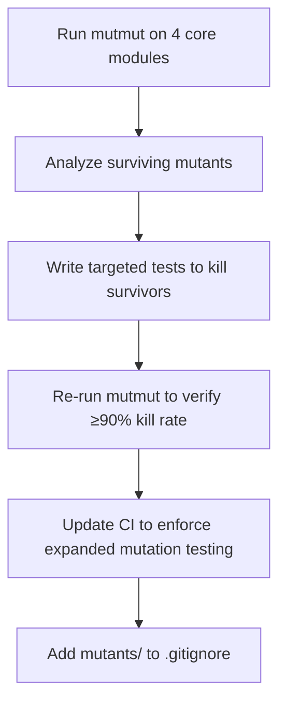

# Plan: Expand Mutation Testing to Identify and Fix Missing Unit Tests

## Original Work Order
> Implement mutation testing to identify missing unit tests.

## Executive Summary

The project already runs mutation testing on `protocol.py` in CI via mutmut, but analysis reveals only a 62% mutation kill rate (266 surviving mutants out of 700) despite 100% line coverage. Other core library modules (`client.py`, `auth.py`, `b2c_login.py`) have no mutation testing at all.

This plan expands mutation testing to the core library modules, identifies surviving mutants (which reveal tests that execute code without verifying correctness), and writes targeted tests to kill them. The CI pipeline is updated to enforce mutation testing across all core modules.

## Context

### Current State vs Target State

| Module | Line Coverage | Mutation Score | Target Mutation Score |
|---|---|---|---|
| protocol.py | 100% | 62% (266 survivors / 700 mutants) | ≥90% |
| client.py | 100% | 64% (116 survivors / 325 mutants) | ≥90% |
| auth.py | 100% | Not tested | ≥90% |
| b2c_login.py | 95% | Not tested | ≥90% |

### Background

Mutation testing is the gold standard for test quality — it goes beyond line coverage by verifying that tests actually *detect* changes to the code. mutmut v3.5.0 is already installed as a dev dependency and runs on `protocol.py` in CI. However, the 62% kill rate on protocol.py shows that many tests execute decode/encode paths without asserting on individual field values, byte offsets, or constant correctness.

The project philosophy states "a high level of test coverage including mutation testing." Currently, mutation testing only covers one of the ~10 core modules.

**Key finding**: 97% line coverage with 62% mutation kill rate means the test suite has significant blind spots — tests that run code without meaningfully verifying its output. The surviving mutants are concentrated in:
- Field-level struct packing/unpacking (wrong byte offsets, swapped fields)
- Return value field names (mutants that swap field values go undetected)
- Constant/enum value substitutions

**Scope boundaries**: This plan targets only the four core library modules listed above. TUI modules and `cli.py` are excluded — TUI is UI-focused (less critical for mutation testing), and `cli.py` is large (602 stmts, ~2000 mutants) with mostly display/formatting code. These can be added in a future iteration if desired.

**mutmut v3 configuration**: mutmut v3 reads config from `setup.cfg` (not `pyproject.toml`). A `[mutmut]` section is needed to define `paths_to_mutate` and `also_copy=src` (required because the project uses a `src/` layout and mutmut's sandbox needs the full package importable).

## Architectural Approach

### Mutmut Configuration
**Objective**: Set up repeatable mutmut configuration for the project.

Add a `setup.cfg` file with a `[mutmut]` section configuring:
- `paths_to_mutate`: the four target modules
- `also_copy=src`: required for the `src/` layout so the mutant sandbox has the full package

Add `mutants/` to `.gitignore` (mutmut v3's working directory). Remove the stale `.mutmut-cache/` gitignore entry (that's mutmut v2).

### Protocol.py Mutant Killing
**Objective**: Raise protocol.py mutation score from 62% to ≥90%.

The 266 surviving mutants are concentrated in decode/encode functions where tests verify round-trip correctness but don't assert individual field values. The fix is to add targeted assertions that verify each decoded field independently and test boundary values for byte-level encoding. The existing `tests/test_protocol.py` (45 tests) is the target file.

### Client.py Mutant Killing
**Objective**: Raise client.py mutation score from 64% to ≥90%.

The 116 surviving mutants are in API call methods and response parsing. Tests need to assert on specific URL paths, request payloads, and parsed response fields rather than just verifying that calls succeed.

### Auth.py and B2C Login Mutant Killing
**Objective**: Establish mutation testing on auth.py and b2c_login.py with ≥90% kill rate.

These modules handle authentication flows — correctness is critical. Run mutmut to identify survivors, then write targeted tests. Auth.py has 90 statements (~200 mutants estimated) and b2c_login.py has 123 statements (~300 mutants estimated).

### CI Pipeline Update
**Objective**: Enforce mutation testing on all four core modules in CI.

Update the mutation test step in `.github/workflows/ci.yml` to run mutmut on all four modules instead of just `protocol.py`. Estimated CI time: ~3.5 minutes total (protocol ~57s + client ~94s + auth ~25s + b2c ~35s), which is acceptable.

## Risk Considerations and Mitigation Strategies

Technical Risks

- **Equivalent mutants**: Some surviving mutants may be semantically equivalent (the mutation doesn't change behavior). These cannot be killed.
    - **Mitigation**: Accept that 100% mutation score is unrealistic. Target ≥90% and document known equivalent mutants.

- **CI time increase**: Expanding from 1 module (~57s) to 4 modules (~3.5 min) adds to CI duration.
    - **Mitigation**: The 3.5-minute total is acceptable. If it grows, mutmut supports `--runner` for faster test selection.

Implementation Risks

- **mutmut v3 sandbox issues**: mutmut v3 copies files to a `mutants/` sandbox. The `src/` layout may cause import issues if `also_copy` is misconfigured.
    - **Mitigation**: Test the `setup.cfg` configuration locally before committing. Verify with `uv run mutmut run --paths-to-mutate=src/flameconnect/auth.py --no-progress`.

- **Test brittleness**: Highly specific field-level assertions may break if the protocol changes.
    - **Mitigation**: Use test fixtures and constants derived from the same model definitions. Follow existing test patterns.

## Success Criteria

### Primary Success Criteria
1. All four core modules (protocol.py, client.py, auth.py, b2c_login.py) achieve ≥90% mutation kill rate.
2. CI runs mutation testing on all four modules and passes.
3. All existing + new tests pass.
4. `setup.cfg` with `[mutmut]` config exists and works for local runs.

## Resource Requirements

### Development Skills
- Python testing with pytest and pytest-asyncio
- Understanding of mutation testing concepts (mutant types, equivalent mutants)
- Familiarity with mutmut v3 CLI and configuration

### Technical Infrastructure
- Existing dev environment with mutmut>=2.4 already installed (v3.5.0 resolved).

## Notes
- mutmut v3 uses `setup.cfg` for configuration, not `pyproject.toml`. This is a mutmut limitation.
- The `mutants/` directory is mutmut v3's working directory and should be gitignored.
- TUI modules and `cli.py` are intentionally excluded from this plan. They can be added later if desired.
- Some surviving mutants will be equivalent (semantically identical to the original). These should be documented rather than chased with brittle tests.

---

## Execution Blueprint

### ✅ Phase 1: Configuration Setup
- ✔️ Task 01: Setup mutmut configuration, .gitignore, and CI update (`01--mutmut-config-and-ci.md`)

### Phase 2: Kill Surviving Mutants (parallel)
- Task 02: Kill surviving mutants in protocol.py (`02--kill-protocol-mutants.md`)
- Task 03: Kill surviving mutants in client.py (`03--kill-client-mutants.md`)
- Task 04: Kill surviving mutants in auth.py (`04--kill-auth-mutants.md`)
- Task 05: Kill surviving mutants in b2c_login.py (`05--kill-b2c-mutants.md`)
