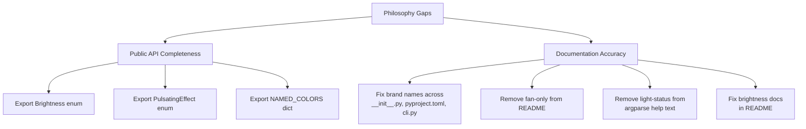

# Plan: Philosophy Alignment Fixes

## Original Work Order
> Review the project philosophy. Identify any gaps in the current implementation as compared to the philosophy and fix them.

## Plan Clarifications

| Question | Answer |
|----------|--------|
| `fan-only` heat-mode is documented in the README but was removed from the CLI per plan 04. Update README or re-add? | Update README only — remove `fan-only` reference |
| Argparse help text lists `light-status` as a settable parameter but no handler exists. Remove stale reference? | Yes — remove from help text since `overhead-light` already handles the field |

## Executive Summary

An audit of the codebase against the project philosophy in `TASK_MANAGER.md` and the README reveals several alignment gaps. None of these are architectural flaws — the core library design (async-first, dual auth, clean API, fixtures-based tests, mypy strict) is solid. The gaps fall into two categories: (1) **incomplete public API exports** that prevent external consumers like Home Assistant from using all parameter types, and (2) **documentation inconsistencies** where the README and code descriptions have drifted from reality.

This plan addresses only the concrete, verifiable gaps identified during the audit. The fixes are small, low-risk, and can be validated by the existing CI pipeline (mypy, ruff, pytest).

## Context

### Current State vs Target State

| Current State | Target State | Why? |
|---|---|---|
| `Brightness` and `PulsatingEffect` enums are not exported from `__init__.py` | Both enums exported in `__init__.py` and listed in `__all__` | Philosophy: "A clean API able to be consumed by other systems like Home Assistant" — consumers cannot set brightness/pulsating without reaching into private modules |
| `NAMED_COLORS` dict is not exported from `__init__.py` | `NAMED_COLORS` exported in `__init__.py` and listed in `__all__` | External consumers need access to the named color presets to set media/overhead colors |
| `__init__.py` docstring says "Dimplex/Faber" | Says "Dimplex, Faber, and Real Flame" | README correctly lists all three supported brands; other surfaces should match |
| `pyproject.toml` description says "Dimplex/Faber" | Says "Dimplex, Faber, and Real Flame" | Same brand consistency issue |
| `cli.py` parser description says "Dimplex" only | Says "Dimplex, Faber, and Real Flame" | Same brand consistency issue |
| README documents `fan-only` as a valid `heat-mode` value | `fan-only` removed from README | `fan-only` was intentionally removed from the CLI in plan 04; README is stale |
| Argparse help text includes `light-status` as a settable parameter | `light-status` removed from help text | No handler exists for `light-status`; the `overhead-light` command already sets the underlying `light_status` field |
| README shows `brightness` as "0-255" range | Shows "low" or "high" | The CLI uses the `Brightness` enum (LOW/HIGH), not a numeric range |

### Background

The project philosophy (in `.ai/task-manager/config/TASK_MANAGER.md`) states:

- *"A clean API able to be consumed by other systems like Home Assistant."* — This requires all model types to be importable from the top-level package.
- *"All functions related to managing the fireplace exposed in the app should be available in this library."* — The `write_parameters` API supports all parameter types, but consumers can't construct `Brightness` or `PulsatingEffect` values without importing from `flameconnect.models` directly.
- *"The README should be written for humans, not AIs."* — Documentation accuracy is essential for human readers.

## Architectural Approach

### Public API Completeness

**Objective**: Ensure all model types needed to construct parameter values are importable from `flameconnect` directly.

Add `Brightness`, `PulsatingEffect`, and `NAMED_COLORS` to the imports and `__all__` list in `src/flameconnect/__init__.py`. These are the only three symbols from `models.py` that are used by the CLI (an internal consumer) but not available to external consumers. A Home Assistant integration that wants to set brightness, pulsating effect, or named colors would currently need `from flameconnect.models import Brightness` instead of the expected `from flameconnect import Brightness`.

Placement in `__all__`:
- `Brightness` and `PulsatingEffect` go in the existing `# Enums` section (alphabetical order)
- `NAMED_COLORS` goes in a new `# Constants` section after `# Enums`

### Documentation Accuracy

**Objective**: Align all user-facing text with the actual implementation to satisfy the "README should be written for humans" philosophy.

Six targeted text fixes across four files:

1. **`__init__.py` docstring** — Change "Dimplex/Faber" to "Dimplex, Faber, and Real Flame"
2. **`pyproject.toml` description** — Change "Dimplex/Faber" to "Dimplex, Faber, and Real Flame"
3. **`cli.py` parser description** — Change "Dimplex" to "Dimplex, Faber, and Real Flame"
4. **`README.md` heat-mode docs** — Remove `fan-only` from the example list
5. **`README.md` brightness docs** — Change "0-255" to "low or high"
6. **`cli.py` argparse help text** — Remove `light-status` from the settable parameter list

## Risk Considerations and Mitigation Strategies

Technical Risks

- **Adding new exports could collide with consumer namespaces**: Very low risk — `Brightness`, `PulsatingEffect`, and `NAMED_COLORS` are specific domain names unlikely to collide.
    - **Mitigation**: These are additive, non-breaking changes. Existing consumers are unaffected.

Implementation Risks

- **README changes could introduce formatting errors**: Low risk — changes are small text edits.
    - **Mitigation**: Verify markdown rendering after editing.

## Success Criteria

### Primary Success Criteria

1. `from flameconnect import Brightness, PulsatingEffect, NAMED_COLORS` works without error
2. All brand name references across `__init__.py`, `pyproject.toml`, and `cli.py` consistently say "Dimplex, Faber, and Real Flame"
3. README `heat-mode` example does not mention `fan-only`
4. README `brightness` example shows `low`/`high` instead of `0-255`
5. Argparse help text does not mention `light-status`
6. All existing CI checks pass (ruff, mypy, pytest, mutmut)

## Resource Requirements

### Development Skills

- Python packaging (understanding of `__init__.py` exports and `__all__`)
- Familiarity with argparse and README markdown

### Technical Infrastructure

- Existing CI pipeline (ruff, mypy, pytest) for validation
- No new dependencies or tools required

## Notes

### Change Log

- 2026-02-25: Initial plan creation
- 2026-02-25: Refinement — all 8 gaps verified against codebase; added `__all__` placement guidance for new exports; no clarifications needed from user
