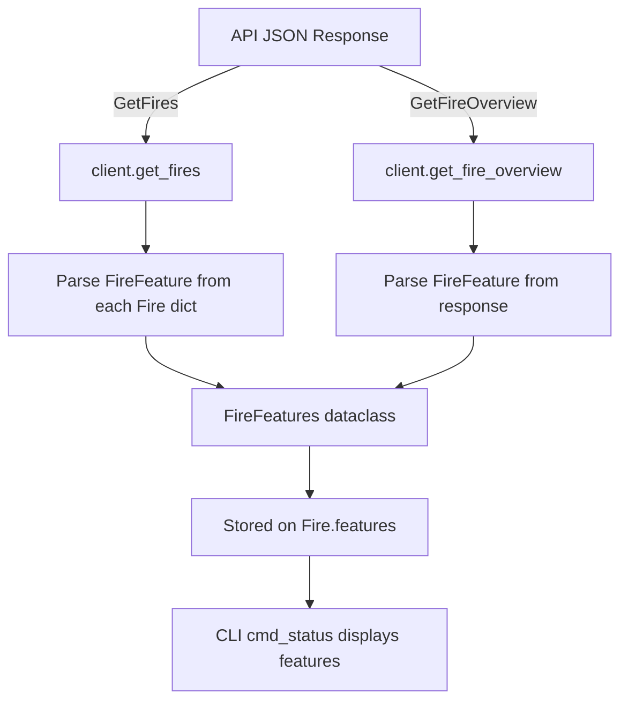
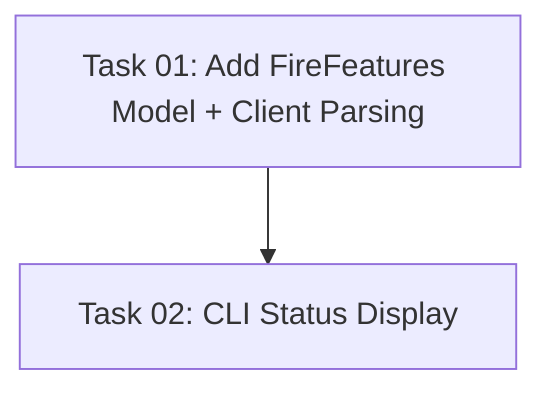

# Plan: Expose Fire Feature Flags in Library and CLI Status

## Original Work Order
> Investigate how to best expose optional fire features in this library. This data may already be available, but check for each one. Then, make it so the CLI tool shows the status all optional features when showing fireplace status. Here is the list.
>
> Sound, SimpleHeat, AdvancedHeat, SevenDayTimer, CountDownTimer, Moods, FlameHeight, RgbFlameAccent, FlameDimming, RgbFuelBed, FuelBedDimming, FlameFanSpeed, RgbBackLight, FrontLightAmber, PirToggleSmartSense, Lgt1To5, RequiresWarmUp, ApplyFlameOnlyFirst, FlameAmber, CheckIfRemoteWasUsed, MediaAccent, PowerBoost, FanOnly, RgbLogEffect

## Executive Summary

The upstream FlameConnect API returns a `FireFeature` object as a nested property on each `Fire` object. This object contains 24 boolean flags that indicate which optional hardware features a specific fireplace model supports (e.g., heat, sound, log effect, media accent lighting). The current Python library **completely ignores** this data during deserialization of both the `GetFires` and `GetFireOverview` API responses.

This plan adds a `FireFeatures` dataclass to the models, parses the `FireFeature` JSON from both API endpoints, stores it on the `Fire` dataclass, and displays all 24 feature flags in the CLI `status` command output.

## Context

### Current State vs Target State

| Current State | Target State | Why? |
|---|---|---|
| `Fire` dataclass has no feature flag fields | `Fire` includes a `FireFeatures` dataclass | Feature availability data is needed to know what a model supports |
| `get_fires()` ignores `FireFeature` in API JSON | `get_fires()` parses `FireFeature` into `FireFeatures` | Data is returned by the API but discarded |
| `get_fire_overview()` ignores `FireFeature` in API JSON | `get_fire_overview()` parses `FireFeature` into `FireFeatures` | Same — data is available but unused |
| CLI `status` shows only live parameters | CLI `status` also shows a "Supported Features" section | Users need to see what their fireplace model supports |
| Test fixtures lack `FireFeature` data | Test fixtures include `FireFeature` JSON | Tests must cover the new parsing logic |

### Background

The decompiled Android app reveals the following about the API response structure:

1. **`FireFeature` is a property on the `Fire` class** (`Fire.cs:575-591`) — it is a nested JSON object, not a separate API call.

2. **`GetFires` returns `List<Fire>`** — each `Fire` object in the JSON array contains an inline `"FireFeature"` object. The current Python `get_fires()` reads from this array but ignores the `"FireFeature"` key.

3. **`GetFireOverview` returns `WiFiFireOverviewResult`** (`WiFiFireOverviewResult.cs`), which has three top-level keys:
   - `"ResultCode"` (short) — currently ignored by Python client
   - `"FireDetails"` (a `Fire` object) — **this is where `FireFeature` lives**
   - `"WiFiFireOverview"` (parameters + FireId only)

   The C# `WiFiFireOverview` class (`WiFiFireOverview.cs`) only has `FireId` and `Parameters` — it does **not** have `FireFeature`. The decompiled app reads `Fire` from `result.FireDetails` (`BaseViewModelWiFiFire.cs:429`).

   However, the current Python client reads fire identity fields (`FriendlyName`, `Brand`, etc.) from `data["WifiFireOverview"]`, suggesting the API may duplicate some fire fields into both locations. The existing test fixture only has a `"WifiFireOverview"` key with no `"FireDetails"`.

4. **The JSON property name is `"FireFeature"`** (PascalCase, matching C# conventions). All 24 boolean fields also use PascalCase names (e.g., `"SimpleHeat"`, `"RgbFlameAccent"`).

## Architectural Approach

### Data Model Addition

**Objective**: Add a `FireFeatures` frozen dataclass to `models.py` that holds all 24 boolean feature flags.

The dataclass will use Pythonic snake_case field names mapped from the PascalCase API keys. Each field defaults to `False` so that missing keys in the API response are handled gracefully. The `Fire` dataclass gains a new `features: FireFeatures` field with a default of `FireFeatures()` (all false) to maintain backward compatibility — since `FireFeatures` is frozen/immutable, a plain default value works without `field(default_factory=...)`.

The 24 boolean fields:
`sound`, `simple_heat`, `advanced_heat`, `seven_day_timer`, `count_down_timer`, `moods`, `flame_height`, `rgb_flame_accent`, `flame_dimming`, `rgb_fuel_bed`, `fuel_bed_dimming`, `flame_fan_speed`, `rgb_back_light`, `front_light_amber`, `pir_toggle_smart_sense`, `lgt1_to_5`, `requires_warm_up`, `apply_flame_only_first`, `flame_amber`, `check_if_remote_was_used`, `media_accent`, `power_boost`, `fan_only`, `rgb_log_effect`

### Client Parsing

**Objective**: Extract `FireFeature` from API responses and construct `FireFeatures` instances.

A private helper function `_parse_fire_features(data: dict[str, Any]) -> FireFeatures` in `client.py` will map PascalCase JSON keys to the dataclass fields. It will use `.get(key, False)` for each field so missing keys default to `False`. If `data` is empty or `None`, return `FireFeatures()` (all false).

**`get_fires()`**: Each fire dict in the response array contains a `"FireFeature"` key. Pass `entry.get("FireFeature", {})` to the helper.

**`get_fire_overview()`**: Based on the C# `WiFiFireOverviewResult` structure, `FireFeature` is on the `FireDetails` object, not on `WifiFireOverview`. The parsing strategy should check multiple locations in priority order:
1. `data.get("FireDetails", {}).get("FireFeature", {})` — the canonical location per the C# model
2. `wifi.get("FireFeature", {})` — fallback in case the API duplicates it here

Use the first non-empty dict found. This handles both the expected structure and any API quirks.

### CLI Status Display

**Objective**: Show a "Supported Features" section in `cmd_status` output listing all 24 feature flags.

Add a `_display_features(features: FireFeatures)` function in `cli.py` that prints a section after the fire identity info (Fireplace name + Connection state) and before the parameter list. The display will show all 24 features with Yes/No values, matching the user's request to "show the status of ALL optional features." Use a human-readable label for each field (e.g., `simple_heat` → `Simple Heat`). Format as a compact list consistent with the existing `_display_*` style.

### Test Fixture and Test Updates

**Objective**: Ensure the new parsing and display logic is tested.

- Update `tests/fixtures/get_fires.json` to include a `"FireFeature"` object on each fire entry with a representative mix of `true` and `false` values.
- Update `tests/fixtures/get_fire_overview.json` to include `"FireFeature"` in a location the client will find (within the existing `"WifiFireOverview"` object is simplest, since that's where the Python client reads fire identity from; optionally also add a top-level `"FireDetails"` key).
- Add tests in `test_client.py` to verify `Fire.features` is correctly populated from both `get_fires()` and `get_fire_overview()`.
- Add tests in `test_cli_commands.py` to verify the status output includes the features section.
- Add a test for the `FireFeatures` dataclass defaults in `test_models.py` (all fields `False` by default).

## Risk Considerations and Mitigation Strategies

Technical Risks

- **Exact JSON location of FireFeature in GetFireOverview is uncertain**: The C# model places it on `FireDetails`, but the Python client reads fire identity from `WifiFireOverview` (suggesting the API may flatten or duplicate fields). The existing test fixture has no `FireDetails` key.
    - **Mitigation**: Check both `data["FireDetails"]["FireFeature"]` and `data["WifiFireOverview"]["FireFeature"]` in priority order. Default to all-false if absent in both. A live API call during development can confirm the exact structure (per project philosophy).

- **API may not return FireFeature for all accounts/models**: Older firmware or API versions might omit the field entirely.
    - **Mitigation**: All fields default to `False`, so a missing `FireFeature` key means "no features reported" rather than an error.

Implementation Risks

- **Breaking existing tests**: Adding a `features` field to `Fire` changes its constructor signature.
    - **Mitigation**: Use a default value (`features: FireFeatures = FireFeatures()`) so existing `Fire(...)` calls without the new field continue to work unchanged.

## Success Criteria

### Primary Success Criteria
1. `FireFeatures` dataclass exists in `models.py` with all 24 boolean fields
2. `client.get_fires()` and `client.get_fire_overview()` populate `Fire.features` from API JSON when present
3. `flameconnect status` CLI command displays a "Supported Features" section listing all 24 feature flags with Yes/No values
4. All existing tests continue to pass
5. New tests cover feature parsing and display
6. `uv run ruff check .` and `uv run mypy src/` pass cleanly

## Resource Requirements

### Development Skills
- Python dataclasses and type annotations
- Async API client patterns (existing codebase conventions)
- CLI output formatting (matching existing `_display_*` style)

### Technical Infrastructure
- Python 3.13+, uv, ruff, mypy, pytest (all already in project)

## Notes

- The `PresetOptions` and `FlamePresetOptions` short fields from the decompiled app are excluded since the user's request only covers the 24 boolean flags.
- The TUI is out of scope for this plan — the user only asked about CLI status. TUI integration can be a follow-up if desired.
- This plan does **not** add feature-gating logic (hiding unsupported controls). That is a separate concern for future work.

### Change Log
- 2026-02-27: Initial plan creation.
- 2026-02-27: Refined client parsing strategy — corrected `GetFireOverview` search order to check `FireDetails` first (matching C# `WiFiFireOverviewResult` structure confirmed via `BaseViewModelWiFiFire.cs:429`). Specified CLI display format as all 24 flags with Yes/No. Removed out-of-scope TUI/HA node from architecture diagram. Clarified dataclass default value approach. Added detail about test fixture `FireDetails` key.

## Task Dependencies

## Execution Blueprint

**Validation Gates:**
- Reference: `/config/hooks/POST_PHASE.md`

### Phase 1: Data Model and Client Parsing
**Parallel Tasks:**
- Task 01: Add FireFeatures dataclass, update Fire model, add client parsing, update fixtures and tests

### Phase 2: CLI Integration
**Parallel Tasks:**
- Task 02: Display fire feature flags in CLI status command (depends on: 01)

### Execution Summary
- Total Phases: 2
- Total Tasks: 2
- Maximum Parallelism: 1 task
- Critical Path Length: 2 phases
