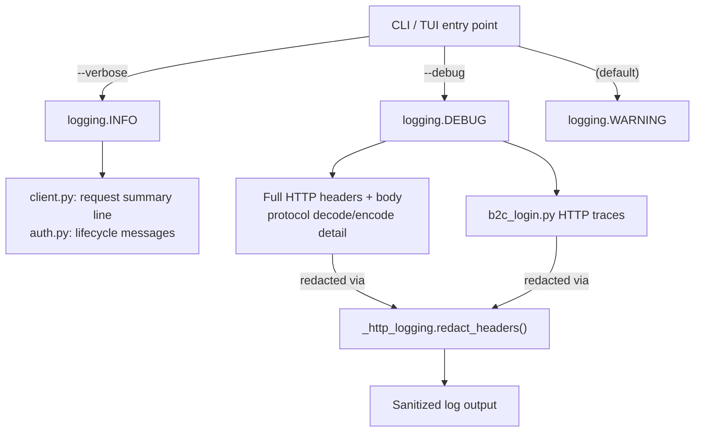

# Plan: HTTP Debug Logging with Credential Redaction

## Original Work Order
> Extend debug logging to show HTTP requests and responses, redacting keys, tokens, and credentials. The CLI / TUI tools should have `--verbose`, which is the existing behaviour (rename the help text to `Enable verbose logging`). Then, we should have a `--debug` parameter which is "Enable verbose logging including HTTP requests and responses". Internally, --verbose should map to an info log level, and --debug should map to a debug log level. With nothing specified, our log level should default to warn.

## Plan Clarifications

| Question | Answer |
|---|---|
| There are currently zero `_LOGGER.info()` calls in the codebase. `--verbose` (INFO) would produce no additional output vs default (WARNING). Should some existing DEBUG messages be promoted to INFO? | Yes. Promote `client.py`'s request summary line (`"GET /url -> 200"`) and key `auth.py` lifecycle messages (silent token acquisition, auth success) to INFO. Keep `protocol.py` decode/encode detail and full HTTP request/response traces at DEBUG. |

## Executive Summary

The library already has partial HTTP debug logging in `b2c_login.py` (via `_log_request`/`_log_response` helpers) but the main API client in `client.py` only logs a one-line summary at DEBUG level. Meanwhile, the `--verbose` flag currently maps directly to DEBUG, providing no intermediate INFO level. Additionally, there are zero INFO-level log calls in the entire codebase, so the intermediate tier would be invisible without re-leveling some messages.

This plan restructures the logging tiers so `--verbose` gives INFO-level insight (request summaries, auth lifecycle) while `--debug` unlocks full HTTP request/response tracing. The HTTP tracing in `client.py._request` will follow the same pattern already established in `b2c_login.py`, with a shared redaction utility to mask Bearer tokens, passwords, CSRF tokens, and other credentials before they reach the log output. Select existing DEBUG messages in `client.py` and `auth.py` will be promoted to INFO to populate the verbose tier.

## Context

### Current State vs Target State

| Current State | Target State | Why? |
|---|---|---|
| `--verbose` maps to DEBUG | `--verbose` maps to INFO | Provides a useful middle ground without overwhelming HTTP detail |
| No `--debug` flag exists | `--debug` maps to DEBUG | Unlocks full HTTP request/response tracing for troubleshooting |
| Default log level is WARNING | Default log level remains WARNING | No change needed |
| Help text says "Enable debug logging" | Help text says "Enable verbose logging" / "Enable verbose logging including HTTP requests and responses" | Accurate description of each flag's purpose |
| Zero `_LOGGER.info()` calls exist | Key messages in `client.py` and `auth.py` promoted to INFO | Makes `--verbose` produce useful output |
| `client.py._request` logs only `"GET /url -> 200"` at DEBUG | Summary line promoted to INFO; full headers/body logged at DEBUG | INFO gives request-level trace; DEBUG gives full HTTP detail |
| `b2c_login.py` has its own `_log_request`/`_log_response` | Shared helpers in `_http_logging.py` used by both modules | Consistent redaction of sensitive values |
| `b2c_login._log_request` redacts only `password` key in form data | Redaction covers Authorization headers, passwords, CSRF tokens, and cookie values | Prevents accidental credential leakage in logs |
| TUI `run_tui(verbose=bool)` sets DEBUG on verbose | TUI accepts a `log_level: int` and applies it directly | Supports both verbose and debug modes |

### Background

The `b2c_login.py` module already contains a well-structured pattern for HTTP debug logging (`_log_request` at line 117, `_log_response` at line 136). These use `>>>` and `<<<` prefixes and truncate response bodies to 2000 characters. The `client.py._request` method (line 135) is the single point through which all API calls flow, making it the ideal place to add equivalent tracing. The `b2c_login.py` redaction currently only masks the `password` form field; Bearer tokens in Authorization headers and CSRF tokens are logged in plain text.

The existing DEBUG messages across the codebase fall into three categories:
- **Auth lifecycle** (`auth.py`): "Attempting silent token acquisition", "Token acquired silently", "Authentication successful" — useful operational context, appropriate for INFO.
- **Request summary** (`client.py`): `"GET /url -> 200"` — useful at INFO to see API traffic without full payloads.
- **Protocol decode/encode** (`protocol.py`): Byte-level parameter decoding — noisy, should remain at DEBUG.

## Architectural Approach

### Shared HTTP Logging Module

**Objective**: Centralise HTTP debug logging and credential redaction into a single module shared by `client.py` and `b2c_login.py`.

A new private module `src/flameconnect/_http_logging.py` will contain:

- **`redact_headers(headers: Mapping[str, str]) -> dict[str, str]`** — Returns a copy with sensitive values replaced by `"***"`. Keys matched case-insensitively: `Authorization`, `Cookie`, `Set-Cookie`, `X-CSRF-TOKEN`. For `Authorization`, the scheme prefix is preserved (e.g. `"Bearer ***"`).
- **`redact_body(data: dict[str, str]) -> dict[str, str]`** — Returns a copy with the `password` key redacted. This is the form-data redaction already in `b2c_login.py`.
- **`log_request(logger, method, url, *, headers=None, data=None, params=None)`** — Logs at DEBUG using `>>>` prefix. Applies `redact_headers` to headers and `redact_body` to data before logging.
- **`log_response(logger, response, body=None)`** — Logs at DEBUG using `<<<` prefix. Applies `redact_headers` to response headers. Truncates body to 2000 characters.

The module name `_http_logging` (not `_logging`) avoids visual confusion with the stdlib `logging` module. All functions accept a `logger` parameter rather than using a module-level logger, so each caller's messages appear under their own logger name (e.g. `flameconnect.client`, `flameconnect.b2c_login`).

### Log Level Promotion

**Objective**: Populate the INFO tier so `--verbose` produces meaningful output.

Specific changes to existing log calls:

- **`client.py:174`**: `_LOGGER.debug("%s %s -> %s", method, url, response.status)` → `_LOGGER.info(...)`. This is the request summary visible with `--verbose`.
- **`auth.py:126`**: `"Attempting silent token acquisition"` → `_LOGGER.info(...)`
- **`auth.py:134`**: `"Token acquired silently (refreshed from cache)"` → `_LOGGER.info(...)`
- **`auth.py:138`**: `"No cached token, initiating interactive auth code flow"` → `_LOGGER.info(...)`
- **`auth.py:189`**: `"Authentication successful, token acquired"` → `_LOGGER.info(...)`

All other DEBUG messages (protocol decode/encode, auth internals like "Exchanging authorization code", `b2c_login.py` HTTP traces) remain at DEBUG.

### Client HTTP Debug Logging

**Objective**: Add full HTTP request/response debug logging to `FlameConnectClient._request`, matching the pattern already used in `b2c_login.py`.

The `_request` method in `client.py` will call the shared `log_request` before the HTTP call and `log_response` after, both at DEBUG level. The existing summary line stays but is promoted to INFO (see above), so `--verbose` users see `"GET /url -> 200"` while `--debug` users additionally see headers, body, and response detail. Response bodies will be truncated to 2000 characters, consistent with the existing `b2c_login.py` behaviour.

### CLI Flag Restructuring

**Objective**: Add `--debug` flag and adjust `--verbose` semantics across CLI and TUI entry points.

In `build_parser()`: rename `--verbose` help text to `"Enable verbose logging"` and add `--debug` with help text `"Enable verbose logging including HTTP requests and responses"`. The flags should be mutually exclusive (using `argparse.add_mutually_exclusive_group`). In `main()`, the log level selection becomes: `--debug` -> `DEBUG`, `--verbose` -> `INFO`, default -> `WARNING`.

The `run_tui` function signature changes from `verbose: bool` to accept a `log_level: int` parameter (defaulting to `logging.WARNING`), and applies that level to the `flameconnect` logger. The `cmd_tui` and `async_main` callers will compute the appropriate level and pass it through. In the TUI's `DashboardScreen`, the log handler currently attaches to the `flameconnect` logger at whatever level is set — this behaviour continues unchanged, meaning DEBUG messages (including HTTP traces) will appear in the TUI messages panel when `--debug` is used.

### b2c_login.py Migration

**Objective**: Remove duplicated logging helpers from `b2c_login.py` and use the shared module.

The `_log_request` and `_log_response` functions will be removed from `b2c_login.py` and replaced with imports from `flameconnect._http_logging`. All existing call sites will be updated to pass `_LOGGER` as the first argument. The password redaction in form data is handled by the shared `redact_body` function.

## Risk Considerations and Mitigation Strategies

Technical Risks

- **Credential leakage in logs**: Sensitive tokens or passwords could appear in log output if redaction misses a field.
    - **Mitigation**: Case-insensitive header matching against a known set of sensitive keys. Test coverage will verify redaction of Authorization, Cookie, password, and CSRF token values.
- **JSON response bodies containing tokens**: B2C token exchange responses may contain `access_token` fields in JSON bodies.
    - **Mitigation**: Response body logging is only active at DEBUG level, which is opt-in for troubleshooting. The truncation to 2000 characters limits exposure. Full JSON body redaction is out of scope for this plan — users opting into `--debug` accept seeing raw (truncated) response content.

Implementation Risks

- **Breaking existing test assertions**: Tests that assert on `--verbose` behaviour or mock logging calls will need updating. There are ~20 test references to `verbose` in `test_cli_commands.py`.
    - **Mitigation**: Update tests alongside the implementation. Tests for `build_parser` will cover both `--verbose` and `--debug`. Tests for `async_main`/`cmd_tui` will pass `log_level` instead of `verbose`.

## Success Criteria

### Primary Success Criteria
1. `flameconnect --debug list` logs full HTTP request headers (with Bearer token redacted), request body, response status, response headers, and truncated response body
2. `flameconnect --verbose list` shows INFO-level messages (request summaries, auth lifecycle) but no HTTP request/response detail
3. `flameconnect list` (no flag) shows only WARNING and above
4. All sensitive values (Authorization tokens, passwords, cookies, CSRF tokens) are redacted in debug output
5. `mypy` strict checking passes, `ruff` passes, test coverage remains at or above 95%

## Resource Requirements

### Development Skills
- Python async programming, `logging` module, `aiohttp`
- `argparse` mutually exclusive groups

### Technical Infrastructure
- Existing dev toolchain: `uv`, `ruff`, `mypy`, `pytest`

## Notes

### Change Log
- 2026-03-11: Initial plan created
- 2026-03-11: Refinement — added Log Level Promotion section to address zero INFO-level messages; renamed module from `_logging.py` to `_http_logging.py` to avoid stdlib shadowing; specified function signatures for shared module; added JSON body token risk; clarified that `log_request`/`log_response` accept a logger parameter for proper logger namespacing
