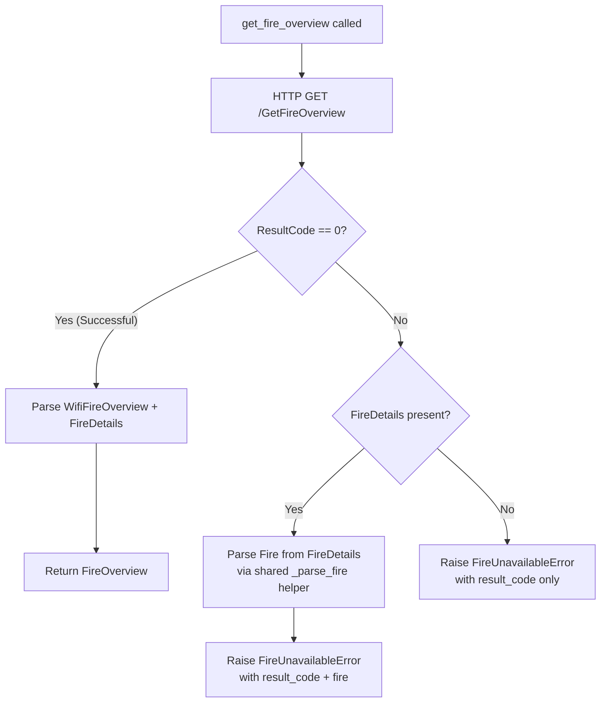
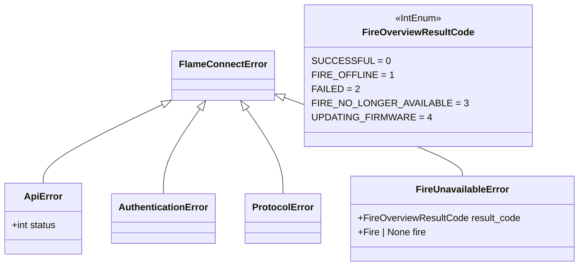

# Plan: Handle Fire Overview ResultCode

## Original Work Order

> The `get_fire_overview` method in `client.py` ignores the `ResultCode` field from the API response, causing a `TypeError: 'NoneType' object is not subscriptable` crash when the fireplace is offline. The fix needs to: (1) Check `data["ResultCode"]` before accessing `WifiFireOverview`, (2) For non-zero result codes, either raise a specific exception or return a response indicating the fireplace is offline/unavailable, (3) The `FireDetails` field is populated even for non-success codes, so fire metadata can still be extracted when `FireDetails` is not null.

## Plan Clarifications

| Question | Resolution |
|---|---|
| Should one offline fire crash the entire Home Assistant coordinator update loop? | No. The library should raise `FireUnavailableError` per-fire. The HA integration coordinator is responsible for catching it per-fire and marking that entity as unavailable. This is standard HA practice -- the library raises, the integration decides policy. |
| Should `FireOverview` itself carry `result_code` so callers can handle it without exceptions? | No. Exceptions are the correct pattern here: a non-success `ResultCode` means `WifiFireOverview` is null, so there is no telemetry to return. Returning a partial `FireOverview` with no parameters would be misleading. The exception carries the `fire` metadata when available. |
| Should the coordinator skip `get_fire_overview` for fires with `IoTConnectionState != CONNECTED`? | Out of scope. This is an optimization for the HA integration, not the library. The library should faithfully report what the API returns. The integration can choose to skip calls based on `get_fires` data. |
| Can the `Fire` parsing logic be shared between `get_fires` and the `FireDetails` error path? | Yes. The `FireDetails` JSON object has the same shape as the entries from `get_fires`. A private `_parse_fire` helper should be extracted to deduplicate this. Currently `get_fire_overview` builds `Fire` from `WifiFireOverview` (which has the same fields), and `get_fires` builds it inline. Both use identical field mappings. |

## Executive Summary

The `get_fire_overview` method unconditionally accesses `data["WifiFireOverview"]`, which is `null` when the API returns a non-zero `ResultCode` (offline, failed, no longer available, updating firmware). This causes a `TypeError` crash that prevents any caller -- including the Home Assistant integration -- from gracefully handling offline fireplaces.

The fix introduces a `FireOverviewResultCode` enum mirroring the API's five known result codes, adds a dedicated `FireUnavailableError` exception for non-success responses, and modifies `get_fire_overview` to inspect `ResultCode` before accessing nullable fields. When the fireplace is reachable (`ResultCode == 0`), behavior remains identical to today. For non-zero codes, the method raises `FireUnavailableError` carrying the result code and, when available, the `Fire` metadata extracted from `FireDetails`. This matches the behavior of the official app, which only reads telemetry on success.

The approach is minimal: one new enum, one new exception class, a guard clause in `get_fire_overview`, and a small refactor to extract shared `Fire` parsing logic. No new abstractions, no optional return types, no changes to `FireOverview` itself. Callers that already handle `FlameConnectError` will catch the new exception automatically; callers that want finer control can catch `FireUnavailableError` and inspect its `result_code` and optional `fire` attributes.

## Context

### Current State vs Target State

| Current State | Target State | Why? |
|---|---|---|
| `get_fire_overview` ignores `ResultCode` | `get_fire_overview` checks `ResultCode` before accessing `WifiFireOverview` | Prevents `TypeError` crash when fireplace is offline |
| No representation of API result codes in the model layer | `FireOverviewResultCode` enum with all five known values | Enables type-safe handling of API result codes |
| No way for callers to distinguish "offline" from other API errors | `FireUnavailableError` exception with `result_code` and optional `fire` | Callers (including Home Assistant) can present appropriate UI for each state |
| `FireDetails` data is discarded for non-success responses | `Fire` metadata extracted from `FireDetails` when present, attached to exception | Fire identity info remains accessible even when telemetry is unavailable |
| `turn_on`/`turn_off` crash if fireplace is offline | Callers can catch `FireUnavailableError` to handle gracefully | Prevents cascading crashes in higher-level operations |
| `Fire` construction is duplicated between `get_fires` and `get_fire_overview` | Shared `_parse_fire` helper used by both methods and the error path | Reduces duplication and ensures consistent parsing |

### Background

The `GetFireOverview` API endpoint returns a `WiFiFireOverviewResult` envelope with three fields: `ResultCode` (short enum), `FireDetails` (nullable `Fire` object), and `WifiFireOverview` (nullable telemetry object). The official Dimplex/Faber app switches on `ResultCode` and only accesses `WifiFireOverview` when the code is `0` (Successful). Our client was written against successful responses only and never handled the non-success paths.

The C# enum is named `EWifiFireOverviewResponseCode` with members: `Successful` (0), `FireOffline` (1), `Failed` (2), `FireNoLongerAvailable` (3), `MostLikelyUpdatingFirmware` (4). The Python enum will use `UPDATING_FIRMWARE` as a cleaner name for the last member.

The existing exception hierarchy (`FlameConnectError` > `ApiError`, `AuthenticationError`, `ProtocolError`) does not cover application-level "fire unavailable" conditions. A new leaf exception is needed. The `exceptions.py` module currently has no imports from `models.py`, so adding type references requires care to avoid circular imports.

**Key codebase observations from code review:**
- The existing `get_fire_overview.json` test fixture does NOT include a `ResultCode` field. The fixture and the `_build_overview_payload` test helper both need updating to include `ResultCode: 0` for the success path.
- `get_fire_overview` currently builds `Fire` from `WifiFireOverview` data (not from `FireDetails`). It only uses `FireDetails` for `FireFeature` extraction (with fallback to `WifiFireOverview.FireFeature`). There is no existing `FireDetails`-to-`Fire` parsing to "extract" -- new parsing logic is needed for the error path.
- `get_fires` builds `Fire` objects from the list endpoint using an identical field set (`FireId`, `FriendlyName`, `Brand`, `ProductType`, `ProductModel`, `ItemCode`, `IoTConnectionState`, `WithHeat`, `IsIotFire`, `FireFeature`). The `FireDetails` object has this same shape (confirmed from the decompiled C# `Fire` model). A shared `_parse_fire` helper can serve all three call sites.
- `get_fires` uses direct key access (`entry["FireId"]`) while `get_fire_overview` uses `.get()` with defaults. The shared helper should use `.get()` with defaults to be resilient for the `FireDetails` case where some fields may be absent.

## Architectural Approach

The fix touches three files in `src/flameconnect/` (models, exceptions, client) plus their corresponding test files and the package `__init__.py` exports. No new files are created.

### Component 1: FireOverviewResultCode Enum
**Objective**: Provide a type-safe representation of the five API result codes so callers can match on specific states.

Add a `FireOverviewResultCode(IntEnum)` to `models.py` with members: `SUCCESSFUL = 0`, `FIRE_OFFLINE = 1`, `FAILED = 2`, `FIRE_NO_LONGER_AVAILABLE = 3`, `UPDATING_FIRMWARE = 4`. This mirrors the API's `EWifiFireOverviewResponseCode` enum from the decompiled official app. The enum follows the same `IntEnum` pattern used by all other enums in `models.py` (e.g., `ConnectionState`, `FireMode`, `HeatMode`).

### Component 2: FireUnavailableError Exception
**Objective**: Give callers a specific, catchable exception for non-success result codes that carries structured context.

Add `FireUnavailableError` to `exceptions.py` as a subclass of `FlameConnectError`. It accepts a `result_code: FireOverviewResultCode` and an optional `fire: Fire | None` (the metadata from `FireDetails` when available). The human-readable message should include the enum member name. Since it inherits from `FlameConnectError`, existing broad `except FlameConnectError` blocks catch it automatically.

For the type annotations, `FireOverviewResultCode` can be imported at runtime (it is a simple `IntEnum` and `models.py` does not import from `exceptions.py`). The `Fire` type should use a `TYPE_CHECKING` guard with a string annotation to be defensive, matching the pattern already used in `client.py` for `AbstractAuth`.

### Component 3: Shared _parse_fire Helper and Guard Clause
**Objective**: Prevent the `TypeError` crash by checking `ResultCode` before accessing nullable fields, and reduce code duplication in `Fire` construction.

Extract a private `_parse_fire(data: dict[str, Any]) -> Fire` helper in `client.py` that builds a `Fire` dataclass from a JSON dict. This helper uses `.get()` with sensible defaults for all fields except `FireId` (which is required). The helper replaces the inline `Fire(...)` construction in three places:
1. The `get_fires` loop (currently builds `Fire` inline from each entry)
2. The `get_fire_overview` success path (currently builds `Fire` from `WifiFireOverview` data)
3. The new `get_fire_overview` error path (builds `Fire` from `FireDetails` when present)

In `get_fire_overview`, add a guard clause after the HTTP request: read `data["ResultCode"]` (defaulting to `0` for backward compatibility with any responses that omit the field) and convert to `FireOverviewResultCode`. If the code is not `SUCCESSFUL`, attempt to parse `Fire` from `data["FireDetails"]` (if non-null) using `_parse_fire`, then raise `FireUnavailableError`. The success path continues to parse `WifiFireOverview` as before, now using the shared helper.

Note: The backward compatibility default of `0` ensures that if an existing API deployment omits `ResultCode`, the method behaves identically to today.

### Component 4: Package Exports
**Objective**: Make the new enum and exception available to library consumers.

Add `FireOverviewResultCode` and `FireUnavailableError` to the imports and `__all__` list in `__init__.py`. `FireOverviewResultCode` goes in the Enums section and `FireUnavailableError` goes in the Exceptions section, following the existing organizational pattern.

### Component 5: Test Coverage
**Objective**: Verify all result code paths and ensure mutation testing cannot survive.

Update the existing `get_fire_overview.json` fixture to include `"ResultCode": 0` at the top level. Update the `_build_overview_payload` test helper to accept an optional `result_code` parameter (defaulting to `0`). Add test cases for:
- Each non-success `ResultCode` (offline, failed, no longer available, updating firmware) verifying `FireUnavailableError` is raised with the correct `result_code`
- `FireUnavailableError.fire` populated from `FireDetails` when present
- `FireUnavailableError.fire` is `None` when `FireDetails` is absent or null
- The success path (`ResultCode == 0`) continues to return `FireOverview` identically
- Omitted `ResultCode` field defaults to success (backward compatibility)
- `turn_on` and `turn_off` propagate `FireUnavailableError` when the fireplace is offline
- Unknown `ResultCode` values (e.g., 99) are handled gracefully
- The `_parse_fire` helper correctly constructs `Fire` from minimal and complete JSON dicts
- Malformed `FireDetails` does not prevent the `FireUnavailableError` from being raised (graceful degradation to `fire=None`)

## Risk Considerations and Mitigation Strategies

Technical Risks

- **Unknown ResultCode values from the API**: The API may return result codes not in the known set of 0-4.
    - **Mitigation**: Use `IntEnum` with a fallback -- if the value is not a known member, still raise `FireUnavailableError` with the raw integer converted via a try/except on the enum constructor. For non-zero unknown codes, treat them as unavailable. For unknown code `0`, treat as success (defensive).

- **FireDetails parsing failure on non-success responses**: The `FireDetails` structure may differ or be partially populated for certain result codes.
    - **Mitigation**: Wrap the `FireDetails` parsing in a try/except so a malformed `FireDetails` does not prevent the `FireUnavailableError` from being raised. Log a warning and set `fire=None` on parse failure.

- **Backward compatibility with responses that omit ResultCode**: Older API versions or edge cases may not include `ResultCode` in the response.
    - **Mitigation**: Use `.get("ResultCode", 0)` to default to `SUCCESSFUL` when the field is absent, preserving current behavior.

Implementation Risks

- **Breaking change for callers only catching specific exceptions**: Callers that expect `get_fire_overview` to always return a `FireOverview` will now get an exception for offline fireplaces.
    - **Mitigation**: This is the correct behavior -- callers should handle offline fireplaces explicitly. Document the new exception in the method docstring. Since the current behavior is a crash (`TypeError`), any caller already has broken behavior for this case.

- **Circular import between exceptions.py and models.py**: `FireUnavailableError` references `Fire` and `FireOverviewResultCode` from `models.py`.
    - **Mitigation**: `FireOverviewResultCode` is a simple `IntEnum` and can be imported at runtime since `models.py` does not import from `exceptions.py`. Use `TYPE_CHECKING` guard for the `Fire` import with a string annotation, matching the pattern used in `client.py` for `AbstractAuth`.

- **Existing test fixtures lack ResultCode**: The `get_fire_overview.json` fixture and the `_build_overview_payload` helper do not include `ResultCode`, so existing tests will break if the guard clause requires it.
    - **Mitigation**: Use `.get("ResultCode", 0)` in the production code so omitted fields default to success. Update the fixture and helper to include `ResultCode: 0` for explicitness and forward compatibility.

## Success Criteria

### Primary Success Criteria
1. `get_fire_overview` raises `FireUnavailableError` (not `TypeError`) when `ResultCode != 0`
2. The `FireUnavailableError.result_code` correctly maps to the API's `ResultCode` value for all five known codes
3. `FireUnavailableError.fire` is populated from `FireDetails` when the field is non-null, and `None` otherwise
4. The success path (`ResultCode == 0`) returns an identical `FireOverview` to today's behavior
5. Omitting `ResultCode` from the response defaults to success (backward compatibility)
6. All new code passes `mypy --strict`, `ruff check`, and `ruff format --check`
7. Test coverage remains at or above 95%, and mutation testing (`mutmut`) shows no surviving mutants for the new code paths

## Resource Requirements

### Development Skills
Python async programming, familiarity with the flameconnect codebase patterns (frozen dataclasses, IntEnum, aiohttp mocking with `aioresponses`)

### Technical Infrastructure
Existing development toolchain: uv, pytest, mypy, ruff, mutmut. No new dependencies required.

## Notes

The `turn_on` and `turn_off` methods call `get_fire_overview` internally (confirmed at client.py lines 295 and 331). After this fix, they will propagate `FireUnavailableError` to their callers rather than crashing with `TypeError`. This is the desired behavior -- callers of high-level convenience methods should handle unavailability the same way.

### Change Log

| Date | Change |
|---|---|
| 2026-03-11 | Initial plan created |
| 2026-03-11 | Refined after code review: (1) Added Plan Clarifications table resolving open questions about HA coordinator behavior, partial results, and IoTConnectionState optimization. (2) Corrected Component 3 -- there is no existing "FireDetails-to-Fire parsing logic" to extract; `get_fire_overview` builds `Fire` from `WifiFireOverview`, not `FireDetails`. Added `_parse_fire` shared helper covering `get_fires`, `get_fire_overview` success path, and error-path `FireDetails` parsing. (3) Added context about existing test fixture lacking `ResultCode` field and the need to update `get_fire_overview.json` and `_build_overview_payload`. (4) Added backward compatibility risk for responses omitting `ResultCode`, mitigated by `.get("ResultCode", 0)`. (5) Added current-vs-target row for shared `_parse_fire` helper. (6) Documented the C# enum's original name (`EWifiFireOverviewResponseCode`) and the `MostLikelyUpdatingFirmware` member mapping. (7) Added success criterion for backward compatibility default. (8) Expanded test coverage section with specific cases for backward compat, unknown codes, malformed FireDetails, and the shared helper. |
